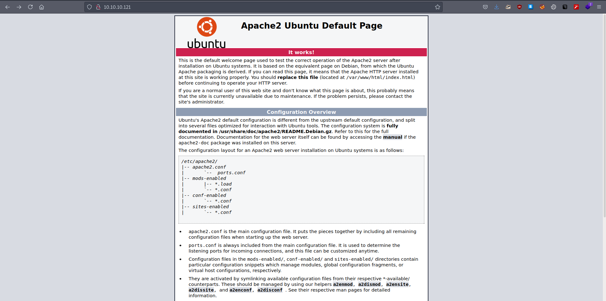
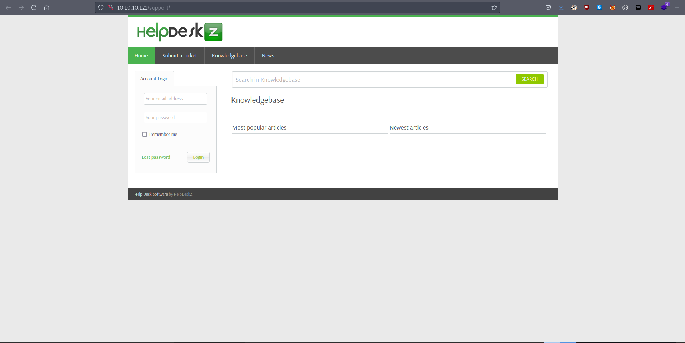
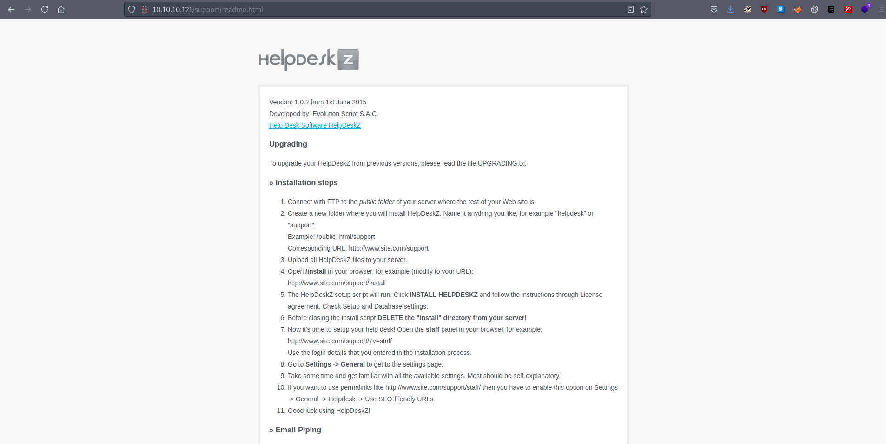
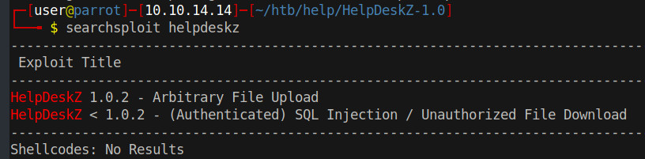
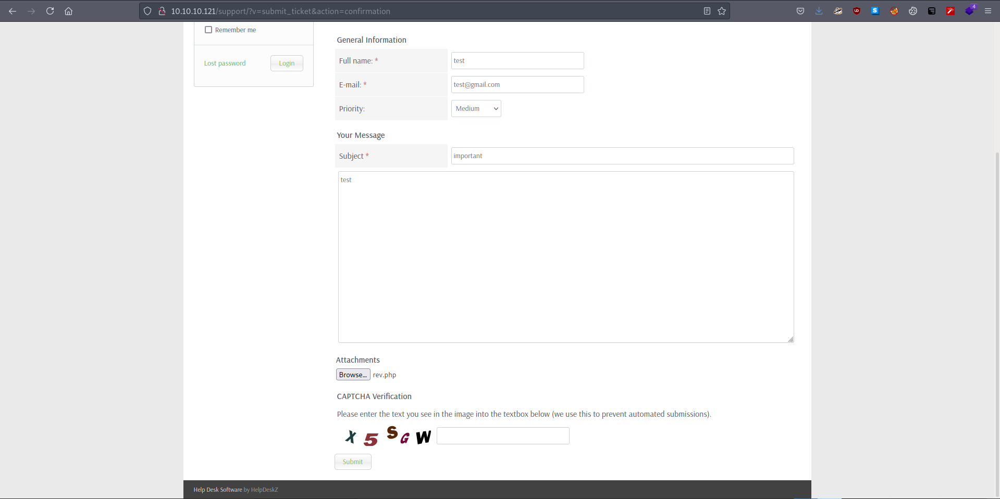
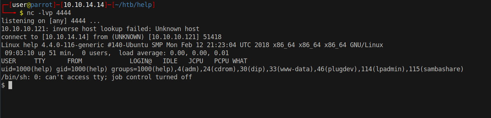

# 10 - HTTP


# Index


Whenever I see the default apache page I get suspicious. Usually there is a misconfiguration or a hidden directory under development. The first thing I do is go to robots.txt and admin to check if they exist. If that fails, run gobuster on it.

# Gobuster
```bash
┌─[user@parrot]─[10.10.14.14]─[~/htb/help]
└──╼ $ cat gobuster/initial-x.log  | grep -v 403
/index.html           (Status: 200) [Size: 11321]
/javascript           (Status: 301) [Size: 317] [--> http://10.10.10.121/javascript/]
/support              (Status: 301) [Size: 314] [--> http://10.10.10.121/support/]
/.                    (Status: 200) [Size: 11321]
```

Support sounds interesting, just a filename can reveal a lot about how the server works.


# HelpDeskZ




HelpDeskZ is an open source ticket software. We can download and enumerate the file structure for potential locations.

```bash 
┌─[user@parrot]─[10.10.14.14]─[~/htb/help/]
└──╼ $ git clone https://github.com/evolutionscript/HelpDeskZ-1.0
┌─[user@parrot]─[10.10.14.14]─[~/htb/help/HelpDeskZ-1.0]
└──╼ $ grep -ri version .  | tail -3 
./readme.html:Version: 1.0.2 from 1st June 2015<br />
./readme.html:To upgrade your HelpDeskZ from previous versions, please read the file UPGRADING.txt
./views/staff/dashboard.html:            <div>HelpDeskZ version {{ settings.helpdeskz_version }}</div>

```

Good, there is a way to tell the version, with luck we may even find an exploit on exploitdb.


# readme.html




Version: 1.0.2, at this point we can look for possible password locations but it's highly unlikely. This should be our last resort. Instead we can search for public exploits for this version against the exploitdb database.


# Arbitrary File Upload



Good thing about the this exploit it doesn't require authentication.

# Ticket submission


According to the author of the exploit, this version allows .php file uploads but obfuscates them with md5 hash of the time they are uploaded. What the exploit does is simple, it tries to guess the hash by recalculating the md5 of the current time. If you are in a different time zone, you have to adjust the time in the script as it uses time.time() to get current time. Date is sent from the server as a header you may want to check it out to compare with your local time if the exploit isn't working. 


php-reverse-shel.php is the exploit I will be using.

# Upload Directories
```bash
┌─[user@parrot]─[10.10.14.14]─[~/htb/help/HelpDeskZ-1.0]
└──╼ $ find . -type d  |grep uploads
./uploads
./uploads/articles
./uploads/tickets
```

Second argument to the exploit is the upload address, uploads/tickets sounds like a good location to upload tickets.


```bash
┌─[user@parrot]─[10.10.14.14]─[~/htb/help]
└──╼ $ python2 40300.py http://10.10.10.121/support/uploads/tickets/ rev.php
Helpdeskz v1.0.2 - Unauthenticated shell upload exploit
```

It might take a while because it is guessing the filename.


# Shell

