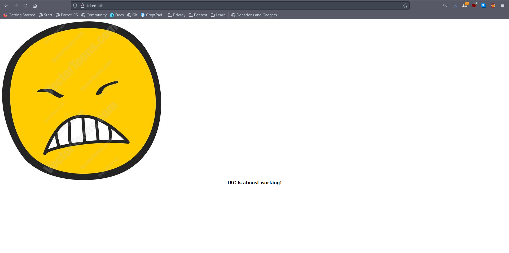

# 12 - HTTP

# Index


# gobuster
```bash
┌─[user@parrot]─[10.10.14.9]─[~/htb/irked]
└──╼ $ cat gobuster/irked.log 
/index.html           (Status: 200) [Size: 72]
/manual               (Status: 301) [Size: 307] [--> http://irked.htb/manual/]
/server-status        (Status: 403) [Size: 297]
```