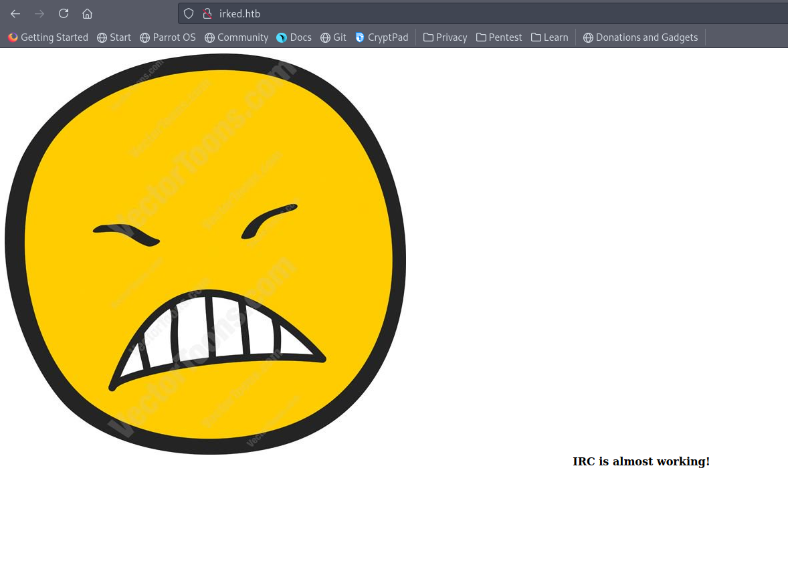
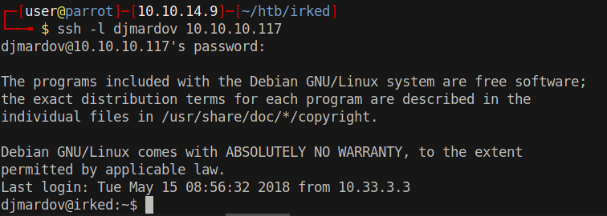

# 15 - PrivEsc

# .bash_history
```bash
ircd@irked:~$ cat .bash_history 
cd djmardov
ls
cd Documents
ls -lah
cat .backup
```


# .backup
```bash
ircd@irked:/home/djmardov/Documents$ cat .backup 
Super elite steg backup pw
UPupDOWNdownLRlrBAbaSSss
```

This should be the password of some data embedded in a picture. 


# irked.jpg & [Steganography](https://en.wikipedia.org/wiki/Steganography)



We have seen it on the web page. Let's try to extract data from this picture.


```
┌─[user@parrot]─[10.10.14.9]─[~/htb/irked]
└──╼ $ wget http://10.10.10.117/irked.jpg
┌─[user@parrot]─[10.10.14.9]─[~/htb/irked]
└──╼ $ steghide extract -sf irked.jpg -p 'UPupDOWNdownLRlrBAbaSSss'  
wrote extracted data to "pass.txt".
┌─[user@parrot]─[10.10.14.9]─[~/htb/irked]
└──╼ $ ls
backup  creds  exploit  gobuster  irked.jpg  nmap  notes  pass.txt  www
┌─[user@parrot]─[10.10.14.9]─[~/htb/irked]
└──╼ $ cat pass.txt 
Kab6h+m+bbp2J:HG
```

It may be the password of djmardov.

# User djmardov

