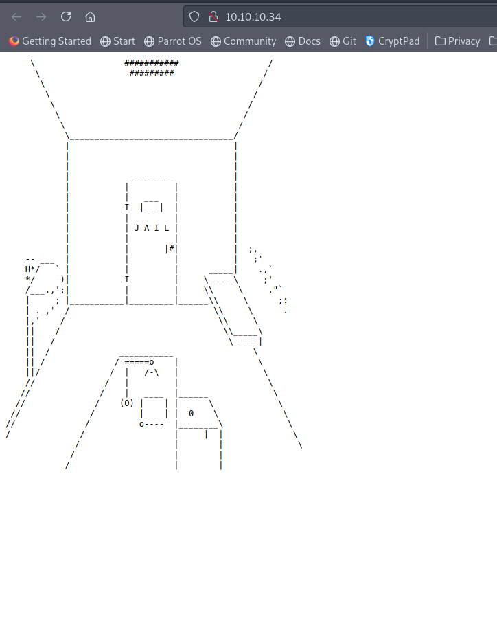
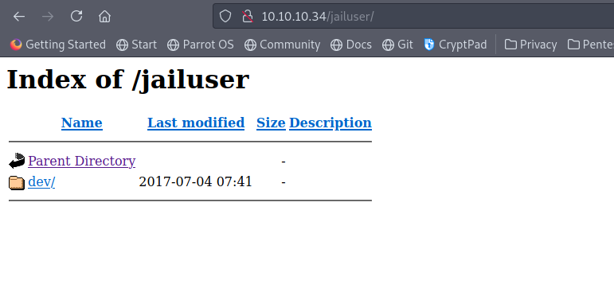
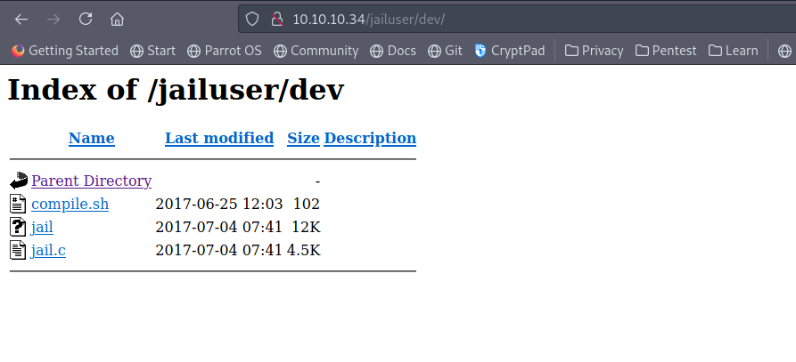

# 10 - Jail


# Gobuster

```bash
┌─[user@parrot]─[10.10.14.12]─[~/htb/jail]
└──╼ $ gobuster dir -u http://10.10.10.34 -w /usr/share/wordlists/dirbuster/directory-list-2.3-medium.txt -o gobuster/jail.log -t 100
/jailuser             (Status: 301) [Size: 236] [--> http://10.10.10.34/jailuser/]
```

# Dev





# compile.sh
```bash
gcc -o jail jail.c -m32 -z execstack
service jail stop
cp jail /usr/local/bin/jail
service jail start
```

# jail.c
```c
#include <stdio.h>
#include <stdlib.h>
#include <netdb.h>
#include <netinet/in.h>
#include <string.h>
#include <unistd.h>
#include <time.h>

int debugmode;
int handle(int sock);
int auth(char *username, char *password);

int auth(char *username, char *password) {
    char userpass[16];
    char *response;
    if (debugmode == 1) {
        printf("Debug: userpass buffer @ %p\n", userpass);
        fflush(stdout);
    }
    if (strcmp(username, "admin") != 0) return 0;
    strcpy(userpass, password);
    if (strcmp(userpass, "1974jailbreak!") == 0) {
        return 1;
    } else {
        printf("Incorrect username and/or password.\n");
        return 0;
    }
    return 0;
}

int handle(int sock) {
    int n;
    int gotuser = 0;
    int gotpass = 0;
    char buffer[1024];
    char strchr[2] = "\n\x00";
    char *token;
    char username[256];
    char password[256];
    debugmode = 0;
    memset(buffer, 0, 256);
    dup2(sock, STDOUT_FILENO);
    dup2(sock, STDERR_FILENO);
    printf("OK Ready. Send USER command.\n");
    fflush(stdout);
    while(1) {
        n = read(sock, buffer, 1024);
        if (n < 0) {
            perror("ERROR reading from socket");
            return 0;
        }
        token = strtok(buffer, strchr);
        while (token != NULL) {
            if (gotuser == 1 && gotpass == 1) {
                break;
            }
            if (strncmp(token, "USER ", 5) == 0) {
                strncpy(username, token+5, sizeof(username));
                gotuser=1;
                if (gotpass == 0) {
                    printf("OK Send PASS command.\n");
                    fflush(stdout);
                }
            } else if (strncmp(token, "PASS ", 5) == 0) {
                strncpy(password, token+5, sizeof(password));
                gotpass=1;
                if (gotuser == 0) {
                    printf("OK Send USER command.\n");
                    fflush(stdout);
                }
            } else if (strncmp(token, "DEBUG", 5) == 0) {
                if (debugmode == 0) {
                    debugmode = 1;
                    printf("OK DEBUG mode on.\n");
                    fflush(stdout);
                } else if (debugmode == 1) {
                    debugmode = 0;
                    printf("OK DEBUG mode off.\n");
                    fflush(stdout);
                }
            }
            token = strtok(NULL, strchr);
        }
        if (gotuser == 1 && gotpass == 1) {
            break;
        }
    }
    if (auth(username, password)) {
        printf("OK Authentication success. Send command.\n");
        fflush(stdout);
        n = read(sock, buffer, 1024);
        if (n < 0) {
            perror("Socket read error");
            return 0;
        }
        if (strncmp(buffer, "OPEN", 4) == 0) {
            printf("OK Jail doors opened.");
            fflush(stdout);
        } else if (strncmp(buffer, "CLOSE", 5) == 0) {
            printf("OK Jail doors closed.");
            fflush(stdout);
        } else {
            printf("ERR Invalid command.\n");
            fflush(stdout);
            return 1;
        }
    } else {
        printf("ERR Authentication failed.\n");
        fflush(stdout);
        return 0;
    }
    return 0;
}

int main(int argc, char *argv[]) {
    int sockfd;
    int newsockfd;
    int port;
    int clientlen;
    char buffer[256];
    struct sockaddr_in server_addr;
    struct sockaddr_in client_addr;
    int n;
    int pid;
    int sockyes;
    sockyes = 1;
    sockfd = socket(AF_INET, SOCK_STREAM, 0);
    if (sockfd < 0) {
        perror("Socket error");
        exit(1);
    }
    if (setsockopt(sockfd, SOL_SOCKET, SO_REUSEADDR, &sockyes, sizeof(int)) == -1) {
        perror("Setsockopt error");
        exit(1);
    }
    memset((char*)&server_addr, 0, sizeof(server_addr));
    port = 7411;
    server_addr.sin_family = AF_INET;
    server_addr.sin_addr.s_addr = INADDR_ANY;
    server_addr.sin_port = htons(port);
    if (bind(sockfd, (struct sockaddr*)&server_addr, sizeof(server_addr)) < 0) {
        perror("Bind error");
        exit(1);
    }
    listen(sockfd, 200);
    clientlen = sizeof(client_addr);
    while (1) {
        newsockfd = accept(sockfd, (struct sockaddr*)&client_addr, &clientlen);
        if (newsockfd < 0) {
            perror("Accept error");
            exit(1);
        }
        pid = fork();
        if (pid < 0) {
            perror("Fork error");
            exit(1);
        }
        if (pid == 0) {
            close(sockfd);
            exit(handle(newsockfd));
        } else {
            close(newsockfd);
        }
    }
}
```