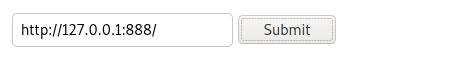

# 10 - Kotarak

# Index

# Gobuster


```bash
┌──(kali㉿kali)-[10.10.14.9/23]-[~/htb/kotarak]
└─$ curl 10.10.10.55:60000/server-status
<!DOCTYPE HTML PUBLIC "-//IETF//DTD HTML 2.0//EN">
<html><head>
<title>403 Forbidden</title>
</head><body>
<h1>Forbidden</h1>
<p>You don't have permission to access /server-status
on this server.<br />
</p>
<hr>
<address>Apache/2.4.18 (Ubuntu) Server at 10.10.10.55 Port 60000</address>
</body></html>
```
# server-status





hover over backup file and you will see doc=backup


view source
    


  
# tetris.c
