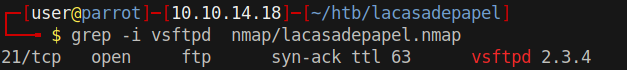
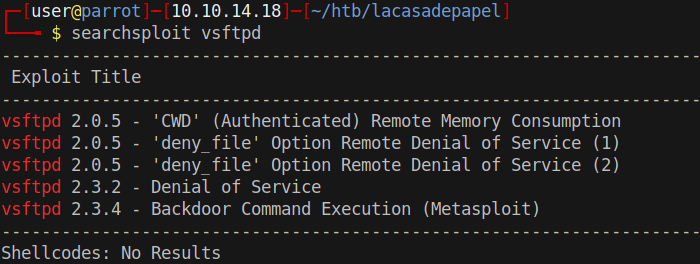
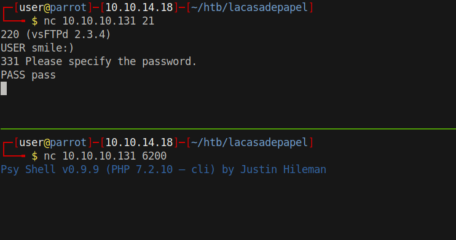
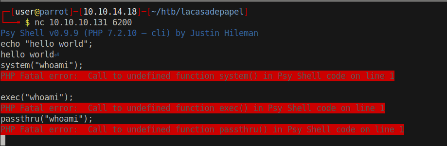
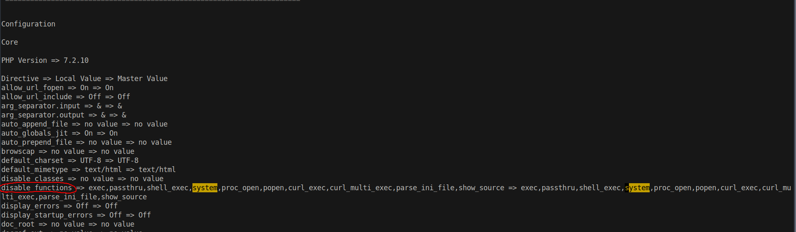
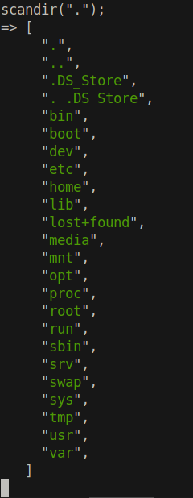
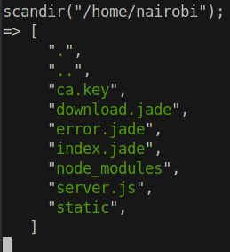

# 10 - VSFTPD


# vsftdp version



# Searchsploit & Backdoor Command Execution



vsftpd version 2.3.4 happens to include a backdoor in its download archive. Smile emoji in the username triggers the backdoor in the authentication process. A modified shell process launches and listens on port 6200.


# The backdoor shell



# [Psy Shell](https://psysh.org/#features)
Psy Shell is an interactive debugger  for php


# Program execution is disabled




# phpinfo();



# scandir


scandir is a builtin function


# /proc/self/environ

```php
file_get_contents("/proc/self/environ");
=> "TERM=linux\0PATH=/lib/rc/sbin:/lib/rc/bin:/bin:/sbin:/bin:/sbin:/usr/bin:/usr/sbin:/usr/bin:/usr/sbin:/usr/local/bin:/usr/local/sbin\0MAIL=/var/mail/dali\0LOGNAME=dali\0USER=dali\0USERNAME=dali\0HOME=/home/dali\0SHELL=/usr/bin/psysh\0SUDO_COMMAND=/usr/bin/node /home/dali/server.js\0SUDO_USER=root\0SUDO_UID=0\0SUDO_GID=0\0"
```


It looks like root has run this program as dali


# CA key




