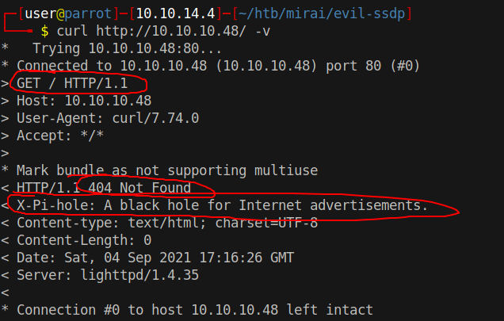
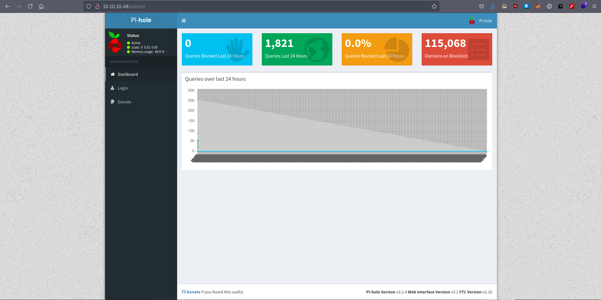

# 10 - HTTP

# 404 on root



X-Pi-hole header checks out. Let us keep that in mind and proceed with gobuster before looking into Pi hole


# Gobuster
```bash
┌─[user@parrot]─[10.10.14.4]─[~/htb/mirai]                                                     
└──╼ $ gobuster dir -u 10.10.10.48 -w /opt/SecLists/Discovery/Web-Content/raft-small-words.txt  -x ".txt" -o gobuster/initial.log
===============================================================                      
Gobuster v3.1.0                                                                                
by OJ Reeves (@TheColonial) & Christian Mehlmauer (@firefart)                        
===============================================================                      
[+] Url:                     http://10.10.10.48                                      
[+] Method:                  GET                                                               
[+] Threads:                 10                                                                
[+] Wordlist:                /opt/SecLists/Discovery/Web-Content/raft-small-words.txt
[+] Negative Status codes:   404
[+] User Agent:              gobuster/3.1.0                                                    
[+] Extensions:              txt          
[+] Timeout:                 10s                                                                                                                                                              
===============================================================
2021/09/04 19:33:03 Starting gobuster in directory enumeration mode
===============================================================
/admin                (Status: 301) [Size: 0] [--> http://10.10.10.48/admin/]
/.js                  (Status: 200) [Size: 61]                                
/versions             (Status: 200) [Size: 18]                                
/.min.js              (Status: 200) [Size: 61]                                
/.inc.js              (Status: 200) [Size: 61]                                
/.3.2.min.js          (Status: 200) [Size: 61]                                
                                                                              
===============================================================
2021/09/04 19:42:40 Finished
===============================================================

```


# admin



Pi-hole can be installed on any linux devices but mainly designed for embedded network devices, like Raspberry Pi . Raspberry Pi by default exposes ssh with the credentials: **pi:raspberry**. Let us try to login with this credentials.

```bash
┌─[user@parrot]─[10.10.14.4]─[~/htb/mirai/repo]                                                
└──╼ $ ssh -l pi  10.10.10.48                                                                                                                                                                 
The authenticity of host '10.10.10.48 (10.10.10.48)' can't be established.
ECDSA key fingerprint is SHA256:UkDz3Z1kWt2O5g2GRlullQ3UY/cVIx/oXtiqLPXiXMY.
Are you sure you want to continue connecting (yes/no/[fingerprint])? yes       
Warning: Permanently added '10.10.10.48' (ECDSA) to the list of known hosts.                                                                                                                  
pi@10.10.10.48's password: raspberry
                                               
The programs included with the Debian GNU/Linux system are free software;  
the exact distribution terms for each program are described in the
individual files in /usr/share/doc/*/copyright. 
                                               
Debian GNU/Linux comes with ABSOLUTELY NO WARRANTY, to the extent
permitted by applicable law.                                                                   
Last login: Sun Aug 27 14:47:50 2017 from localhost

SSH is enabled and the default password for the 'pi' user has not been changed.
This is a security risk - please login as the 'pi' user and type 'passwd' to set a new password.


SSH is enabled and the default password for the 'pi' user has not been changed.
This is a security risk - please login as the 'pi' user and type 'passwd' to set a new password.

pi@raspberrypi:~ $ id
uid=1000(pi) gid=1000(pi) groups=1000(pi),4(adm),20(dialout),24(cdrom),27(sudo),29(audio),44(video),46(plugdev),60(games),100(users),101(input),108(netdev),117(i2c),998(gpio),999(spi)
```

Seemingly, we are on a default pi setup.