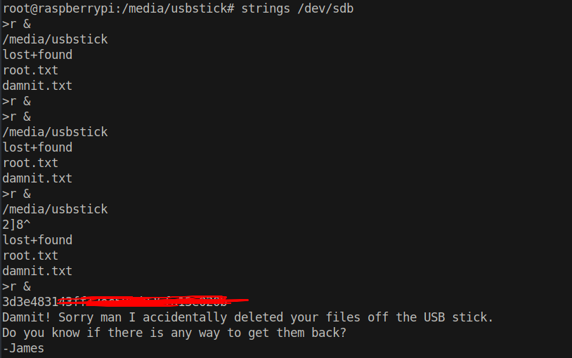

# 15 - PrivEsc


```bash
pi@raspberrypi:~ $ sudo -l
Matching Defaults entries for pi on localhost:
    env_reset, mail_badpass, secure_path=/usr/local/sbin\:/usr/local/bin\:/usr/sbin\:/usr/bin\:/sbin\:/bin

User pi may run the following commands on localhost:
    (ALL : ALL) ALL
    (ALL) NOPASSWD: ALL
pi@raspberrypi:~ $ sudo id
uid=0(root) gid=0(root) groups=0(root)
pi@raspberrypi:~ $ sudo -i                  
                                                                                               
SSH is enabled and the default password for the 'pi' user has not been changed.
This is a security risk - please login as the 'pi' user and type 'passwd' to set a new password.
                                                                                               
                                                                                               
SSH is enabled and the default password for the 'pi' user has not been changed.
This is a security risk - please login as the 'pi' user and type 'passwd' to set a new password.
                                               
root@raspberrypi:~# cat root.txt
I lost my original root.txt! I think I may have a backup on my USB stick...
```

Pi is left to default settings. We basically have full control over the system but flag is still missing. The message suggests that there is a USB stick and we should check that out.


```bash
root@raspberrypi:~# lsblk
NAME   MAJ:MIN RM  SIZE RO TYPE MOUNTPOINT
sda      8:0    0   10G  0 disk 
├─sda1   8:1    0  1.3G  0 part /lib/live/mount/persistence/sda1      
└─sda2   8:2    0  8.7G  0 part /lib/live/mount/persistence/sda2
sdb      8:16   0   10M  0 disk /media/usbstick 
sr0     11:0    1 1024M  0 rom      
loop0    7:0    0  1.2G  1 loop /lib/live/mount/rootfs/filesystem.squashfs
```

Usb stick is represented as /dev/sdb  in the file system and it is mounted in /media/usbstick.


# damnit.txt
```bash
root@raspberrypi:~# cd /media/usbstick/   
root@raspberrypi:/media/usbstick# ls
damnit.txt  lost+found
root@raspberrypi:/media/usbstick# cat damnit.txt 
Damnit! Sorry man I accidentally deleted your files off the USB stick.
Do you know if there is any way to get them back?
                                               
-James   
```

James mistakenly deleted the file. Contrary to popular belief, file is not deleted from the disk it's just deleted from the file system. Simply put, it's still in the disk but forgotten. We can retrieve the flag by dumping the whole disk.




There it is, the root flag :)