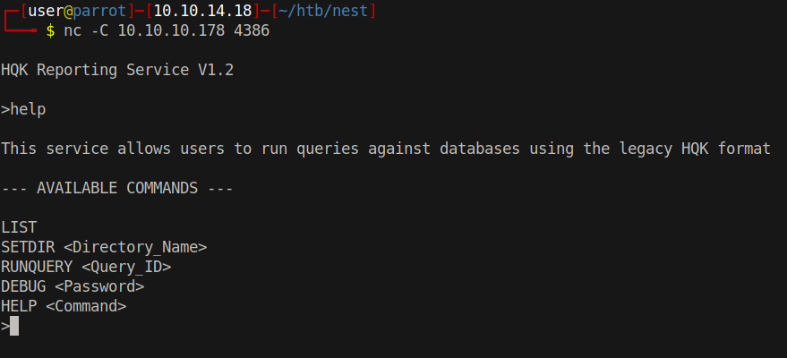
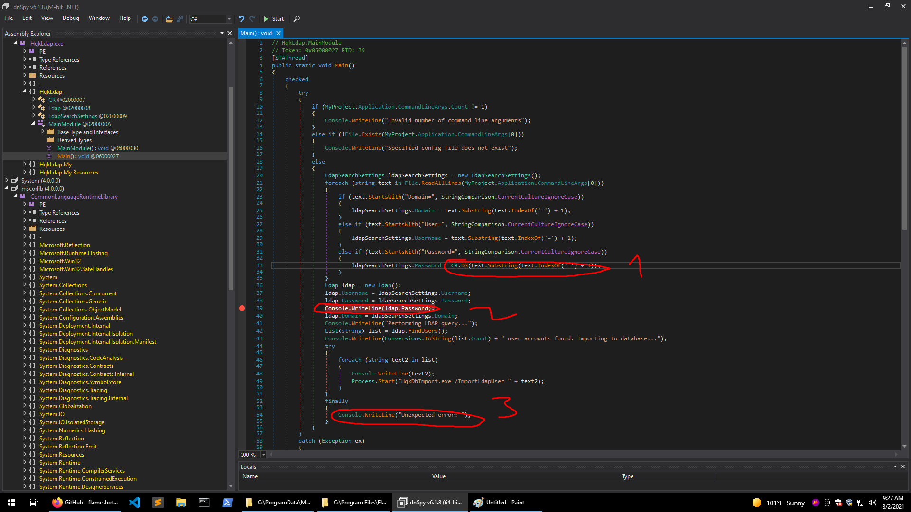
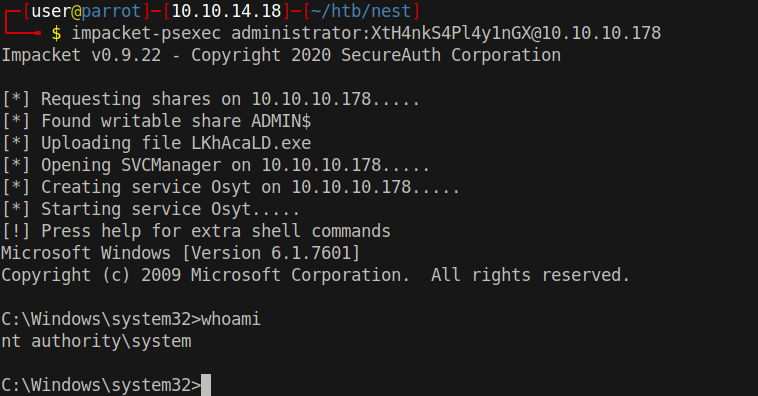

# 15 - HQK




# Ldap.conf and  Administrator's password
```
┌─[user@parrot]─[10.10.14.18]─[~/htb/nest]
└──╼ $ nc -C 10.10.10.178 4386

HQK Reporting Service V1.2
>DEBUG WBQ201953D8w 
Debug mode enabled. Use the HELP command to view additional commands that are now available
>SETDIR ../LDAP
Current directory set to LDAP
>list

Use the query ID numbers below with the RUNQUERY command and the directory names with the SETDIR command

 QUERY FILES IN CURRENT DIRECTORY

[1]   HqkLdap.exe
[2]   Ldap.conf

Current Directory: LDAP
>SHOWQUERY 2

Domain=nest.local
Port=389
BaseOu=OU=WBQ Users,OU=Production,DC=nest,DC=local
User=Administrator
Password=yyEq0Uvvhq2uQOcWG8peLoeRQehqip/fKdeG/kjEVb4=

```

We finally found the password but it's again encrypted. There is another file HqkLdap.exe which we saw before let us go and take a look at this file.

```
┌─[user@parrot]─[10.10.14.18]─[/mnt/nest/Users/C.Smith/HQK Reporting/AD Integration Module]
└──╼ $ ls
HqkLdap.exe
┌─[user@parrot]─[10.10.14.18]─[~/htb/nest]
└──╼ $ file HqkLdap.exe 
HqkLdap.exe: PE32 executable (console) Intel 80386 Mono/.Net assembly, for MS Windows

```

The file appears to be a .Net binary. There is a tool called dnSpy which can decompile .Net binaries.

# Decompiled HqkLdap.exe


1 - decrypts the password from the specified configuration file(argv1)
2 - WriteLine after ldap.password so that we can see the plaintext password while it is running
3 - `finally` block was giving me some error about enumerator being undefined, instead of fixing the program I decided to replace it with a simple WriteLine

Also there was another `else if` block holding me from getting the password, I omitted that piece as well.


```
C:\Users\Refik\Desktop>.\HqkLdapleak.exe Ldap.conf
XtH4nkS4Pl4y1nGX
Performing LDAP query...
Unexpected error: The specified domain does not exist or cannot be contacted.                                                                                                                                                                     
```

Ldap.conf is the file from HQK 


# System
