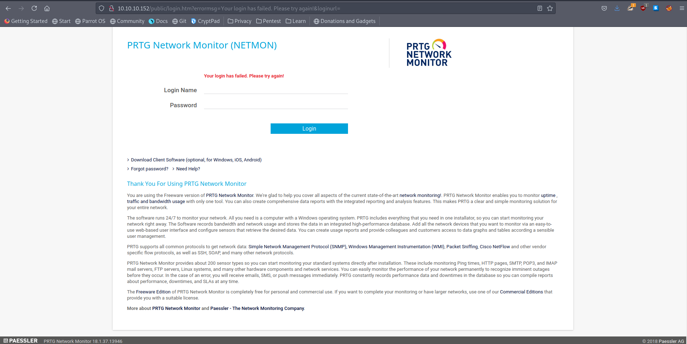

# 10 - NETMON


# PRTG Network Monitor (Netmon)


Default credentials doesn't work


# Searchsploit


Remote code execution requires authentication, we definitely need those credentials. Let's take a look at the ftp service


# See 15 - FTP.md


After enumerating the ftp service we got plain text credentials however the password is different with the new configuration but luckily only the year is changed. The new password is `PrTg@dmin2019`


# Netmon (Authenticated)


# Remote Code Execution 

```sql
┌─[user@parrot]─[10.10.14.9]─[~/htb/netmon/exploit]
└──╼ $ searchsploit -m windows/webapps/46527.sh
┌─[user@parrot]─[10.10.14.9]─[~/htb/netmon/exploit]
└──╼ $ sed 's/\r//' 46527.sh > exploit.sh # to get rid of carriage return character
```


New user pentest:P3nT3st!  is also in the administrators group

# Shell
