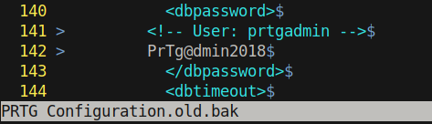

# 15 - FTP


# C drive 


The entire C: drive is shared over ftp, we can take a look at the configuration files for netmon. Maybe there are some plain text credentials stored in these files. In the documentation, it is mentioned that configuration files are stored in `%programdata%\Paessler\PRTG Network Monitor` let us go there and view the configuration files


# Configuration files
```bash
ftp> pwd
257 "/ProgramData/Paessler/PRTG Network Monitor" is current directory.
ftp> ls
200 PORT command successful.
125 Data connection already open; Transfer starting.
07-02-21  10:27AM       <DIR>          Configuration Auto-Backups
07-02-21  09:46AM       <DIR>          Log Database
02-03-19  12:18AM       <DIR>          Logs (Debug)
02-03-19  12:18AM       <DIR>          Logs (Sensors)
02-03-19  12:18AM       <DIR>          Logs (System)
07-02-21  09:46AM       <DIR>          Logs (Web Server)
07-02-21  09:51AM       <DIR>          Monitoring Database
02-25-19  10:54PM              1189697 PRTG Configuration.dat
02-25-19  10:54PM              1189697 PRTG Configuration.old
07-14-18  03:13AM              1153755 PRTG Configuration.old.bak
07-02-21  11:09AM              1695943 PRTG Graph Data Cache.dat
02-25-19  11:00PM       <DIR>          Report PDFs
02-03-19  12:18AM       <DIR>          System Information Database
02-03-19  12:40AM       <DIR>          Ticket Database
02-03-19  12:18AM       <DIR>          ToDo Database
226 Transfer complete.
ftp> 
```

# Download the configuration files

```
ftp> get "PRTG Configuration.dat"
ftp> get "PRTG Configuration.old"
ftp> get "PRTG Configuration.old.bak"
```

# Plain text credentials in the backup file
