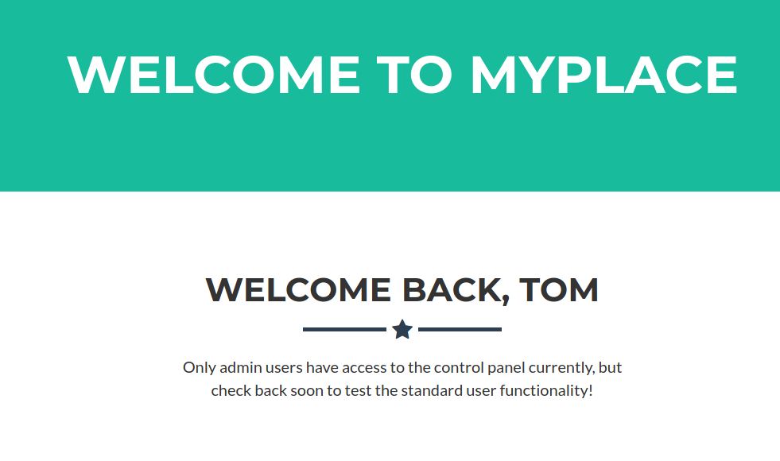

# 10 - MyPlace


# Gobuster is having an issue.

```sql
$ gobuster dir -u http://10.10.10.58:3000 -w /usr/share/wordlists/dirbuster/directory-list-2.3-medium.txt -o gobuster/initial.log                     
===============================================================                                                                                              
Gobuster v3.1.0                                                                                                                                              
by OJ Reeves (@TheColonial) & Christian Mehlmauer (@firefart)                                                                                                
===============================================================                                                                                              
[+] Url:                     http://10.10.10.58:3000                                                                                                         
[+] Method:                  GET                                              
[+] Threads:                 10                                                                                                                              
[+] Wordlist:                /usr/share/wordlists/dirbuster/directory-list-2.3-medium.txt                                                                    
[+] Negative Status codes:   404                                                                                                                             
[+] User Agent:              gobuster/3.1.0                                                                                                                  
[+] Timeout:                 10s                                                                                                                             
===============================================================               
2021/05/15 15:30:31 Starting gobuster in directory enumeration mode                                                                                          
===============================================================               
Error: the server returns a status code that matches the provided options for non existing urls. http://10.10.10.58:3000/99a05f91-2832-43a9-84e2-f9990261f75b
 => 200 (Length: 3861). To continue please exclude the status code, the length or use the --wildcard switch
```


# It seems we are blocked because of our user agent


# The other problem is that instead of giving 404 status page the server redirects the user to the index page.


# Burp suite logged some interesting files and folders


#  api directory has some credentials


# sha256 crack


# Logging in as tom




# /partials/admin.html is never requested by the browser but it is referenced in one of the javascript files


# admin.html
Unfortunately Download Backup button doesn't work


# Another interesting directory


# We find the username and the sha256 password of the admin user


# Luckly it is in the Crackstation's database


# Logging in as admin 


