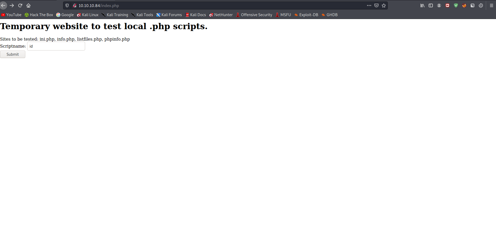
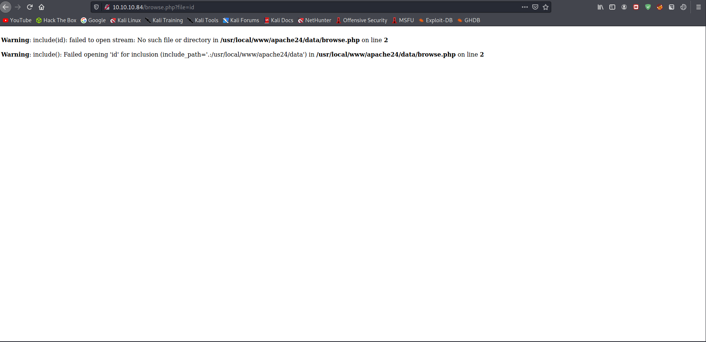
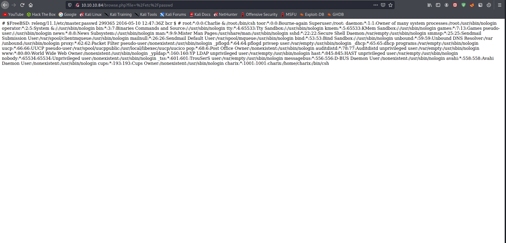
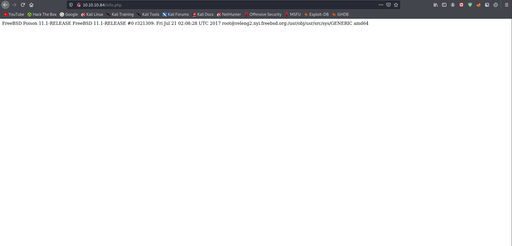
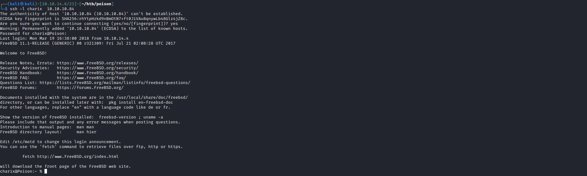

# 10 - Web Server


# index.php


# browse.php



# Local file inclusion



# info.php 


[FreeBSD 11.1-RELEASE (July 26, 2017)](https://www.freebsd.org/releases/)



# /etc/passwd
```
# $FreeBSD: releng/11.1/etc/master.passwd 299365 2016-05-10 12:47:36Z bcr $
#
root:*:0:0:Charlie &:/root:/bin/csh
toor:*:0:0:Bourne-again Superuser:/root:
daemon:*:1:1:Owner of many system processes:/root:/usr/sbin/nologin
operator:*:2:5:System &:/:/usr/sbin/nologin
bin:*:3:7:Binaries Commands and Source:/:/usr/sbin/nologin
tty:*:4:65533:Tty Sandbox:/:/usr/sbin/nologin
kmem:*:5:65533:KMem Sandbox:/:/usr/sbin/nologin
games:*:7:13:Games pseudo-user:/:/usr/sbin/nologin
news:*:8:8:News Subsystem:/:/usr/sbin/nologin
man:*:9:9:Mister Man Pages:/usr/share/man:/usr/sbin/nologin
sshd:*:22:22:Secure Shell Daemon:/var/empty:/usr/sbin/nologin
smmsp:*:25:25:Sendmail Submission User:/var/spool/clientmqueue:/usr/sbin/nologin
mailnull:*:26:26:Sendmail Default User:/var/spool/mqueue:/usr/sbin/nologin
bind:*:53:53:Bind Sandbox:/:/usr/sbin/nologin
unbound:*:59:59:Unbound DNS Resolver:/var/unbound:/usr/sbin/nologin
proxy:*:62:62:Packet Filter pseudo-user:/nonexistent:/usr/sbin/nologin
_pflogd:*:64:64:pflogd privsep user:/var/empty:/usr/sbin/nologin
_dhcp:*:65:65:dhcp programs:/var/empty:/usr/sbin/nologin
uucp:*:66:66:UUCP pseudo-user:/var/spool/uucppublic:/usr/local/libexec/uucp/uucico
pop:*:68:6:Post Office Owner:/nonexistent:/usr/sbin/nologin
auditdistd:*:78:77:Auditdistd unprivileged user:/var/empty:/usr/sbin/nologin
www:*:80:80:World Wide Web Owner:/nonexistent:/usr/sbin/nologin
_ypldap:*:160:160:YP LDAP unprivileged user:/var/empty:/usr/sbin/nologin
hast:*:845:845:HAST unprivileged user:/var/empty:/usr/sbin/nologin
nobody:*:65534:65534:Unprivileged user:/nonexistent:/usr/sbin/nologin
_tss:*:601:601:TrouSerS user:/var/empty:/usr/sbin/nologin
messagebus:*:556:556:D-BUS Daemon User:/nonexistent:/usr/sbin/nologin
avahi:*:558:558:Avahi Daemon User:/nonexistent:/usr/sbin/nologin
cups:*:193:193:Cups Owner:/nonexistent:/usr/sbin/nologin
charix:*:1001:1001:charix:/home/charix:/bin/csh
```


# listfiles.php


```
Array
(
    [0] => .
    [1] => ..
    [2] => browse.php
    [3] => index.php
    [4] => info.php
    [5] => ini.php
    [6] => listfiles.php
    [7] => phpinfo.php
    [8] => pwdbackup.txt
)
```


# pwdbackup.txt

```
This password is secure, it's encoded atleast 13 times.. what could go wrong really.. Vm0wd2QyUXlVWGxWV0d4WFlURndVRlpzWkZOalJsWjBUVlpPV0ZKc2JETlhhMk0xVmpKS1IySkVU bGhoTVVwVVZtcEdZV015U2tWVQpiR2hvVFZWd1ZWWnRjRWRUTWxKSVZtdGtXQXBpUm5CUFdWZDBS bVZHV25SalJYUlVUVlUxU1ZadGRGZFZaM0JwVmxad1dWWnRNVFJqCk1EQjRXa1prWVZKR1NsVlVW M040VGtaa2NtRkdaR2hWV0VKVVdXeGFTMVZHWkZoTlZGSlRDazFFUWpSV01qVlRZVEZLYzJOSVRs WmkKV0doNlZHeGFZVk5IVWtsVWJXaFdWMFZLVlZkWGVHRlRNbEY0VjI1U2ExSXdXbUZEYkZwelYy eG9XR0V4Y0hKWFZscExVakZPZEZKcwpaR2dLWVRCWk1GWkhkR0ZaVms1R1RsWmtZVkl5YUZkV01G WkxWbFprV0dWSFJsUk5WbkJZVmpKMGExWnRSWHBWYmtKRVlYcEdlVmxyClVsTldNREZ4Vm10NFYw MXVUak5hVm1SSFVqRldjd3BqUjJ0TFZXMDFRMkl4WkhOYVJGSlhUV3hLUjFSc1dtdFpWa2w1WVVa T1YwMUcKV2t4V2JGcHJWMGRXU0dSSGJFNWlSWEEyVmpKMFlXRXhXblJTV0hCV1ltczFSVmxzVm5k WFJsbDVDbVJIT1ZkTlJFWjRWbTEwTkZkRwpXbk5qUlhoV1lXdGFVRmw2UmxkamQzQlhZa2RPVEZk WGRHOVJiVlp6VjI1U2FsSlhVbGRVVmxwelRrWlplVTVWT1ZwV2EydzFXVlZhCmExWXdNVWNLVjJ0 NFYySkdjR2hhUlZWNFZsWkdkR1JGTldoTmJtTjNWbXBLTUdJeFVYaGlSbVJWWVRKb1YxbHJWVEZT Vm14elZteHcKVG1KR2NEQkRiVlpJVDFaa2FWWllRa3BYVmxadlpERlpkd3BOV0VaVFlrZG9hRlZz WkZOWFJsWnhVbXM1YW1RelFtaFZiVEZQVkVaawpXR1ZHV210TmJFWTBWakowVjFVeVNraFZiRnBW VmpOU00xcFhlRmRYUjFaSFdrWldhVkpZUW1GV2EyUXdDazVHU2tkalJGbExWRlZTCmMxSkdjRFpO Ukd4RVdub3dPVU5uUFQwSwo= 
```

# Decoding the very secure password


Let's remove the space characters first
```bash
┌──(kali㉿kali)-[10.10.14.6/23]-[~/htb/poison/server]
└─$ sed -i "s/ //g" pwdbackup.txt
```

# Password
```py
┌──(kali㉿kali)-[10.10.14.6/23]-[~/htb/poison/server]
└─$ python3
>>> import base64
>>> password="Vm0wd2QyUXlVWGxWV0d4WFlURndVRlpzWkZOalJsWjBUVlpPV0ZKc2JETlhhMk0xVmpKS1IySkVUbGhoTVVwVVZtcEdZV015U2tWVQpiR2hvVFZWd1ZWWnRjRWRUTWxKSVZtdGtXQXBpUm5CUFdWZDBSbVZHV25SalJYUlVUVlUxU1ZadGRGZFZaM0JwVmxad1dWWnRNVFJqCk1EQjRXa1prWVZKR1NsVlVWM040VGtaa2NtRkdaR2hWV0VKVVdXeGFTMVZHWkZoTlZGSlRDazFFUWpSV01qVlRZVEZLYzJOSVRsWmkKV0doNlZHeGFZVk5IVWtsVWJXaFdWMFZLVlZkWGVHRlRNbEY0VjI1U2ExSXdXbUZEYkZwelYyeG9XR0V4Y0hKWFZscExVakZPZEZKcwpaR2dLWVRCWk1GWkhkR0ZaVms1R1RsWmtZVkl5YUZkV01GWkxWbFprV0dWSFJsUk5WbkJZVmpKMGExWnRSWHBWYmtKRVlYcEdlVmxyClVsTldNREZ4Vm10NFYwMXVUak5hVm1SSFVqRldjd3BqUjJ0TFZXMDFRMkl4WkhOYVJGSlhUV3hLUjFSc1dtdFpWa2w1WVVaT1YwMUcKV2t4V2JGcHJWMGRXU0dSSGJFNWlSWEEyVmpKMFlXRXhXblJTV0hCV1ltczFSVmxzVm5kWFJsbDVDbVJIT1ZkTlJFWjRWbTEwTkZkRwpXbk5qUlhoV1lXdGFVRmw2UmxkamQzQlhZa2RPVEZkWGRHOVJiVlp6VjI1U2FsSlhVbGRVVmxwelRrWlplVTVWT1ZwV2EydzFXVlZhCmExWXdNVWNLVjJ0NFYySkdjR2hhUlZWNFZsWkdkR1JGTldoTmJtTjNWbXBLTUdJeFVYaGlSbVJWWVRKb1YxbHJWVEZTVm14elZteHcKVG1KR2NEQkRiVlpJVDFaa2FWWllRa3BYVmxadlpERlpkd3BOV0VaVFlrZG9hRlZzWkZOWFJsWnhVbXM1YW1RelFtaFZiVEZQVkVaawpXR1ZHV210TmJFWTBWakowVjFVeVNraFZiRnBWVmpOU00xcFhlRmRYUjFaSFdrWldhVkpZUW1GV2EyUXdDazVHU2tkalJGbExWRlZTCmMxSkdjRFpOUkd4RVdub3dPVU5uUFQwSwo="
>>> for i in range(13):
...     password = base64.b64decode(password)
...     print(password)
... 
b'Vm0wd2QyUXlVWGxXYTFwUFZsZFNjRlZ0TVZOWFJsbDNXa2M1VjJKR2JETlhhMUpUVmpGYWMySkVU\nbGhoTVVwVVZtcEdTMlJIVmtkWApiRnBPWVd0RmVGWnRjRXRUTVU1SVZtdFdVZ3BpVlZwWVZtMTRj\nMDB4WkZkYVJGSlVUV3N4TkZkcmFGZGhVWEJUWWxaS1VGZFhNVFJTCk1EQjRWMjVTYTFKc2NITlZi\nWGh6VGxaYVNHUklUbWhWV0VKVVdXeGFTMlF4V25Sa1IwWmFDbFpzV2xoWGExcHJXVlpLUjFOdFJs\nZGgKYTBZMFZHdGFZVk5GTlZkYVIyaFdWMFZLVlZkWGVHRlRNVnBYVjJ0a1ZtRXpVbkJEYXpGeVlr\nUlNWMDFxVmt4V01uTjNaVmRHUjFWcwpjR2tLVW01Q2IxZHNaRFJXTWxKR1RsWmtZVkl5YUZOV01G\nWkxWbFprV0dWSGRHbE5iRXA2VjJ0YWExWnRSWHBWYms1RVlsVndXRll5CmRHOVdNREZ4Vm10NFdG\nWnNjRXhWYWtaUFl6Rldjd3BXYkdOTFdXdG9RbVZzV25SalJXUldUVlpzTkZZeU5VOVpWa2w1WVVa\na1YwMUcKV2t4V2JGcGhaRVV4VlZGdGRFNWhNbmN3VmpKMGIxUXhiRmRVYTJoV1lrVTFSVmxzVmxw\nTmJGcDBDbVZIT1ZkaVZYQkpXVlZvZDFZdwpNWEZTYkdoaFVsZFNXRlZxUms5amQzQmhVbTFPVEZk\nWGVGWmtNbEY0VjJ0V1UySkhVbFpVVjNSM1pXeFdXR1ZHWkZWaVJYQmFWa2QwCk5GSkdjRFlLVFVS\nc1JGcDZNRGxEWnowOUNnPT0K\n'
b'Vm0wd2QyUXlWa1pPVldScFVtMVNXRll3Wkc5V2JGbDNXa1JTVjFac2JETlhhMUpUVmpGS2RHVkdX\nbFpOYWtFeFZtcEtTMU5IVmtWUgpiVVpYVm14c00xZFdaRFJUTWsxNFdraFdhUXBTYlZKUFdXMTRS\nMDB4V25Sa1JscHNVbXhzTlZaSGRITmhVWEJUWWxaS2QxWnRkR0ZaClZsWlhXa1prWVZKR1NtRldh\na0Y0VGtaYVNFNVdaR2hWV0VKVVdXeGFTMVpXV2tkVmEzUnBDazFyYkRSV01qVkxWMnN3ZVdGR1Vs\ncGkKUm5Cb1dsZDRWMlJGTlZkYVIyaFNWMFZLVlZkWGVHdGlNbEp6V2taa1ZtRXpVbk5EYlVwWFYy\ndG9WMDFxVmt4WFZscExVakZPYzFWcwpWbGNLWWtoQmVsWnRjRWRWTVZsNFYyNU9ZVkl5YUZkV01G\nWkxWbFphZEUxVVFtdE5hMncwVjJ0b1QxbFdUa2hWYkU1RVlsVlpNbFp0CmVHOVdiVXBJWVVod1Yw\nMXFSbGhhUldSWFVqRk9jd3BhUm1OTFdXeFZkMlF4V2tWU2JHUlZUV3R3ZWxWWGVGZFViRXBaVkd0\nNFJGcDYKTURsRFp6MDlDZz09Cg==\n'
b'Vm0wd2QyVkZOVWRpUm1SWFYwZG9WbFl3WkRSV1ZsbDNXa1JTVjFKdGVGWlZNakExVmpKS1NHVkVR\nbUZXVmxsM1dWZDRTMk14WkhWaQpSbVJPWW14R00xWnRkRlpsUmxsNVZHdHNhUXBTYlZKd1ZtdGFZ\nVlZXWkZkYVJGSmFWakF4TkZaSE5WZGhVWEJUWWxaS1ZWWkdVa3RpCk1rbDRWMjVLV2sweWFGUlpi\nRnBoWld4V2RFNVdaR2hSV0VKVVdXeGtiMlJzWkZkVmEzUnNDbUpXV2toV01qVkxXVlpLUjFOc1Vs\nVlcKYkhBelZtcEdVMVl4V25OYVIyaFdWMFZLVlZadE1UQmtNa2w0V2toT1lWTkhVbE5EYlVZMlZt\neG9WbUpIYUhwV01qRlhaRWRXUjFOcwpaRmNLWWxVd2QxWkVSbGRVTWtwelVXeFdUbEpZVGt4RFp6\nMDlDZz09Cg==\n'
b'Vm0wd2VFNUdiRmRXV0doVlYwZDRWVll3WkRSV1JteFZVMjA1VjJKSGVEQmFWVll3WVd4S2MxZHVi\nRmROYmxGM1ZtdFZlRll5VGtsaQpSbVJwVmtaYVVWZFdaRFJaVjAxNFZHNVdhUXBTYlZKVVZGUkti\nMkl4V25KWk0yaFRZbFphZWxWdE5WZGhRWEJUWWxkb2RsZFdVa3RsCmJWWkhWMjVLWVZKR1NsUlVW\nbHAzVmpGU1YxWnNaR2hWV0VKVVZtMTBkMkl4WkhOYVNHUlNDbUY2VmxoVmJHaHpWMjFXZEdWR1Ns\nZFcKYlUwd1ZERldUMkpzUWxWTlJYTkxDZz09Cg==\n'
b'Vm0weE5GbFdWWGhVV0d4VVYwZDRWRmxVU205V2JHeDBaVVYwYWxKc1dubFdNblF3VmtVeFYyTkli\nRmRpVkZaUVdWZDRZV014VG5WaQpSbVJUVFRKb2IxWnJZM2hTYlZaelVtNVdhQXBTYldodldWUktl\nbVZHV25KYVJGSlRUVlp3VjFSV1ZsZGhVWEJUVm10d2IxZHNaSGRSCmF6VlhVbGhzV21WdGVGSldW\nbU0wVDFWT2JsQlVNRXNLCg==\n'
b'Vm0xNFlWVXhUWGxUV0d4VFlUSm9WbGx0ZUV0alJsWnlWMnQwVkUxV2NIbFdiVFZQWVd4YWMxTnVi\nRmRTTTJob1ZrY3hSbVZzUm5WaApSbWhvWVRKemVGWnJaRFJTTVZwV1RWVldhUXBTVmtwb1dsZHdR\nazVXUlhsWmVteFJWVmM0T1VOblBUMEsK\n'
b'Vm14YVUxTXlTWGxTYTJoVllteEtjRlZyV2t0VE1WcHlWbTVPYWxac1NubFdSM2hoVkcxRmVsRnVh\nRmhoYTJzeFZrZDRSMVpWTVVWaQpSVkpoWldwQk5WRXlZemxRVVc4OUNnPT0K\n'
b'VmxaU1MySXlSa2hVYmxKcFVrWktTMVpyVm5OalZsSnlWR3hhVG1FelFuaFhha2sxVkd4R1ZVMUVi\nRVJhZWpBNVEyYzlQUW89Cg==\n'
b'VlZSS2IyRkhUblJpUkZKS1ZrVnNjVlJyVGxaTmEzQnhXakk1VGxGVU1EbERaejA5Q2c9PQo=\n'
b'VVRKb2FHTnRiRFJKVkVscVRrTlZNa3BxWjI5TlFUMDlDZz09Cg==\n'
b'UTJoaGNtbDRJVElqTkNVMkpqZ29NQT09Cg==\n'
b'Q2hhcml4ITIjNCU2JjgoMA==\n'
b'Charix!2#4%6&8(0'
```

# SSH



# Flag
```bash
charix@Poison:~ % cat user.txt 
eaacdfb2d141b72a589233063604209c
```