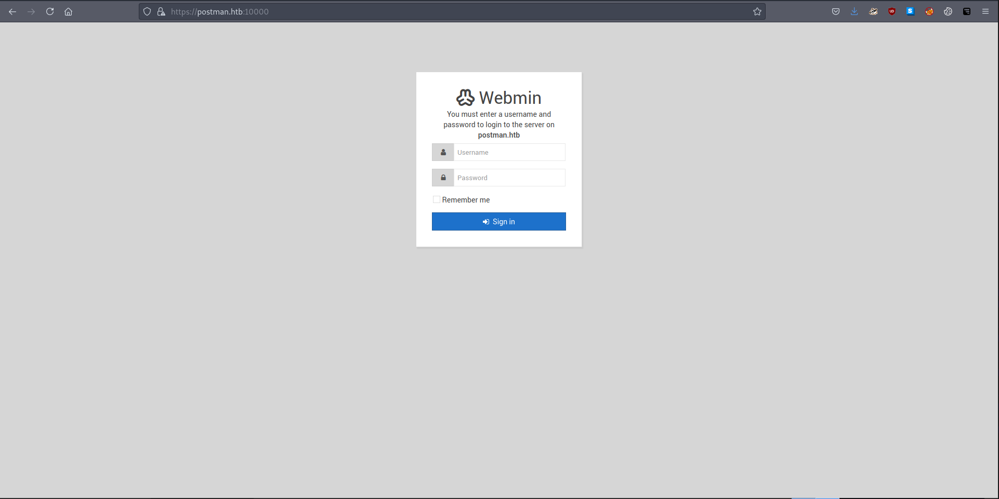

# 10 - HTTP


# index.html


# Webmin



```bash
┌─[user@parrot]─[10.10.14.14]─[~/htb/postman]
└──╼ $ searchsploit webmin
------------------------------------------------------------------------------------------------------------------------------------------------------------ ---------------------------------
 Exploit Title                                                                                                                                              |  Path
------------------------------------------------------------------------------------------------------------------------------------------------------------ ---------------------------------
DansGuardian Webmin Module 0.x - 'edit.cgi' Directory Traversal                                                                                             | cgi/webapps/23535.txt
phpMyWebmin 1.0 - 'target' Remote File Inclusion                                                                                                            | php/webapps/2462.txt
phpMyWebmin 1.0 - 'window.php' Remote File Inclusion                                                                                                        | php/webapps/2451.txt
Webmin - Brute Force / Command Execution                                                                                                                    | multiple/remote/705.pl
webmin 0.91 - Directory Traversal                                                                                                                           | cgi/remote/21183.txt
Webmin 0.9x / Usermin 0.9x/1.0 - Access Session ID Spoofing                                                                                                 | linux/remote/22275.pl
Webmin 0.x - 'RPC' Privilege Escalation                                                                                                                     | linux/remote/21765.pl
Webmin 0.x - Code Input Validation                                                                                                                          | linux/local/21348.txt
Webmin 1.5 - Brute Force / Command Execution                                                                                                                | multiple/remote/746.pl
Webmin 1.5 - Web Brute Force (CGI)                                                                                                                          | multiple/remote/745.pl
Webmin 1.580 - '/file/show.cgi' Remote Command Execution (Metasploit)                                                                                       | unix/remote/21851.rb
Webmin 1.850 - Multiple Vulnerabilities                                                                                                                     | cgi/webapps/42989.txt
Webmin 1.900 - Remote Command Execution (Metasploit)                                                                                                        | cgi/remote/46201.rb
Webmin 1.910 - 'Package Updates' Remote Command Execution (Metasploit)                                                                                      | linux/remote/46984.rb
```

There are a lot of vulnerabilities in webmin, the exploit we are interested in is `Package Updates' Remote Command Execution (Metasploit)` as the version is revealed by nmap. The exploit however requires authentication. 